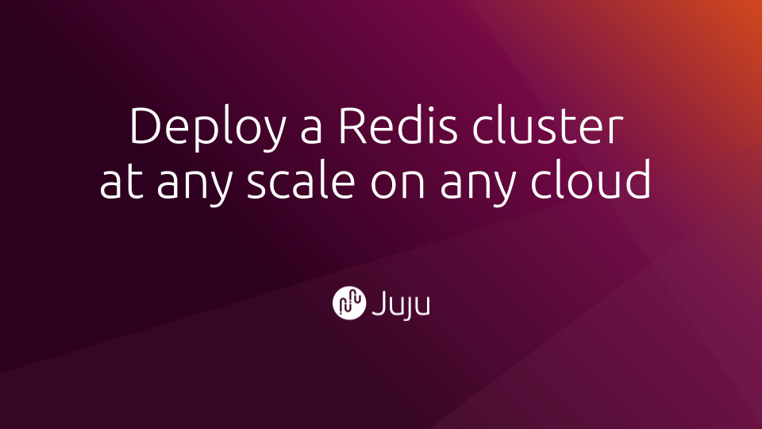

# Deploy a Redis cluster on Ubuntu Server at any scale 



## Welcome

This tutorial walks you through the process of deploying a Redis cluster on Ubuntu Server. The instructions work on all clouds supported by Juju&mdash;even bare metal servers&mdash;but this tutorial includes specific instructions to deploy the cluster to AWS, Google Compute Platform or Azure.

You will be able to configure the exact scale that you require and deploy it into any region supported by each cloud. 

### What you'll learn

* Deploy a Redis cluster
* Tweak the cluster's settings to add authentication 
* Test our deployment

### What you'll need

* Juju installed (install it by running `snap install juju --claasic` or by following the instructions on the [Juju documentation](https://jaas.ai/docs/getting-started-with-juju))
* (Optional) An Ubuntu SSO account (visit [login.ubuntu.com](https://login.ubuntu.com) to create one)
* (Optional) Credential information for AWS, GCP or Azure (created when you create an account with your preferred cloud provider)

### How this tutorial is structured

The top of each step provides a command to be executed in the terminal window. Explanatory text then follows for people who want to know more.

To open a terminal window in Ubuntu, open the Terminal app or holding `Ctrl` + `Alt` + `T` together. 

## (Optional) Log in to JAAS
Duration: 0:20

```bash
juju login jaas
```

### What is "JAAS"?

JAAS is a hosted service provided by Canonical, the company behind Ubuntu. It provides a  "Juju controller" for free. The Juju controller talks to the cloud provider programmatically to provision machines and manage software deployments. Once they're online, the controller then installs the software that we care about: Redis.


## Create model
Duration: 0:20

```
juju add-model redis-cluster-tutorial aws/us-west-1
```


### What's a model and why create one?

A "model" is Juju a term to describe a logical service made up applications. A model might represent a whole web app, including its web server, databases and work queues. 

For our purposes, our Redis cluster will make up the entire model. We'll use the name `redis-cluster-tutorial`.


### Where can I deploy my model?

The command at the top of this page uses the "US West 1" region from the AWS cloud provider by specifying `aws/us-west-1`.

To get a list of cloud providers and supported regions, just omit that argument from the command:

```
juju add-model redis-cluster-tutorial
```

### Why am I being asked to sign in?

Running `juju add-model` command will probably launch a browser window asking you to log in. 

Juju (and JAAS) need to be granted permission to act on your behalf. Juju works by talking to the cloud provider programmatically. This login process confirms that you're willing to delegate authority to Juju to do so.


## Deploy a multi-node Redis cluster
Duration: 0:20

To install Redis, we'll use the `juju deploy` command. `juju deploy` works with the model that we've just defined to install software there.

Enter this command in the command line: 

```
juju deploy cs:~omnivector/redis \
  --config cluster-enabled=true  \
  --constraints 'mem=4G' \
  --num-units 3
```


### Explaining the syntax

That command can be a little confusing if you haven't encountered Juju before. Here is an explanation of each part of the command that you used:

<table>
    <tr><th>Part</th><th>Explanation</th></tr>
    <tr><td><code>juju deploy</code></td><td>The <code>juju deploy</code> command instructs Juju to deploy a charm (defined beflow) into machines that are hosted within our model.</td></tr>
    <tr><td><code>cs:~omnivector/redis</code></td><td>This is the charm that we're deploying. It is made up of the parts "<code>cs:</code>" to denote the public charm store, "<code>~omnivector</code>" to denote the <code>omnivector</code> user account (as the author of the charm) and "<code>redis</code>" as the charm's name.</td></tr>
    <tr><td><code>--config cluster-enabled=true</code></td><td>Sets the configuration option <code>cluster-enabled</code> to <code>true</code>. This instructs the charm code to deploy a Redis as a cluster.</td></tr>
    <tr><td><code>--constrains 'mem=4G'</code></td><td>Specify that the virtual machines that we want Juju to deploy on our behalf have at least 4GB of RAM.</td></tr>
    <tr><td><code>--num-units 3</code></td><td>Set the desired scale of our cluster to be 3 virtual machines</td></tr>
</table>


positive
: **Check that the clustering configuration option is enabled**
It's important to include the option `--config cluster-enabled`. Without it, three independent Redis instances will be deployed.


positive
: **Use whatever scale you want**
If you would like to use a 5 node cluster, for example, change the `--num-units` option to 5. The `--contraints` option can also be tweaked.


### What is a charm?

A charm is software that deploys other software and makes it easy to maintain. The [`cs:~omnivector/redis`](https://jaas.ai/u/omnivector/redis) charm has its own website. 


### What is "Omnivector"?

`omnivector` in `cs:~omnivector/redis` is the Juju Charm Store account for Omnivector Solutions. Omnivector Solutions is a commercial enterpise based in the Oregon, USA. From their website:

Omnivector is a member of the Juju Experts program. Their team has written the Redis charm that we're deploying and released it as open source software.

## Wait for Redis to be deployed
Duration: 0:20

The `juju status` command provides a live view of what is happening behind the scenes. 

```
juju status
```

Will eventually produce an output similar to this:

```
Model                   Controller  Cloud/Region   Version  SLA          Timestamp
redis-cluster-tutorial  jaas        aws/us-west-1  2.6.8    unsupported  16:54:19+13:00

App    Version  Status  Scale  Charm  Store       Rev  OS      Notes
redis  5.0.5    active      3  redis  jujucharms   25  ubuntu  

Unit      Workload  Agent  Machine  Public address  Ports     Message
redis/0*  active    idle   0        54.67.107.206   6379/tcp  successfully clustered
redis/1   active    idle   1        54.219.173.144  6379/tcp  successfully clustered
redis/2   active    idle   2        13.52.185.251   6379/tcp  successfully clustered

Machine  State    DNS             Inst id              Series  AZ          Message
0        started  54.67.107.206   i-0924efebda490847f  bionic  us-west-1b  running
1        started  54.219.173.144  i-0865d0af27dae812f  bionic  us-west-1c  running
2        started  13.52.185.251   i-037f8bdc3cf0b3d22  bionic  us-west-1b  running
```

Once all of the workloads are in the "active" state, it's time to move on. 

positive
: **Hint: use the watch command to avoid retyping `juju status`**
The `watch` command enables you to repeatedly execute a command without needing to retype it. Try `watch -c -n5 juju status --color`


## Add password authentication and enable TCP Keep Alive
Duration: 0:20

Redis is now installed and working correctly. Well done! You're now able to tweak the deployment.

### Add authentication password

To require that Redis clients specify a password when they execute commands, use the `juju config` command. The command supports setting multiple options at the same time by adding additional setting=value pairs.

```
juju config redis password=password123
```

### Increase TCP Keep Alive parameter
 
Use the same command with different arguments to increase the TCP Keep Alive connection settings.
 
```
juju config redis tcp-keepalive=30
```

## Expose the Redis cluster to the Internet
Duration: 0:05

Our Redis cluster is now ready. To make it accessible to the Internet, enter this command in the terminal:

```
juju expose redis
```

The `juju expose` command talks to the cloud's firewall systems to make them publicly accessible. 

## Test deployment
Duration: 2:00

To test that everything is functional, we'll use the Redis command line tools:

###  Install the Redis CLI command:

We'll use `apt` to install the Redis CLI client

```
sudo apt install -y redis-tools
```


### Find the public address of one of the nodes

To know where to ping, we'll make use of the output from `juju status` again.

```
juju status --format=oneline
```

This command will spend a moment or two probing the model, then report something similar to this:

```
- redis/0: 54.67.107.206 (agent:idle, workload:active) 6379/tcp
- redis/1: 54.219.173.144 (agent:idle, workload:active) 6379/tcp
- redis/2: 13.52.185.251 (agent:idle, workload:active) 6379/tcp
```


### Ping the cluster

With the Redis CLI installed and a host to connect to, let's send the `PING` command:

```
redis-cli -h 54.67.107.206 ping; 
```

With some luck, it will produce this encouraging response:

```
PONG
```


## Well done

Redis is installed and active in the cloud. 

### Next steps

We recommend creating an account at the [Juju Discourse forum](https://discourse.jujucharms.com/). That's the best place to ask any questions.

### Further reading

* Take a look through the [Juju documentation](https://jaas.ai/docs/getting-started-with-juju) to learn more about what it's doing
* Visit the [charm's webpage](https://jaas.ai/u/omnivector/redis)
