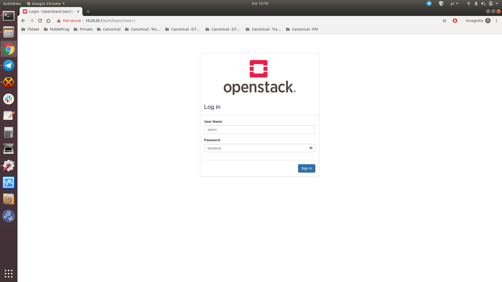
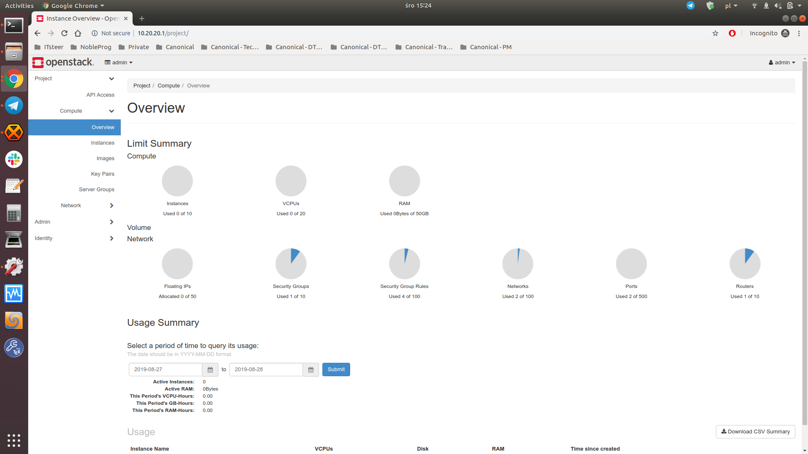
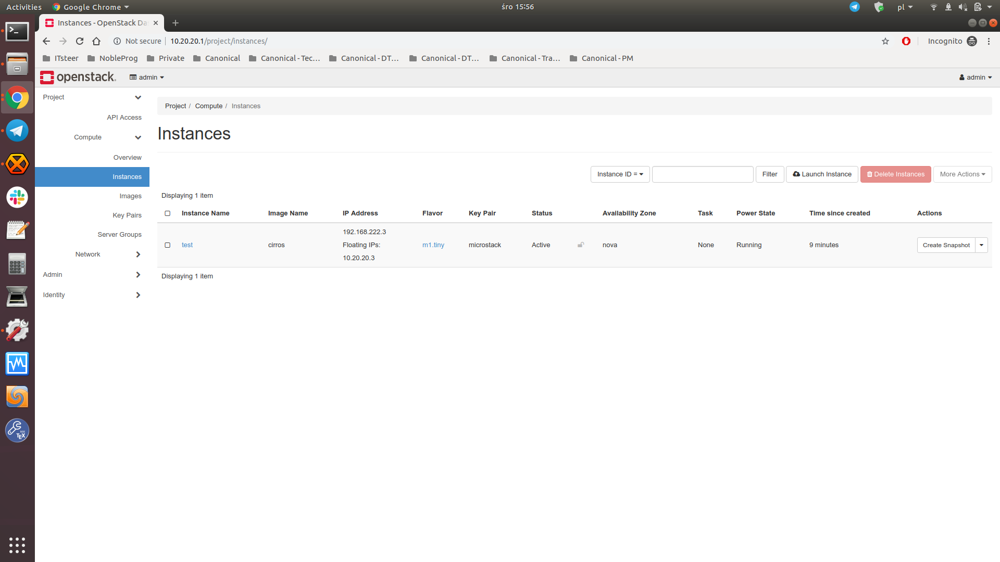

# Get started with MicroStack


## Overview

### What is OpenStack?

[OpenStack][openstack_upstream] is a cloud operating system which allows organizations to manage large pools of distributed compute, network and storage resources in a data center. It is a collection of open source projects designed to work together to form the basis of a cloud. OpenStack can be used for both private and public clouds implementation. Moreover, by applying necessary extensions, it can be turned by telecommunications providers into a fully functional NFVI (*Network Functions Virtualization Infrastructure*) platform. Governed by the OpenStack Foundation, with more than 34,000 individual contributors and over 550 companies that participate in the project, OpenStack is a *de facto* standard for the cloud implementation.

### What is MicroStack?

[MicroStack][microstack] is an upstream single-node OpenStack deployment which can run directly on your workstation. Although made for developers, it is also suitable for edge, IoT and appliances. MicroStack is an OpenStack in a [snap][snapcraft] which means that all OpenStack services and supporting libraries are packaged together in a single package which can be easily installed, upgraded or removed. MicroStack includes all key OpenStack components: Keystone, Nova, Neutron, Glance, Cinder, and is evolving extremally fast. You can use it for development, prototyping and testing, but it is also perfectly suitable for the network edge, IoT and appliances. Do not wait anymore - grab MicroStack from the Snap Store and get your OpenStack running right away!

### In this tutorial you will learn how to:

- Get your OpenStack cluster up and running with MicroStack
- Interact with OpenStack via the web GUI and CLI
- Launch your first VM on OpenStack and access it

### You will need:

* A machine with Linux, a multi-core processor and at least 16 GB of RAM


## Install MicroStack

Duration: 5:00

If you are using Ubuntu, which we highly recommend, you can install MicroStack righ away by running the following command from the terminal:

```bash
sudo snap install microstack --classic --beta
```

However, if you are using some legacy Ubuntu version or other Linux distribution, you have to install *snapd* firt. Refer to [snapd documentation][snapcraft_snapd] for more information on installing *snapd* on your Linux.

If the installation process has finished successfully, you should see the following message on the terminal:

```bash
microstack (beta) rocky from Canonical✓ installed
```

Note that at the time of writing this tutorial, the installed version of OpenStack was Rocky.

TODO:
```
Elaborate more on channels once clarified by the MicroStack team (See my comment on the "Install MicroStack" section at https://docs.google.com/document/d/1-QO5zAclj469qGvFmNJBjQ_qqI_T_uliwj6mAo8ZbCs/edit#)
```


## Initialize MicroStack

Duration: 1:00

Before using your OpenStack installation, it has to be initialized, so that networks and databases get configured. In order to do it run:

```bash
sudo microstack.init
```

TODO:
```
The above command doesn't work for me. I've reported a bug at https://bugs.launchpad.net/microstack/+bug/1841773 .
```

As simple as it is. Your OpenStack installation is ready for being used.


## Interact with OpenStack

Duration: 4:00

### via web GUI

To interact with your OpenStack via the web GUI visit <http://10.20.20.1/> and login with the following credentials:

```bash
username: admin
password: keystone
```

Type the credentials and press the "Sign In" button:



If everything goes right you should see the landing page:



You can now start playing with your OpenStack installation (i.e. create additional users, launch instances, etc.).

### via CLI

You can also interact with your OpenStack via the CLI by using the `microstack.openstack` command. A syntax is identical to the client delivered by the [python-openstackclient][openstack_client] package.

For example, to list available OpenStack endpoints run:

```bash
microstack.openstack catalog list
```

This should result with an output like:

```bash
+-----------+-----------+-----------------------------------------+
| Name      | Type      | Endpoints                               |
+-----------+-----------+-----------------------------------------+
| neutron   | network   | microstack                              |
|           |           |   public: http://10.20.20.1:9696        |
|           |           | microstack                              |
|           |           |   admin: http://10.20.20.1:9696         |
|           |           | microstack                              |
|           |           |   internal: http://10.20.20.1:9696      |
|           |           |                                         |
| keystone  | identity  | microstack                              |
|           |           |   public: http://10.20.20.1:5000/v3/    |
|           |           | microstack                              |
|           |           |   internal: http://10.20.20.1:5000/v3/  |
|           |           | microstack                              |
|           |           |   admin: http://10.20.20.1:5000/v3/     |
|           |           |                                         |
| glance    | image     | microstack                              |
|           |           |   admin: http://10.20.20.1:9292         |
|           |           | microstack                              |
|           |           |   public: http://10.20.20.1:9292        |
|           |           | microstack                              |
|           |           |   internal: http://10.20.20.1:9292      |
|           |           |                                         |
| placement | placement | microstack                              |
|           |           |   public: http://10.20.20.1:8778        |
|           |           | microstack                              |
|           |           |   admin: http://10.20.20.1:8778         |
|           |           | microstack                              |
|           |           |   internal: http://10.20.20.1:8778      |
|           |           |                                         |
| nova      | compute   | microstack                              |
|           |           |   public: http://10.20.20.1:8774/v2.1   |
|           |           | microstack                              |
|           |           |   admin: http://10.20.20.1:8774/v2.1    |
|           |           | microstack                              |
|           |           |   internal: http://10.20.20.1:8774/v2.1 |
|           |           |                                         |
+-----------+-----------+-----------------------------------------+
```

You can run `microstack.openstack --help` to get a list of available subcommands and their required syntax.


## Launch and access a VM

Duration: 9:00

### Test launch

The quickest way to launch your first OpenStack instance (or a VM) is to run the following command:

```bash
microstack.launch test
```

This should result with a lot of output from which the most import are the last two lines:

```bash
Access your server with 'ssh -i /home/guardian/.ssh/id_microstack cirros@10.20.20.3'
You can also visit the openstack dashboard at 'http://10.20.20.1/'
```

Note that the IP address of the instance may be different in your environment. In order to connect to the instance run the command from the output:

```bash
ssh -i /home/guardian/.ssh/id_microstack cirros@10.20.20.3
```

You are now connected to your first instance on your OpenStack cluster. You can start playing with it by executing various commands, for example:

```bash
$ uptime
 14:51:42 up 4 min,  1 users,  load average: 0.00, 0.00, 0.00
```

In order to disconnect from the instance type `exit`.

You can also view the instance from the web GUI. Go to http://10.20.20.1/ and click on the "Instances" tab on the left:



### More advanced launch

It has been said that the `microstack.openstack` command provides the same functionality as the upstream OpenStack client. This means you can use the same commands as on any other OpenStack installation. This is extremally useful, if you are migrating your workloads and scripts from other OpenStack platform.

MicroStack comes preconfigured with networking and images so can get starting using OpenStack as soon as MicroStack is installed. To launch a custom instance run:

```bash
microstack.openstack server create --flavor m1.small --key-name microstack --nic net-id=test --image cirros my-microstack-server
```

This will launch an instance called *my-microstack-server* from the *cirros* image of the *m1.small* flavour, use *microstack* key pair when building the instance, and attach it to the *test* network. You can obviously import other images and create your own networks and flavors, however.

To access the instance, you will need to assign it a floating IP address:

```bash
ALLOCATED_FIP=`microstack.openstack floating ip create -f value -c floating_ip_address external`
microstack.openstack server add floating ip my-microstack-server $ALLOCATED_FIP
```

And as you would expect, MicroStack is just like any other OpenStack and does not allow ingress access to the instance by default, so next enable SSH and ping access to the instance:

```bash
SECGROUP_ID=`microstack.openstack security group list --project admin -f value -c ID`
microstack.openstack security group rule create $SECGROUP_ID --proto tcp --remote-ip 0.0.0.0/0 --dst-port 22
microstack.openstack security group rule create $SECGROUP_ID --proto icmp --remote-ip 0.0.0.0/0
```

positive
: Some of these commands may fail, if you have followed the *Test launch* section.

Once this is complete you should be able to SSH to the instance:

```bash
ssh -i /home/guardian/.ssh/id_microstack cirros@$ALLOCATED_FIP
```


## That’s all folks!

Duration: 1:00

Congratulations! You have made it!

You may wish to temporarily shutdown your MicroStack installation when not in use without un-installing it. In order to do it run:

```bash
sudo snap disable microstack
```

To re-enable it run:

```bash
sudo snap enable microstack
```

### Where to go from here?

* Learn more about [MicroStack][microstack]
* Tell us what you think and [report a bug or fill in a feature request][microstack_bugs]
* Liked the snaps? Try [MicroK8s][microk8s]
* Discover OpenStack opportunities with [Canonical][openstack_canonical]
* Try [Charmed OpenStack][openstack_charmed]
* Contact [us][contact]


<!-- LINKS -->
[contact]: https://ubuntu.com/contact-us/form?product=generic-contact-us
[microk8s]: https://microk8s.io/
[microstack]: https://microstack.io/
[microstack_bugs]: https://bugs.launchpad.net/microstack/+filebug
[openstack_canonical]: https://ubuntu.com/openstack/
[openstack_charmed]: https://jaas.ai/openstack-base/bundle/
[openstack_client]: https://docs.openstack.org/python-openstackclient/latest/cli/command-list.html
[openstack_upstream]: https://www.openstack.org/
[snapcraft]: https://snapcraft.io/
[snapcraft_snapd]: https://snapcraft.io/docs/installing-snapd
