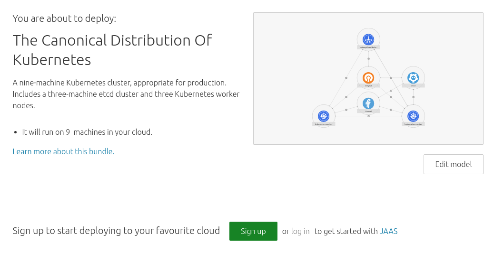

# Get started with Canonical Kubernetes

## Overview
Duration: 1:00

[Kubernetes][kubernetes] fuses the automatic deployment, scaling and management of containerised applications into a single platform. It's open source and rapidly growing in capabilities, reputation and influence.

The [Canonical Distribution of Kubernetes][canonicalkubernetes] packages Canonical's operational expertise alongside the same upstream binaries as Kubernetes, making it easily re-deployable across public clouds (AWS, GCE and Azure, Rackspace), private infrastructure (OpenStack, VMware), and even bare metal - from your laptop to the lab.

### About the Canonical Distribution of Kubernetes

To substantiate these claims, we're going to build a highly available (HA) production ready Kubernetes cluster — with 2 masters, 3 workers, 3 etcd nodes and a load balancer for the HA control plane. It includes logging, monitoring, scaling and the operational tools to automate deployment and lifecycle management of your cluster.

### In this tutorial you’ll learn how to...

- Get your Kubernetes cluster up and running
- Open the K8s dashboard
- Control your cluster from the kubectl CLI client
- Deploy your first container workload
- Add extra features to your Kubernetes cluster

### You will need...

* An [Ubuntu One account][ubuntuone]
* An SSH key. [More on using SSH keys in Juju][sshkey].
* Credentials for either [AWS][aws], [GCE][gce] or [Azure][azure]

## Deploying with JAAS
Duration: 8:00

To kick off, **[open a Canonical distribution of Kubernetes][charmstorek8s]**.

Deployment is via [JAAS][jaas], and you will need to login or create your JAAS account. [Add your credentials][jaascreds] if you've not done so before. Deployment will then take several minutes as Juju creates new instances in the cloud and sets up the Kubernetes cluster components. Pending units are outlined in *orange*. Up and running ones are outlined in *black*.

## Getting started
Duration: 3:00

### Install the Juju client

**You will need to have Juju installed locally to operate your cluster. Skip this step if you already have it.**

Juju is available as a client on many platforms and distributions. To get the latest version of Juju on **macOS**, **Windows** or **CentOS** see the [install docs][jujuinstall].

If you are running **Ubuntu**, you can install Juju through the following steps:

1. First, install Snappy, if you don't have it already:
`sudo apt install snapd`
1. Install Juju to get the command line client:
`sudo snap install juju --classic`
1. Verify you can run Juju. You will see a summary and a list of common commands:
`juju`

Learn more about [getting started with Juju][jujustarted].

### Operate your cluster with kubectl

To deploy and manage applications on Kubernetes you need *kubectl*. Learn more by visiting the [official documentation][kubectl].

1. For **Ubuntu** users, install the [kubectl command line][kubectlinstall]:
`sudo snap install kubectl --classic`
If you are running **macOS**:
`brew install kubectl`
For **Windows** users, use [Chocolatey][chocolatey]:
`choco install kubectl`
For distros with [snap][snapcraft] support (including **Debian, Fedora and OpenSUSE**):
`sudo snap install kubectl --classic`
For **CentOS and other Linuxes**, see [installing kubectl via curl][kubecurl].
1. Verify you can run kubectl. You will see a list of commands to control your cluster.
`kubectl`

## Operating your Kubernetes cluster
Duration: 7:00

To operate your cluster with kubectl you need to download the configuration needed to speak to your cluster. The first step to getting the config is to make sure you have an SSH key in your JAAS deployment of your cluster.

1. To connect to JAAS from the command line you'll need to register with the JAAS controller. You’ll only need to do this the first time:
`juju register jimm.jujucharms.com`
1. This command will open a new window in your browser. Use Ubuntu SSO to login and authorise your account
1. You will then be asked to enter a descriptive name for the JAAS controller.  We suggest using *jaas*
1. You can now import you SSH key from Launchpad or Github into your cluster - if you didn't add it earlier. For instance, a user with the Github username 'ghuser' would use the following command:
`juju import-ssh-key gh:ghuser`
1. Verify your SSH key is working by running the date command on the first machine:
`juju run --machine 0 -- date`
With SSH operating properly you can now setup *kubectl*.
1. Fetch the credentials from the Kubernetes Master charm:
Make a directory:
`mkdir -p ~/.kube`
and then copy the config file:
`juju scp kubernetes-master/0:config ~/.kube/config`
This might open a separate modal window, in which you should enter the passphrase for your SSH key you added in step 4

1. Establish a secure proxy to the Kubernetes apiserver with the command:
`kubectl proxy`

1. Navigate to the Kubernetes dashboard UI through the proxy **http://xxx.xxx.xxx.xxx:8001/ui**. Note the trailing `/ui`.

_**Note**: The browser may warn you that the connection is not private or secure. Bypass the warnings (via the ‘Advanced’) option. The browser will then ask you to login. The default username and password are both **admin**._

1. You can now use the Kubernetes Dashboard to drive your cluster

## Running your first workload
Duration: 10:00

Spin up a simple static website in your Kubernetes cluster.

1. You can run a Juju action to create an example microbot web application, deploying 5 replicas inside the Kubernetes cluster:
`juju run-action kubernetes-worker/0 microbot replicas=5`
1. This action creates a deployment titled *microbots* comprised of 5 replicas defined during the run of the action. It also creates a service named *microbots* which binds an *endpoint*, using all 5 of the microbots pods. Finally, it will create an ingress resource, which points at a **xip.io** domain to simulate a proper DNS service
1. To see the result of this action, run:
 `juju show-action-output [id above]`
You should get a similar response to:

_**Note**: Your FQDN will be different and contains the address of the cloud instance._

1. Copy and paste the microbot address into your web browser: **microbot.xxx.xxx.xxx.xip.io**. It’s normal to see a 502/ 503 error during initial application turnup

1. You've successfully connected to a microbot container! Within a few seconds your microbot example application will be online, and load balanced across the 5 pods running the microbot application. Refresh and the hostname at the bottom should change with each request

To learn more about this, go to the *Running the packaged example* section in the [bundle details][canonicalkubernetes].

## That’s all folks!
Duration: 1:00

Congratulations! You’ve made it!

By now you should have your Kubernetes cluster up and running.

### Next steps

Now that you have your production cluster, you can put it to work:

* [The easy way to commoditise GPUs for Kubernetes][kubegpu]
* [Build a transcoding platform in minutes][kubetransform]
* [Transform your solution into a private PaaS][kubepaas]

### Further reading

* Learn more about the [Canonical Distribution of Kubernetes][canonicalkubernetes] bundle
* Discover [Kubernetes][cankube]
* Get involved and connect with the [Kubernetes community][kubecommunity]

<!-- LINKS -->
[sshkey]: https://jujucharms.com/docs/2.1/users-auth#credentials-and-ssh-keys
[ubuntuone]: https://login.ubuntu.com/
[canonicalkubernetes]: https://jujucharms.com/canonical-kubernetes
[kubernetes]: https://kubernetes.io/
[aws]: https://aws.amazon.com/
[gce]: https://cloud.google.com/compute/
[azure]: https://azure.microsoft.com
[charmstorek8s]: https://jujucharms.com/new/?dd=cs:bundle/canonical-kubernetes
[jaas]: https://jujucharms.com/jaas
[jaascreds]: https://jujucharms.com/docs/stable/getting-started#prepare-your-cloud-credentials
[jujuinstall]: https://jujucharms.com/docs/stable/reference-install#getting-the-latest-juju
[jujustarted]: https://jujucharms.com/docs/stable/getting-started
[kubectl]: https://kubernetes.io/docs/user-guide/kubectl/
[kubectlinstall]: https://kubernetes.io/docs/tasks/tools/install-kubectl/
[chocolatey]: https://chocolatey.org/install
[kubegpu]: https://medium.com/intuitionmachine/how-we-commoditized-gpus-for-kubernetes-7131f3e9231f
[kubetransform]: https://github.com/deis/workflow
[kubepaas]: https://insights.ubuntu.com/2017/03/27/job-concurrency-in-kubernetes-lxd-cpu-pinning-to-the-rescue/
[cankube]: https://jujucharms.com/kubernetes
[kubecommunity]: https://kubernetes.io/community/
[snapcraft]: https://snapcraft.io/
[kubecurl]: https://kubernetes.io/docs/tasks/tools/install-kubectl/#install-kubectl-binary-via-curl
