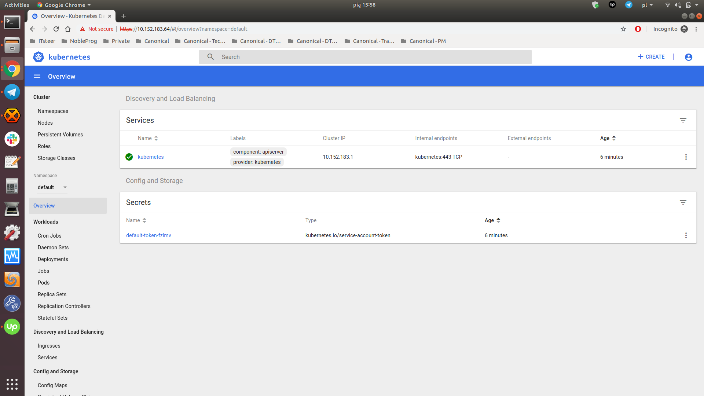
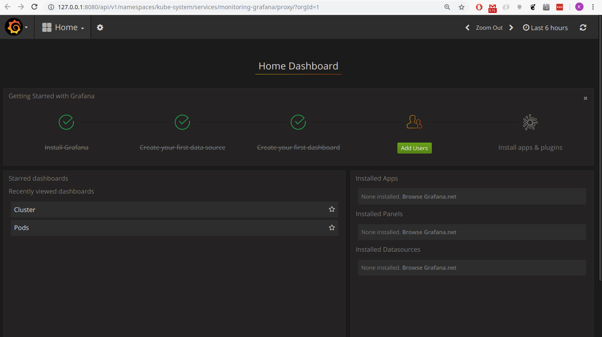
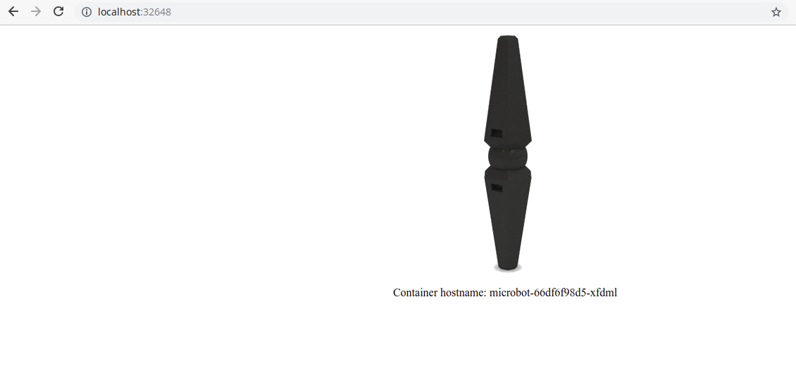

# Install a local Kubernetes with microk8s

## Overview

### What is Kubernetes

[Kubernetes][kubernetes] clusters host containerised applications in a reliable and scalable way. Having devops in mind, Kubernetes makes maintenance tasks such as upgrades dead simple.


### What is microk8s

[Microk8s][microk8s] is a [CNCF certified][cncf-cert] upstream Kubernetes deployment that runs entirely in your workstation. Being a [snap][snap] it runs all Kubernetes services natively (i.e. no virtual machines) while packing the entire set of libraries and binaries needed. Installation is limited by how fast you can download a couple of hundred megabytes and the removal of microk8s leaves nothing behind.

### In this tutorial you’ll learn how to...

- Get your Kubernetes cluster up and running
- Enable core Kubernetes addons such as dns and dashboard
- Control your cluster from the kubectl CLI client
- Deploy your first container workload

### You will only need ...

* A machine with Ubuntu


## Deploying microk8s
Duration: 3:00

The quickest way to get started is to install microk8s directly from the [snap store][microk8s-snap] by clicking the "Install" button.
 
Using the command line, we can install microk8s and let it update to the latest stable upstream Kubernetes release with:

```bash
sudo snap install microk8s --classic
```

[Microk8s][microk8s] is a snap and as such it is frequently updated to each release of Kubernetes. To follow a specific upstream release series we can select a [channel][snap-channels] during installation. For example, to follow the v1.12 series:

```bash
sudo snap install microk8s --classic --channel=1.12/stable
```

Channels are made up of a track and an expected level of microk8s' stability. Try `snap info microk8s` to see what versions are currently published. At the time of this writing we have:
```bash
channels:
  stable:         v1.12.2  (266) 224MB classic
  candidate:      v1.12.2  (266) 224MB classic
  beta:           v1.12.2  (266) 224MB classic
  edge:           v1.12.2  (309) 224MB classic
  1.12/stable:    v1.12.2  (267) 224MB classic
  1.12/candidate: v1.12.2  (267) 224MB classic
  1.12/beta:      v1.12.2  (267) 224MB classic
  1.12/edge:      v1.12.2  (310) 224MB classic
  1.11/stable:    v1.11.4  (255) 219MB classic
  1.11/candidate: v1.11.4  (255) 219MB classic
  1.11/beta:      v1.11.4  (255) 219MB classic
  1.11/edge:      v1.11.4  (292) 219MB classic
  1.10/stable:    v1.10.9  (245) 175MB classic
  1.10/candidate: v1.10.10 (285) 175MB classic
  1.10/beta:      v1.10.10 (285) 175MB classic
  1.10/edge:      v1.10.10 (291) 175MB classic

```


positive
: You may need to configure your firewall to allow pod-to-pod and pod-to-internet communication:
```
sudo ufw allow in on cbr0 && sudo ufw allow out on cbr0
sudo ufw default allow routed
```


## Enable addons
Duration: 2:00

By default we get a barebones upstream Kubernetes. Additional services such as kube-dns and dashboard can be run using the `microk8s.enable` command:
```bash
microk8s.enable dns dashboard
```

These addons can be disabled at anytime using the disable command
```bash
microk8s.disable dashboard dns
```

With `microk8s.status` you can see the list of available addons and the ones currently enabled.

### List of the most important addons
 - dns: Deploy kube dns. This addon may be required by others thus we recommend you always enable it.
 - dashboard: Deploy kubernetes dashboard as well as grafana and influxdb.
 - storage: Create a default storage class. This storage class makes use of the hostpath-provisioner pointing to a directory on the host.
 - ingress: Create an ingress controller.
 - gpu: Expose GPU(s) to microk8s by enabling the nvidia-docker runtime and nvidia-device-plugin-daemonset. Requires NVIDIA drivers to be already installed on the host system.
 - istio: Deploy the core Istio services. You can use the `microk8s.istioctl` command to manage your deployments.
 - registry: Deploy a docker private registry and expose it on localhost:32000. The storage addon will be enabled as part of this addon.


## Accessing the Kubernetes and grafana dashboards
Duration: 8:00

Now that we have enabled the dns and dashboard addons we can access the available dashboard. To do so we first check the deployment progress of our addons with `microk8s.kubectl get all --all-namespaces`. It only takes a few minutes to get all pods in the "Running" state:
```
> microk8s.kubectl get all --all-namespaces
NAMESPACE     NAME                                                  READY   STATUS    RESTARTS   AGE
kube-system   pod/heapster-v1.5.2-5995dc5b8c-q6zlj                  4/4     Running   0          29s
kube-system   pod/kube-dns-67b548dcff-qrqrv                         3/3     Running   0          54s
kube-system   pod/kubernetes-dashboard-67d4c89764-6vnwq             1/1     Running   0          49s
kube-system   pod/monitoring-influxdb-grafana-v4-8467db6558-7s7kq   2/2     Running   0          49s

NAMESPACE     NAME                           TYPE        CLUSTER-IP       EXTERNAL-IP   PORT(S)             AGE
default       service/kubernetes             ClusterIP   10.152.183.1     <none>        443/TCP             2m  
kube-system   service/heapster               ClusterIP   10.152.183.89    <none>        80/TCP              49s
kube-system   service/kube-dns               ClusterIP   10.152.183.10    <none>        53/UDP,53/TCP       54s
kube-system   service/kubernetes-dashboard   ClusterIP   10.152.183.149   <none>        443/TCP             49s
kube-system   service/monitoring-grafana     ClusterIP   10.152.183.54    <none>        80/TCP              49s
kube-system   service/monitoring-influxdb    ClusterIP   10.152.183.163   <none>        8083/TCP,8086/TCP   49s

NAMESPACE     NAME                                             DESIRED   CURRENT   UP-TO-DATE   AVAILABLE   AGE
kube-system   deployment.apps/heapster-v1.5.2                  1         1         1            1           49s
kube-system   deployment.apps/kube-dns                         1         1         1            1           54s
kube-system   deployment.apps/kubernetes-dashboard             1         1         1            1           49s
kube-system   deployment.apps/monitoring-influxdb-grafana-v4   1         1         1            1           49s

NAMESPACE     NAME                                                        DESIRED   CURRENT   READY   AGE
kube-system   replicaset.apps/heapster-v1.5.2-5995dc5b8c                  1         1         1       29s
kube-system   replicaset.apps/heapster-v1.5.2-7864d77c47                  0         0         0       37s
kube-system   replicaset.apps/heapster-v1.5.2-dd4fd4c49                   0         0         0       49s
kube-system   replicaset.apps/kube-dns-67b548dcff                         1         1         1       54s
kube-system   replicaset.apps/kubernetes-dashboard-67d4c89764             1         1         1       49s
kube-system   replicaset.apps/monitoring-influxdb-grafana-v4-8467db6558   1         1         1       49s
```

### Kubernetes dashboard

As we see above the kubernetes-dashboard service in the kube-system namespace has a ClusterIP of `10.152.183.149` and listens on `443`. The ClusterIP is randomly assigned so if you follow these steps on your host, make sure you check the IP you got. Point your browser to `https://10.152.183.149:443` and you will see the kubernetes dashboard UI.



### Grafana dashboard

Let's use an alternative approach to access hosted services. The API server proxies our services, here is how to get to them:
```bash
> microk8s.kubectl cluster-info
Kubernetes master is running at http://127.0.0.1:8080
Heapster is running at http://127.0.0.1:8080/api/v1/namespaces/kube-system/services/heapster/proxy
KubeDNS is running at http://127.0.0.1:8080/api/v1/namespaces/kube-system/services/kube-dns:dns/proxy
Grafana is running at http://127.0.0.1:8080/api/v1/namespaces/kube-system/services/monitoring-grafana/proxy
InfluxDB is running at http://127.0.0.1:8080/api/v1/namespaces/kube-system/services/monitoring-influxdb:http/proxy
```

We only need to point our browser to (http://127.0.0.1:8080/api/v1/namespaces/kube-system/services/monitoring-grafana/proxy)




## Host your first service in Kubernetes
Duration: 7:00

We start by creating a microbot deployment with two pods via the kubectl cli:
```bash
microk8s.kubectl run microbot --image=dontrebootme/microbot:v1 --replicas=2
```

To expose our deployment we need to create a service:
```bash
microk8s.kubectl expose deployment microbot --type=NodePort --port=80 --name=microbot-service
```

After a few minutes our cluster looks like this:
```
> microk8s.kubectl get all --all-namespaces
NAMESPACE     NAME                                                  READY   STATUS    RESTARTS   AGE
default       pod/microbot-66df6f98d5-l5z8c                         1/1     Running   0          12m
default       pod/microbot-66df6f98d5-xfdml                         1/1     Running   0          12m
kube-system   pod/heapster-v1.5.2-5995dc5b8c-q6zlj                  4/4     Running   4          51m
kube-system   pod/kube-dns-67b548dcff-qrqrv                         3/3     Running   6          51m
kube-system   pod/kubernetes-dashboard-67d4c89764-6vnwq             1/1     Running   1          51m
kube-system   pod/monitoring-influxdb-grafana-v4-8467db6558-7s7kq   2/2     Running   3          51m

NAMESPACE     NAME                           TYPE        CLUSTER-IP       EXTERNAL-IP   PORT(S)             AGE
default       service/kubernetes             ClusterIP   10.152.183.1     <none>        443/TCP             53m
default       service/microbot-service       NodePort    10.152.183.110   <none>        80:32648/TCP        12m
kube-system   service/heapster               ClusterIP   10.152.183.89    <none>        80/TCP              51m
kube-system   service/kube-dns               ClusterIP   10.152.183.10    <none>        53/UDP,53/TCP       51m
kube-system   service/kubernetes-dashboard   ClusterIP   10.152.183.149   <none>        443/TCP             51m
kube-system   service/monitoring-grafana     ClusterIP   10.152.183.54    <none>        80/TCP              51m
kube-system   service/monitoring-influxdb    ClusterIP   10.152.183.163   <none>        8083/TCP,8086/TCP   51m

NAMESPACE     NAME                                             DESIRED   CURRENT   UP-TO-DATE   AVAILABLE   AGE
default       deployment.apps/microbot                         2         2         2            2           12m
kube-system   deployment.apps/heapster-v1.5.2                  1         1         1            1           51m
kube-system   deployment.apps/kube-dns                         1         1         1            1           51m
kube-system   deployment.apps/kubernetes-dashboard             1         1         1            1           51m
kube-system   deployment.apps/monitoring-influxdb-grafana-v4   1         1         1            1           51m

NAMESPACE     NAME                                                        DESIRED   CURRENT   READY   AGE
default       replicaset.apps/microbot-66df6f98d5                         2         2         2       12m
kube-system   replicaset.apps/heapster-v1.5.2-5995dc5b8c                  1         1         1       51m
kube-system   replicaset.apps/heapster-v1.5.2-7864d77c47                  0         0         0       51m
kube-system   replicaset.apps/heapster-v1.5.2-dd4fd4c49                   0         0         0       51m
kube-system   replicaset.apps/kube-dns-67b548dcff                         1         1         1       51m
kube-system   replicaset.apps/kubernetes-dashboard-67d4c89764             1         1         1       51m
kube-system   replicaset.apps/monitoring-influxdb-grafana-v4-8467db6558   1         1         1       51m
```

At the very top we have the microbot pods, `service/microbot-service` is the second in the services list. Our service has a ClusterIP through which we can access it. Notice however that our service is of type [NodePort][nodeport]. This means that our deployment is also available on a port on the host machine; that port is randomly selected and in this case it happens to be `32648`. All we need to do is to point our browser to `http://localhost:32648`.




## Integrated commands
Duration: 5:00

There are many commands that ship with microk8s. We've only seen the essential ones in this tutorial. Explore the others at your own convenience:

 - microk8s.status: Provides an overview of the microk8s state (running/not running) as well as the set of enabled addons
 - microk8s.enable: Enables an addon
 - microk8s.disable: Disables an addon
 - microk8s.kubectl: Interact with kubernetes
 - microk8s.config: Shows the kubernetes config file
 - microk8s.istioctl: Interact with the istio services. Needs the istio addon to be enabled
 - microk8s.inspect: Performs a quick inspectio of the microk8s intallation. Offers hints on what 
 - microk8s.reset: Resets the infrastructure to a clean state
 - microk8s.stop: Stops all kubernetes services
 - microk8s.start: Starts microk8s after it is being stopped


## That’s all folks!
Duration: 1:00

Congratulations! You’ve made it!

Until next time, stop all microk8s services:
```bash
microk8s.stop
```

### Where to go from here?

* Learn more about [Kubernetes][k8s-docs]
* Discover [microk8s][microk8s]
* Tell us what you think and [file feature requests][microk8s-issues]


<!-- LINKS -->
[kubernetes]: https://kubernetes.io/
[k8s-docs]: https://kubernetes.io/docs/
[microk8s]: https://microk8s.io/
[microk8s-issues]: https://github.com/ubuntu/microk8s/issues/
[cncf-cert]: https://www.cncf.io/certification/software-conformance/
[snap]: https://snapcraft.io
[microk8s-snap]: https://snapcraft.io/microk8s
[nodeport]: https://kubernetes.io/docs/concepts/services-networking/service/#nodeport
[snap-channels]: https://docs.snapcraft.io/channels/551
