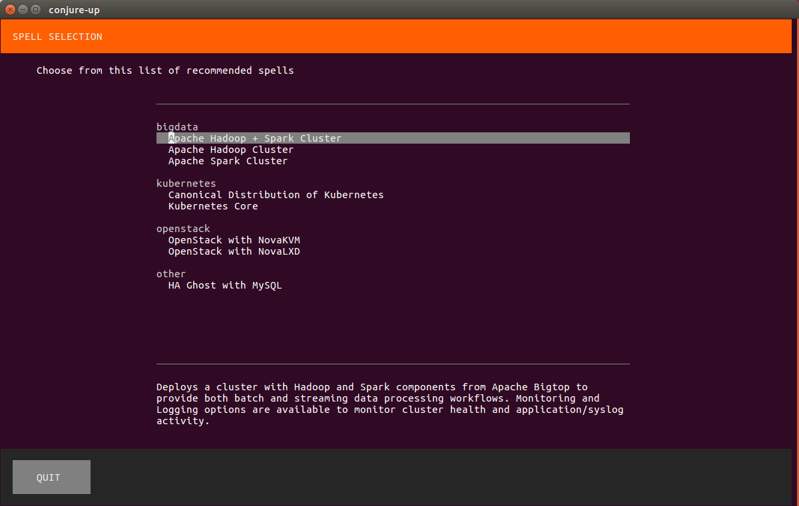
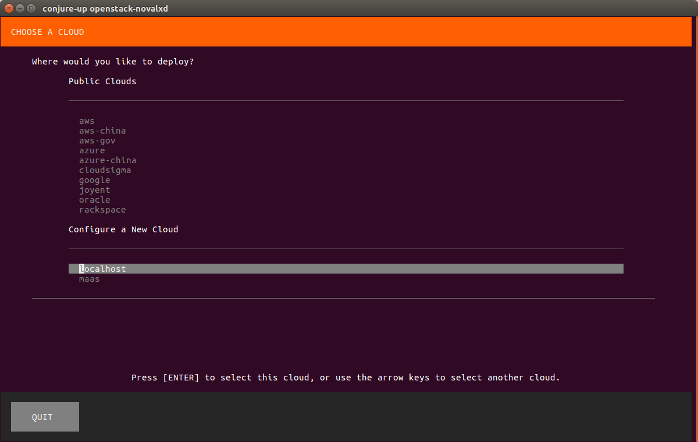
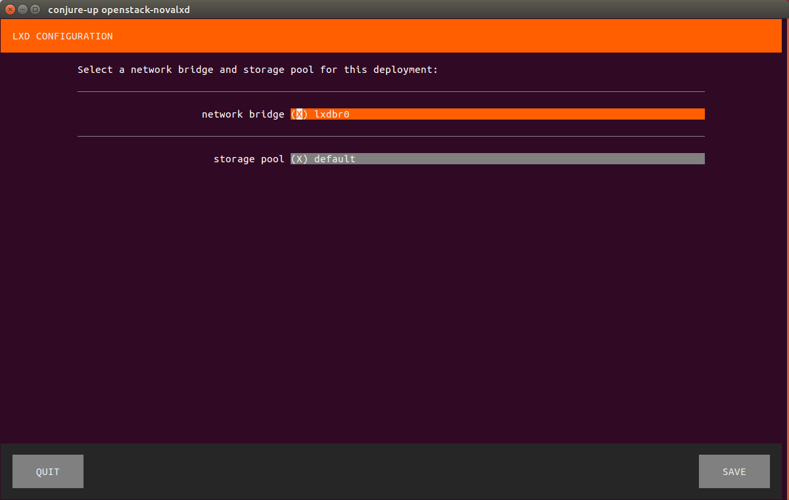
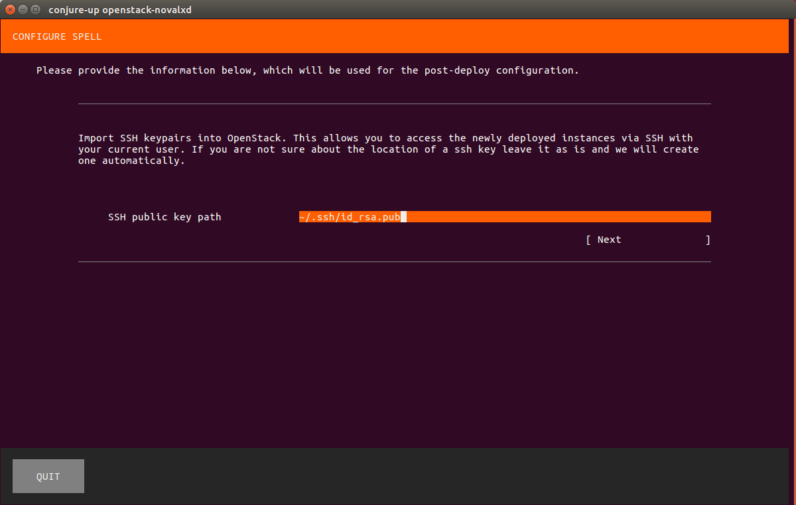
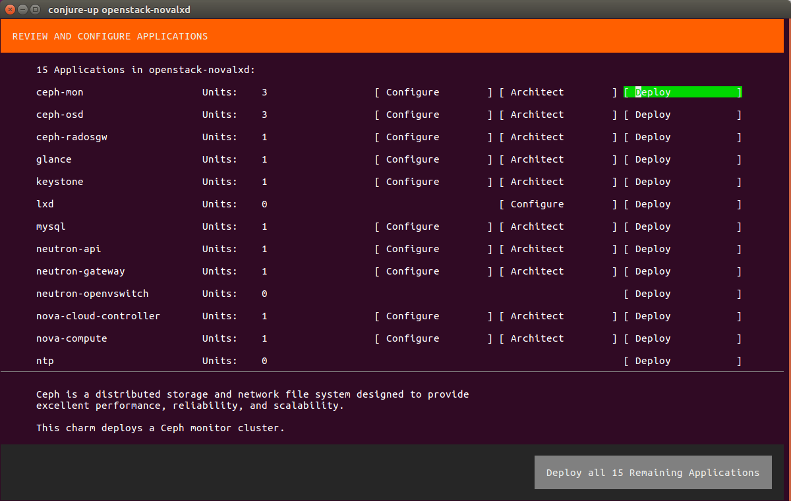
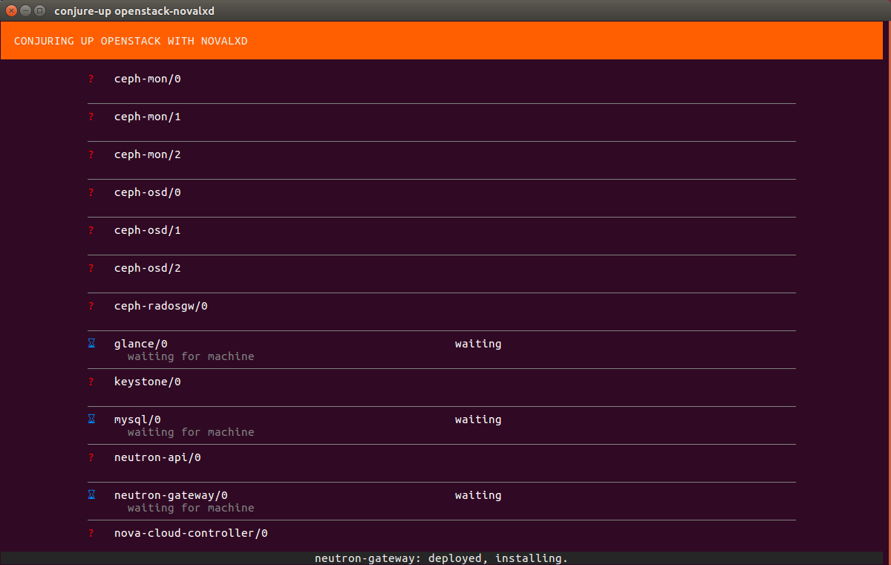
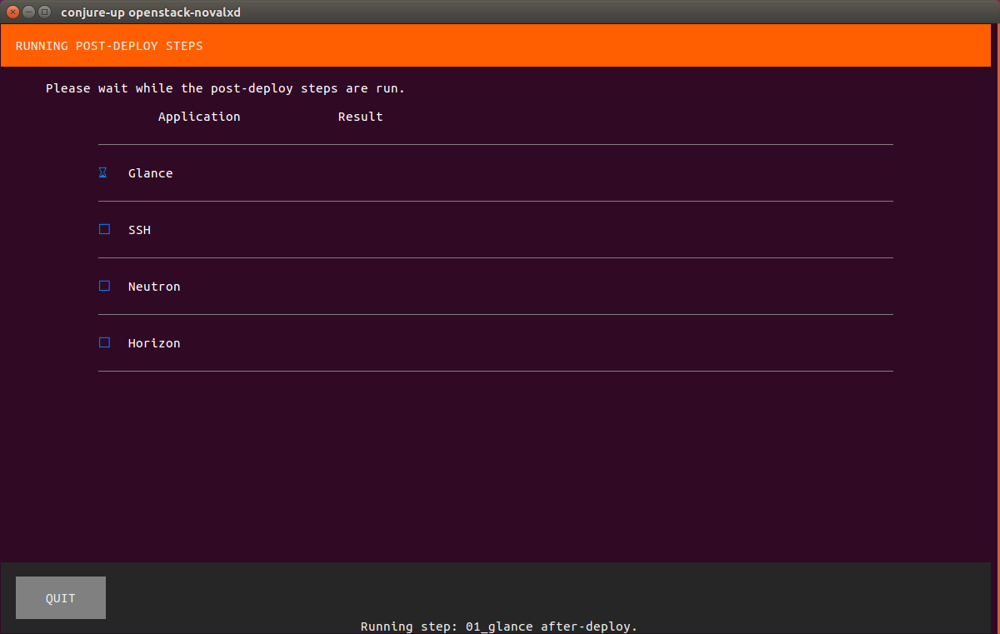
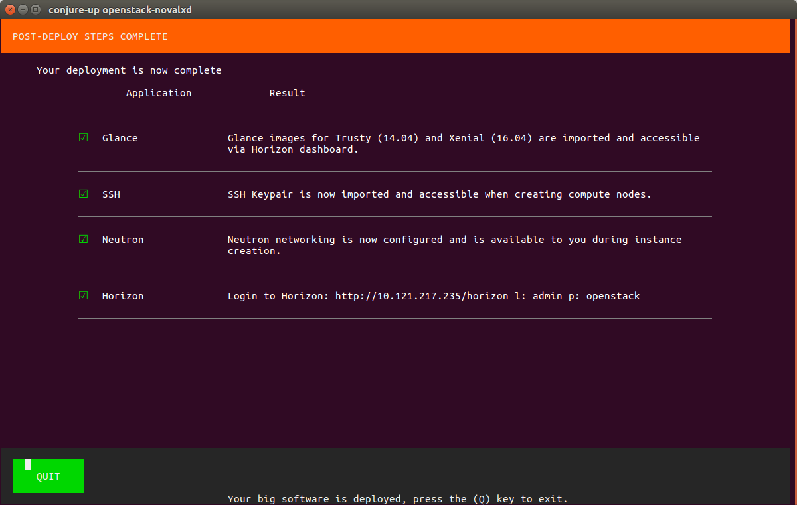
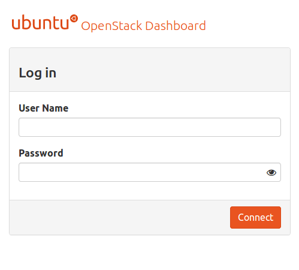
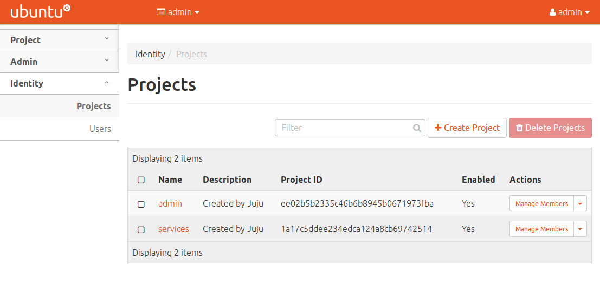

# Install single-server OpenStack with conjure-up

## Overview
Duration: 1:00

[OpenStack](https://www.openstack.org) is a very popular software stack for creating private and public clouds.

OpenStack is an advanced platform and deploying it manually may not be an easy task. Luckily, with [conjure-up](https://conjure-up.io), it's very simple and straightforward.

### What you'll learn

- How to install OpenStack on your machine with conjure-up
- How to install and configure LXD

### What you'll need

- A well-specced computer running Ubuntu 16.04 LTS with 16 gigabytes of RAM (SSD drive is strongly recommended)
- Some basic command-line knowledge
- An hour of your time

## Installing and configuring LXD
Duration: 3:00

We'll need to set up [LXD](https://linuxcontainers.org/lxd) to deploy OpenStack.

negative
: **LXD version**
conjure-up requires that the minimum version of LXD be **2.18**, so the version of LXD distributed through official repositories (which can be installed with `sudo apt install lxd`) is **not** compatible with conjure-up.

### Installing LXD

The recommended LXD installation method is to use [snaps](https://snapcraft.io). Don't worry - the snap support is included with Ubuntu 16.04 LTS and above, so we don't have to do anything.

To install LXD, open the terminal emulator and type:

```bash
sudo snap install lxd
```

### Setting up LXD

Now, we have to initialize LXD. To do it, run the following:

```bash
sudo lxd init
```

We'll be asked a few questions:

* *Do you want to configure a new storage pool?* - leave the default answer ("yes")
* *Name of the new storage pool* - leave the default answer ("default")
* *Name of the storage backend to use* - type "**dir**" (advanced users may choose another option)
* *Would you like LXD to be available over the network?* - leave the default answer ("no")
* *Would you like stale cached images to be updated automatically* - leave the default answer ("yes")
* *Would you like to create a new network bridge?* - leave the default answer ("yes")
* *What should the new bridge be called?* - leave the default answer ("lxdbr0")
* *What IPv4 address should be used?* - leave the default answer ("auto")
* *What IPv6 address should be used?* - answer "**none**" (conjure-up doesn't support IPv6)

Then, the following message should appear:

```bash
LXD has been successfully configured.
```

Now, we need to add ourselves to the "lxd" group. Execute the following commands:

```bash
sudo usermod -a -G lxd <username>
newgrp lxd
```

If you are using a proxy server, you might run into errors if you do not configure LXD specifically. To do so use the following commands:

```bash
lxc config set core.proxy_http <http proxy server>
lxc config set core.proxy_https <https proxy server>
lxc config set core.proxy_ignore_hosts <no_proxy hosts>
```

## Installing OpenStack
Duration: 45:00

Now it's time to install OpenStack. Firstly, install the conjure-up spell:

```bash
sudo snap install conjure-up --classic
```

Then, simply run:

```bash
conjure-up
```

We'll see the "Spell selection" screen:



Choose "OpenStack with NovaLXD" and press Return.

Next, select "localhost" and again press Return:



On the next screen, leave the default values and click "Save":



positive
: **Navigating inside conjure-up**
To navigate between the main content and buttons located at the bottom of the screen, use **Tab**.

Then, leave the default SSH public key path and click "Next":



After that, we'll see the "Review and configure applications" screen. We can configure and deploy individual apps there. For the purpose of this tutorial we'll deploy all of them, so choose "Deploy all 15 Remaining Applications":



Now, the Juju controller will be initialized:


Then, the installation process will begin:



It may take several minutes for the deployment to finish. **Please be patient**.

Next, the post-deploy steps will be run:



Again, please be patient and wait for the post-deploy steps to finish.

After everything has completed, we'll see the following screen:



Copy the Horizon URL to the clipboard or store it somewhere - we'll need it in a while.

## Checking if OpenStack is working
Duration: 1:00

Now, let's check if everything is working.

Open a web browser and navigate to the Horizon using the URL we copied before. We will see the following login screen:



Use **admin** as a login and **openstack** as a password. After logging in, we should see something similar to this:



## That's all!
Duration: 1:00

Congratulations, you have successfully installed OpenStack on your machine!

### Next steps

If you have a problem, we're ready to help! Check the following links:

* [Ubuntu forums](https://ubuntuforums.org)
* [Ask Ubuntu](https://askubuntu.com)

### Further reading

* To learn more about OpenStack, check the [official website](https://www.openstack.org).
* Also, you can check the [conjure-up website](https://conjure-up.io) to learn more about it.
* There's a [video walkthrough](https://www.ubuntu.com/download/cloud/try-openstack) which covers some of the steps described here.
