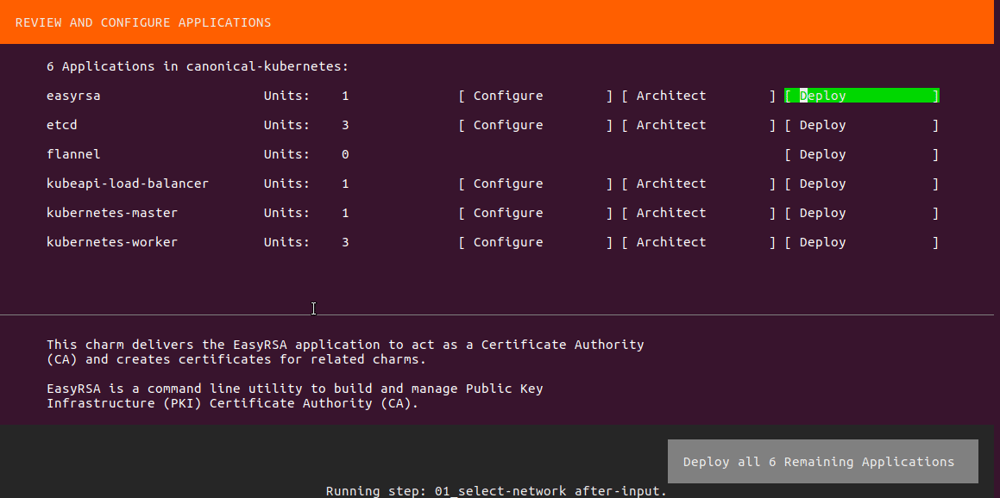
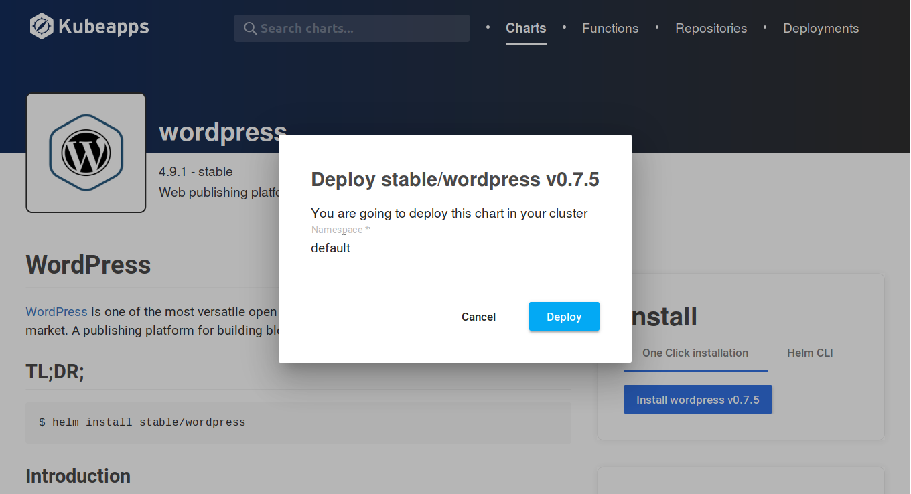

# Install Kubeapps on your Kubernetes cluster

## Overview
Duration: 1

This tutorial will guide you through the installation of Kubeapps on the Canonical Distribution of Kubernetes®*.

### Kubeapps

[Kubeapps](https://www.kubeapps.com/) is a Kubernetes dashboard that supercharges your Kubernetes cluster with simple browse and click deployment of applications. Kubeapps provides a complete application delivery environment that empowers users to launch, review and share applications.


### What you'll learn

- How to configure dynamic volume provisioning for your Kubernetes cluster on AWS
- How to supercharge your cluster with Kubeapps

### What you'll need

- A Linux system with [snapd](https://snapcraft.io/docs/core/install) installed
- Account [credentials](https://docs.aws.amazon.com/general/latest/gr/aws-sec-cred-types.html) for AWS

_* Kubernetes® is a registered trademark of The Linux Foundation in the United States and other countries, and is used pursuant to a license from The Linux Foundation_

## Create your cluster
Duration: 5:00

On your local machine, install `conjure-up` with the following command:

```bash
sudo snap install conjure-up --classic
```

Install the Canonical Distribution of Kubernetes using `conjure-up`.

```bash
conjure-up canonical-kubernetes
```

Follow the on-screen instructions to select AWS as the cloud provider and specify the AWS credentials in subsequent prompts.

To add support for dynamic volume provisioning; navigate to the **Advanced Configuration** page of the **kubernetes-master** application and set the value of the `api-extra-args` field to `admission-control=Initializers,NamespaceLifecycle,LimitRanger,ServiceAccount,ResourceQuota,DefaultTolerationSeconds,DefaultStorageClass` and trigger the deployment.



After the installation has completed, lets configure `kubectl` to talk to our cluster.

```bash
mkdir -p ~/.kube
juju scp kubernetes-master/0:config ~/.kube/config
```

positive
: The `conjure-up` command executed earlier automatically installs the `juju` snap package if the command cannot be found.

Now let's verify that we're able to communicate with our Kubernetes cluster:

```bash
kubectl cluster-info
```

If you do not have the `kubectl` command already installed, install it with:

```bash
sudo snap install kubectl --classic
```

## Setup dynamic disk provisioning
Duration: 2:00

The Canonical Distribution of Kubernetes does not define a default storage class and since we've setup our cluster on the AWS cloud, let's define a storage class named `gp2` which will dynamically provision storage for `PersistentVolumeClaim`'s from Amazon EBS.

Create a file named `gp2-storageclass.yaml` with the following content:

```yaml
apiVersion: storage.k8s.io/v1
kind: StorageClass
metadata:
  name: gp2
  annotations:
    storageclass.beta.kubernetes.io/is-default-class: "true"
provisioner: kubernetes.io/aws-ebs
parameters:
  type: gp2
reclaimPolicy: Delete
```

Next, create the storage class using the command:

```bash
kubectl create -f gp2-storageclass.yaml
```

Let's verify the storage class was created:

```bash
kubectl get storageclass
```

## Deploy kubeapps
Duration: 2:00

Use the following commands to install the Kubeapps CLI to your local Linux machine:

```bash
curl -s https://api.github.com/repos/kubeapps/kubeapps/releases/latest | grep linux | grep browser_download_url | cut -d '"' -f 4 | wget -i -
chmod +x kubeapps-linux-amd64
sudo mv kubeapps-linux-amd64 /usr/local/bin/kubeapps
```

Fasten your seatbelt! it's time we supercharge the cluster with Kubeapps.

```bash
kubeapps up
```

Kubeapps will be installed under the `kubeapps` namespace. We can check the status of the deployments using:

```bash
kubectl get pods --namespace kubeapps
```

To access the in-cluster dashboard, execute the following command:

```bash
kubeapps dashboard
```

That's it! Deploy your favorite applications and functions to your Kubernetes cluster with a single click from the Kubeapps dashboard.



### Further readings

* To learn more about Kubeapps refer to the [documentation](https://github.com/kubeapps/kubeapps/tree/master/docs)
* To learn more about The Canonical Distribution of Kubernetes refer to the documentation of the [canonical-kubernetes](https://jujucharms.com/canonical-kubernetes/bundle/132) juju charm.
