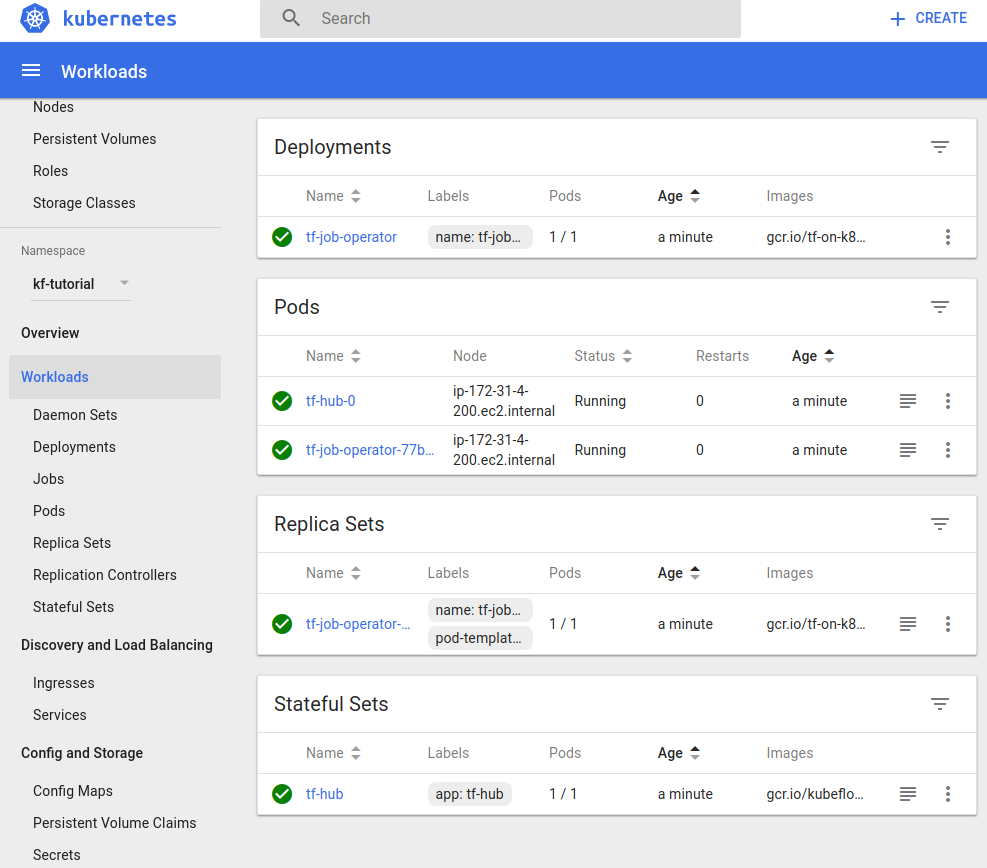
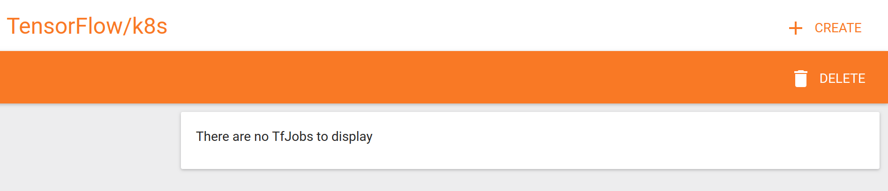
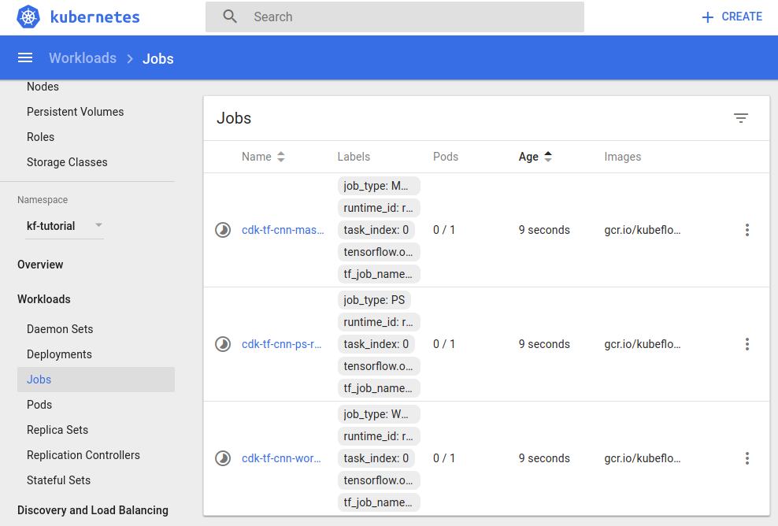

# Get started with Kubeflow

## Overview
Duration: 2:00

This tutorial will guide you through installing [Kubeflow](https://github.com/google/kubeflow) on top of either the [Canonical Distribution of Kubernetes (CDK)](https://www.ubuntu.com/kubernetes), using conjure-up and Amazon AWS, or the [Google Kubernetes Engine (GKE)](https://cloud.google.com/kubernetes-engine).

Both CDK and GKE will then use [ksonnet](https://github.com/ksonnet/ksonnet) - a framework to manage Kubernetes application manifests - to deploy Kubeflow. We will also learn how to prepare your cluster and offer pointers on how GPU-enabled Kubernetes worker nodes can be provisioned.

### Kubeflow

Kubeflow is an open source project dedicated to providing easy to use Machine Learning (ML) resources on top of a Kubernetes cluster. Most prominently, Kubeflow eases the installation of [TensorFlow](https://www.tensorflow.org/) and provides the mechanisms for leveraging GPUs attached to the underlying host in the execution of ML jobs submitted to it.

### What you'll learn

- how to create CDK and GKE custers
- how to install Kubeflow using ksonnet
- how to run your first job on Kubeflow

### What you'll need

For a CDK-based deployment:
- Amazon Web Services account credentials
- ability to provision [AWS EC2 P2 instances](https://aws.amazon.com/ec2/instance-types/p2/)
- general knowledge of how to [deploy Kubernetes using conjure-up](https://tutorials.ubuntu.com/tutorial/install-kubernetes-with-conjure-up)

For a GKE-based deployment:
- [Cloud SDK installed](https://cloud.google.com/sdk/downloads)
- general knowledge of how to [create and use Kubernetes on GKE](https://cloud.google.com/kubernetes-engine)

In addition to the above, [ksonnet](https://github.com/ksonnet/ksonnet) needs to be installed and ready to use.

Survey
: How will you use this tutorial?
 - Only read through it
 - Read it and complete the exercises
: What is your current level of experience?
 - Novice
 - Intermediate
 - Proficient

## Create your CDK Cluster
Duration: 8:00

Skip to the next step if you're purely interested setting up Google Kubernetes Engine.

### (Optional) Deploy a GPU-enabled Kubernetes Worker

positive
: **Using GPU resources in Kubernetes**
In order for us to provision GPU-enabled workloads such as TensorFlow on top of Kubernetes, we need to provision worker nodes in the appropriate instance type. Kubeflow is using a newer way to use GPU resources currently still requiring manual steps, so we have marked the deployment of GPU-enabled Kubernetes worker nodes as optional for now. We will update this guide as we evolve this series to show GPU acceleration.

For this tutorial, we will start with a dedicated CDK cluster to run our Machine Learning workloads on top of TensorFlow. By default, `conjure-up canonical-kubernetes` will instantiate the kubernetes-worker nodes as `m3.medium`, which is not what we need in our case.

We will therefore create a bundle snippet called `cdk-gpu-worker.yaml` with the following contents:

```yaml
services:
  "kubernetes-worker":
    charm: "cs:~containers/kubernetes-worker"
    num_units: 1
    options:
      channel: 1.8/stable
    expose: true
    constraints: "instance-type=p2.xlarge root-disk=32768"
```

This will ensure we have the right instance flavors available for our Kubernetes worker node, and enough root-disk space to hold the CUDA libraries, as well as the GPU-enabled TensorFlow container image.

Kick off the deployment of your cluster:

```bash
conjure-up --bundle-add cdk-gpu-worker.yaml canonical-kubernetes
```

You might have to add your AWS credentials in order to be able to use AWS as target cloud environment. We are using aws/us-east-1 as it has the `p2.xlarge` flavors available. Note that in order to deploy the standard CDK, you can simply leave out the bundle addition, which will give you CPU-only workers.

After the installation is complete, copy the K8s configuration file locally:

```bash
juju scp kubernetes-master/0:config ~/.kube/config
```

## Create your GKE Cluster
Duration: 8:00

Skip to the next step if you have already set up a cluster with CDK.

For GKE we first want to set a default [compute zone](https://cloud.google.com/compute/docs/regions-zones/#available) for our cluster. For example: 

```bash
gcloud config set compute/zone us-central1
```

Next we will [create a project](https://cloud.google.com/sdk/gcloud/reference/projects/create). Let's name it 'Kubeflow':

```bash
gcloud projects create kubeflow-tutorial --name="Kubeflow"
```
You might need to replace 'kubeflow-tutorial' with something unique.

Now we are ready to create our Kubernetes cluster on GKE:

```bash
gcloud config set container/use_v1_api_client false
gcloud beta container clusters create kubeflow-cluster --num-nodes 2
```

When you run through cluster creation for the first time, you will be prompted with a link to enable the [Google Kubernetes Engine API](https://cloud.google.com/kubernetes-engine/docs/reference/rest/). Enable that API and retry the cluster creation.

positive
: **Enabling Billing for new project**
Billing should be enabled for the new project you created. You can do that using the [Billing option from Google Console](https://console.cloud.google.com/billing).

We can watch the cluster coming up via:

```bash
gcloud beta container clusters describe kubeflow-cluster
```

To grab the cluster credentials, we need to set the default cluster and then fetch the credentials:

```bash
gcloud config set container/cluster kubeflow-cluster
gcloud beta container clusters get-credentials kubeflow-cluster
```

Well done! `kubectl cluster-info` should return something similar to this:

```bash
$ kubectl cluster-info
Kubernetes master is running at https://35.225.77.93
GLBCDefaultBackend is running at https://35.225.77.93/api/v1/namespaces/kube-system/services/default-http-backend:http/proxy
Heapster is running at https://35.225.77.93/api/v1/namespaces/kube-system/services/heapster/proxy
KubeDNS is running at https://35.225.77.93/api/v1/namespaces/kube-system/services/kube-dns:dns/proxy
kubernetes-dashboard is running at https://35.225.77.93/api/v1/namespaces/kube-system/services/https:kubernetes-dashboard:/proxy

To further debug and diagnose cluster problems, use 'kubectl cluster-info dump'.

```

positive
: **Using GPU resources on GKE**
GPU resources on GKE Kubernetes clusters is in alpha state. If you are interested in running GPU workloads you can setup a GPU equipped cluster with some manual steps describe in the[official GKE documentation.](https://cloud.google.com/kubernetes-engine/docs/concepts/gpus).

## Install Kubeflow using ksonnet
Duration: 3:00

Now that we have a Kubernetes cluster up and running, we will deploy Kubeflow to it. The Kubeflow project is a relatively new community spun out of the Kubernetes project and aims to make machine learning developer workflows easy.

We are going to prepare our ksonnet deployment "kf-tutorial" and add the necessary packages to it. To keep things clean and tidy, we'll also create a dedicated Kubernetes namespace, and tie that to our ksonnet deployment as an environment which we'll call "cdk".

Let's start by initializing ksonnet:

```bash
kubectl create namespace kf-tutorial
ks init kf-tutorial && cd kf-tutorial
```

Then, we create our environment:

```bash
ks env add cdk
ks registry add kubeflow github.com/google/kubeflow/tree/master/kubeflow
```

And install our apps:

```bash
ks pkg install kubeflow/core
ks pkg install kubeflow/tf-serving
ks pkg install kubeflow/tf-job
```

positive
: **ksonnet rate limit**
If you hit a "403 API rate limit of 60 still exceeded" error you will need to register with Github. Please follow the [rate limit workaround](https://github.com/ksonnet/ksonnet/blob/master/docs/troubleshooting.md#github-rate-limiting-errors).

ksonnet will pick up the configuration in our local `~/.kube/config` and prepare the environment for us. We can then proceed to apply the parameters to the prototypes and deploy the Kubeflow core components (JupyterHub and the TensorFlow job controller):

```bash
ks generate core kubeflow-core --name=kubeflow-core --namespace=kf-tutorial
```

As GKE has RBAC enabled and our user has insufficient permissions, we need to grant the *admin* role to our user with an additional command for GKE:

```bash
kubectl create clusterrolebinding default-admin --clusterrole=cluster-admin --user=your-user@acme.com
```

Finally, enter the following - replacing *cdk* with *gke* for GKE deployments:

```bash
ks apply cdk -c kubeflow-core
```

You should see some informational messages confirming the deployment. Let's look at the Kubernetes Dashboard to verify. `kubectl proxy` will proxy the dashboard and we will use the token from kube config file to login. What you see should look similar to this (note the namespace "kf-tutorial"):



Now check out the running services with the following command:

```bash
kubectl get services --namespace=kf-tutorial
```

The above will return a list of services with their external IPs. CDK users will see output similar to the following:

```no-highlight
NAME        TYPE           CLUSTER-IP       EXTERNAL-IP        PORT(S)        AGE
tf-hub-0    ClusterIP      None             <none>             8000/TCP       7m
tf-hub-lb   LoadBalancer   10.152.183.118   ace3eaaf2e457...   80:32456/TCP   6m
```

While GKE users will see output like this:

```no-highlight
NAME               TYPE        CLUSTER-IP      EXTERNAL-IP   PORT(S)    AGE
ambassador         ClusterIP   10.27.245.20    <none>        80/TCP     18m
ambassador-admin   ClusterIP   10.27.249.255   <none>        8877/TCP   13m
k8s-dashboard      ClusterIP   10.27.253.174   <none>        443/TCP    13m
tf-hub-0           ClusterIP   None            <none>        80/TCP     18m
tf-job-dashboard   ClusterIP   10.27.247.218   <none>        80/TCP     13m
```

If GKE users would like to access *tf-job-dashboard*, expose it using a Loadbalancer:

```bash
kubectl expose deployment tf-job-dashboard --type=LoadBalancer --name=lb-tf-job-dashboard -n kf-tutorial
```

Wait until GKE appoints an `EXTERNAL-IP` to your service and visit port 8080. You should see that you do not have any jobs running:



However we are not done! Part of the appeal of using Kubernetes together with TensorFlow is the ability to submit your own TF jobs directly through the Kubernetes API. In the next step, we are going to leverage the Custom Resource Definition (CRD) feature of Kubernetes to provide that.

## Submitting TensorFlow jobs
Duration: 3:00

The Custom Resource Definition (CRD) allows you to define custom objects with their own name and schema. This is what we are going to use to submit TensorFlow jobs to our cluster.

Luckily, the Kubeflow Core installation step already created the CRD so we can immediately submit models as ksonnet components by using the generate/apply pair of commands.

The job we are going to deploy is `tf-cnn`, a [convolutional neural network (CNN)](https://en.wikipedia.org/wiki/Convolutional_neural_network) example shipped with Kubeflow (GKE users can substitute *cdk* for *gke*):

```bash
ks generate tf-cnn kubeflow-test --name=cdk-tf-cnn --namespace=kf-tutorial
ks apply cdk -c kubeflow-test
```

We can check that a resource of type "tfjob" was indeed submitted into the "kf-tutorial" namespace:

```bash
kubectl get tfjobs --namespace=kf-tutorial
```

Which should return (the job name will be *gke-tf-cnn* on GKE):

```bash
NAME         AGE
cdk-tf-cnn   1m
```

You can also find the components of the TensorFlow job in the "Jobs" section of your Kubernetes Dashboard. The following image shows the Parameter Server and Worker and components on GKE. CDK has a *Master* component in addition to these two: 



Once all pods have been deployed, we can verify the CNN job is running properly by inspecting the logs of the worker pod. The following command shows the output from our CDK deployment:

```bash
kubectl logs --namespace=kf-tutorial -f cdk-tf-cnn-worker-rptp-0-wjdph
```

The end of the log should show us our job:

```bash
INFO|2017-12-19T01:12:17|/opt/launcher.py|27| TensorFlow:  1.5
INFO|2017-12-19T01:12:17|/opt/launcher.py|27| Model:       resnet50
INFO|2017-12-19T01:12:17|/opt/launcher.py|27| Mode:        training
INFO|2017-12-19T01:12:17|/opt/launcher.py|27| SingleSess:  False
INFO|2017-12-19T01:12:17|/opt/launcher.py|27| Batch size:  32 global
INFO|2017-12-19T01:12:17|/opt/launcher.py|27| 32 per device
INFO|2017-12-19T01:12:17|/opt/launcher.py|27| Devices:     ['/job:worker/task:0/cpu:0']
INFO|2017-12-19T01:12:17|/opt/launcher.py|27| Data format: NHWC
INFO|2017-12-19T01:12:17|/opt/launcher.py|27| Optimizer:   sgd
INFO|2017-12-19T01:12:17|/opt/launcher.py|27| Variables:   parameter_server
INFO|2017-12-19T01:12:17|/opt/launcher.py|27| Sync:        True
INFO|2017-12-19T01:12:17|/opt/launcher.py|27| ==========
INFO|2017-12-19T01:12:17|/opt/launcher.py|27| Generating model
INFO|2017-12-19T01:12:21|/opt/launcher.py|27| 2017-12-19 01:12:21.230800: I tensorflow/core/distributed_runtime/master_session.cc:1008] Start master session 8ba56f373a0872fb with config: intra_op_parallelism_threads: 1 gpu_options { force_gpu_compatible: true } allow_soft_placement: true
INFO|2017-12-19T01:12:22|/opt/launcher.py|27| Running warm up
```

There it is! Congratulations, you have successfully launched Kubeflow on top of either CDK on AWS or GKE (or both!).

You can check its parameters using the ``ks show`` command:

```bash
ks show cdk -c kubeflow-test
```

The above will return the following on CDK, and be similar on GKE:

``` yaml
---
apiVersion: tensorflow.org/v1alpha1
kind: TfJob
metadata:
  name: cdk-tf-cnn
  namespace: kf-tutorial
spec:
  replicaSpecs:
  - replicas: 1
    template:
      spec:
        containers:
        - args:
          - python
          - tf_cnn_benchmarks.py
          - --batch_size=32
          - --model=resnet50
          - --variable_update=parameter_server
          - --flush_stdout=true
          - --num_gpus=1
          - --local_parameter_device=cpu
          - --device=cpu
          - --data_format=NHWC
          image: gcr.io/kubeflow/tf-benchmarks-cpu:v20171202-bdab599-dirty-284af3
          name: tensorflow
          workingDir: /opt/tf-benchmarks/scripts/tf_cnn_benchmarks
        restartPolicy: OnFailure
    tfReplicaType: MASTER
  - replicas: 1
    template:
      spec:
        containers:
        - args:
          - python
          - tf_cnn_benchmarks.py
          - --batch_size=32
          - --model=resnet50
          - --variable_update=parameter_server
          - --flush_stdout=true
          - --num_gpus=1
          - --local_parameter_device=cpu
          - --device=cpu
          - --data_format=NHWC
          image: gcr.io/kubeflow/tf-benchmarks-cpu:v20171202-bdab599-dirty-284af3
          name: tensorflow
          workingDir: /opt/tf-benchmarks/scripts/tf_cnn_benchmarks
        restartPolicy: OnFailure
    tfReplicaType: WORKER
  - replicas: 1
    template:
      spec:
        containers:
        - args:
          - python
          - tf_cnn_benchmarks.py
          - --batch_size=32
          - --model=resnet50
          - --variable_update=parameter_server
          - --flush_stdout=true
          - --num_gpus=1
          - --local_parameter_device=cpu
          - --device=cpu
          - --data_format=NHWC
          image: gcr.io/kubeflow/tf-benchmarks-cpu:v20171202-bdab599-dirty-284af3
          name: tensorflow
          workingDir: /opt/tf-benchmarks/scripts/tf_cnn_benchmarks
        restartPolicy: OnFailure
    tfReplicaType: PS
tfImage: gcr.io/kubeflow/tf-benchmarks-cpu:v20171202-bdab599-dirty-284af3
```

As you can see, by default there are no GPUs being used (the parameter `--device=cpu` indicates this and forces the usage of the CPU version of the docker image). In a follow-up tutorial, we will build on this guide to add GPU-accelerated TensorFlow workers to your cluster and expose them via the CRD interface.

In order to clean up the kubeflow deployment on the cluster, issue the `kubectl delete` command. On CDK, enter the following:

```bash
ks delete cdk -c kubeflow-test
```

The equivalent command to delete our GKE instance is:

```bash
kubectl delete ns kf-tutorial
```

Congratulations! You're ready to rock'n roll using Kubeflow on CDK and GKE!

## Next Steps
Duration: 2:00

The goal of this tutorial was to get you up and running quickly using Kubeflow. As we verified the installation, we submitted a sample job, called `tf-cnn`, which executes High Performance Benchmarks, an implementation of several convolutional neural network models. In order to create your own job executing your own code, you need to manually create a `tf-job` resource and fill the parameters accordingly, including linking to the right docker image.

### Enabling GPU support
As we noted in the introduction to this tutorial, Kubeflow is leveraging the GPU resources on a Kubernetes worker via a different mechanism. Stay tuned while we prepare a follow-up tutorial that shows how to utilize them. You can subscribe at the end of this tutorial to be notified of updates and new publications.

### Recommended reading

* [TensorFlow](https://www.tensorflow.org/)
* [Kubeflow](https://github.com/google/kubeflow)
* [TensorFlow: CNN Benchmarks](https://github.com/tensorflow/benchmarks/tree/master/scripts/tf_cnn_benchmarks)
* [Creating a Custom TfJob to serve a TF model](https://github.com/jlewi/kubeflow/blob/28fd44ca51075d9c5c3b4784a1224f480075d5cb/README.ksonnet.md#serve-a-model)
* [ksonnet](https://ksonnet.io/) - A CLI-supported framework for extensible Kubernetes configurations
