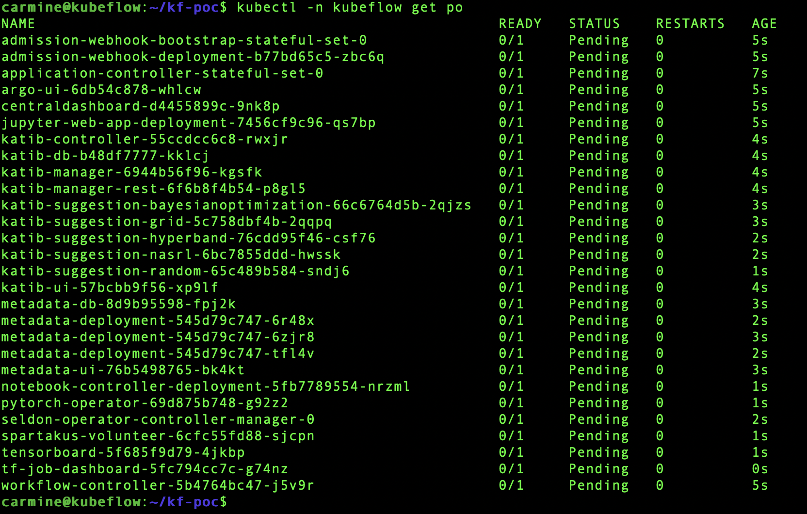
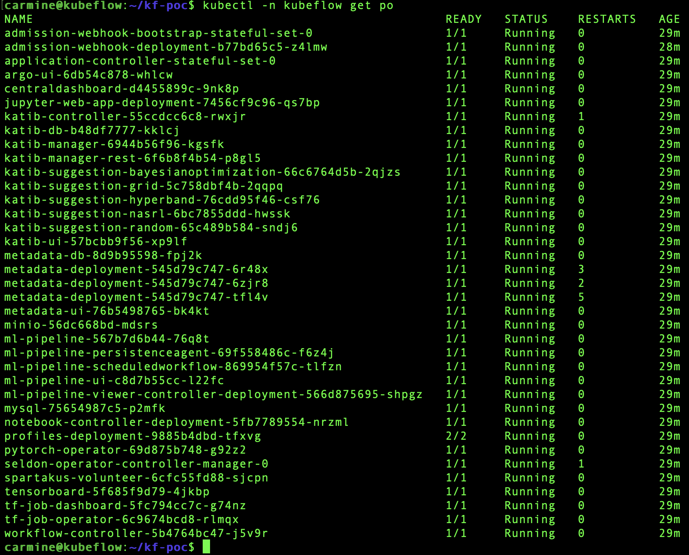
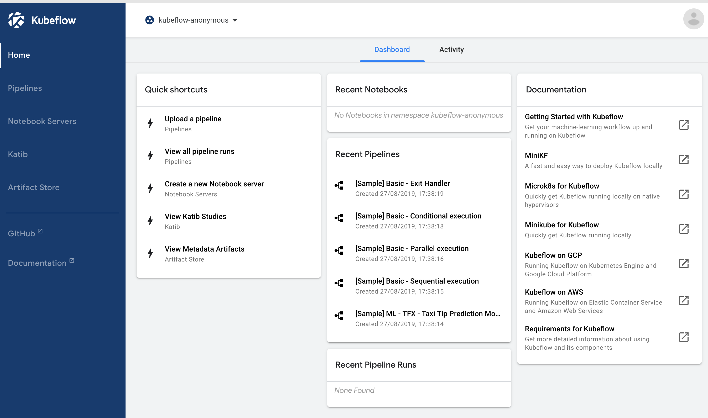
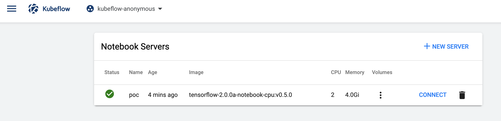
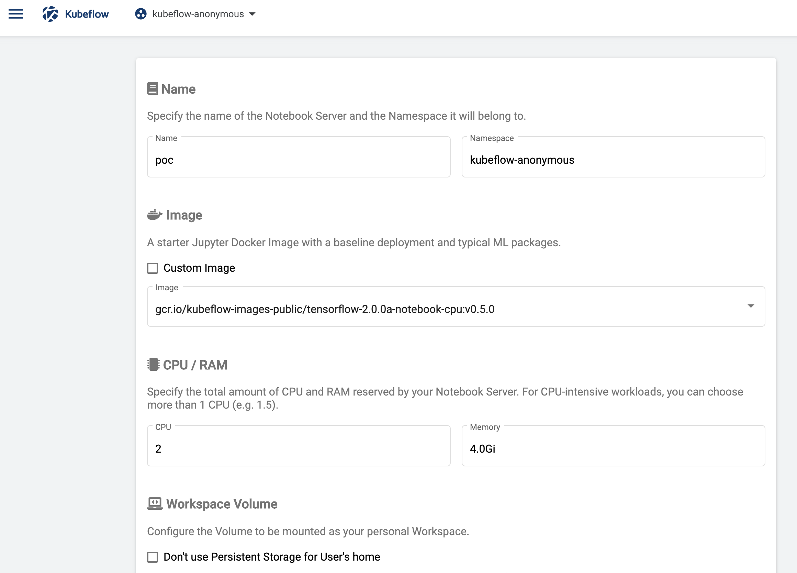
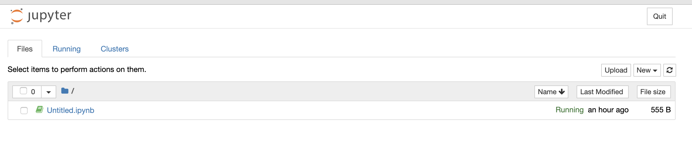

# Get started with Kubeflow

## Overview
Duration: 2:00

This tutorial will guide you through installing [Kubeflow](https://www.kubeflow.org/) and running you first model. Kubeflow will be deployed on top of [microk8s](https://microk8s.io), a zero-configuration Kubernetes.

Here is the tutorial outline:

1. Create a VM
2. SSH into the VM
3. Install MicroK8s
4. Install Kubeflow
5. Do some work!

### What you'll learn

- How to create an ephemeral VM, either on your desktop or in a public cloud
- How to create a Kubernetes cluster in that VM
- How to install Kubeflow using the Kubeflow native `kfctl` tool
- How to create a Jupyter Notebook server on your Kubeflow cluster

### What you'll need

- A linux terminal. This could be done locally.
- [_optional_] For a VM locally, [Multipass](https://multipass.run)
- [_optional_] For a VM on GCP, GCP account credentials and utilities
- [_optional_] For a VM on AWS, AWS account credentials and utilities

Survey
: How will you use this tutorial?
 - Only read through it
 - Read it and complete the exercises
: What is your current level of experience?
 - Novice
 - Intermediate
 - Proficient


## About the tools

This tutorial makes use of several technologies, some of which may be unfamiliar. 

### Kubeflow

Kubeflow is an [open source project](https://github.com/kubeflow) created by Google that is dedicated to providing an easy to use and customisable machine learning toolkit. You can easily compose your machine learning stack from many Kubeflow-enabled components. There are components for training models, serving models, creating workflows (pipelines), and a host of other supporting functionality.

Examples of machine learning frameworks enabled by Kubeflow are TensorFlow, PyTorch, Chainer, MXNet, XGBoost, and MPI.

### MicroK8s

[MicroK8s](https://microk8s.io) is zero-ops Kubernetes on just about any Linux box. It is packaged as a snap and installs in seconds, making it perfect for development or small scale production clusters.

MicroK8s can be installed on just about any Linux distribution. This could be a desktop, a server, an edge or IoT device, or a virtual machine.

### Multipass

A mini-cloud on your Mac or Windows workstation. [Multipass](https://multipass.run/) provides a command line  interface to launch and manage instances of Ubuntu as virtual machines. Downloading the cloud images takes seconds, and within minutes a VM can be up and running.

We use Multipass to ensure consistency for readers who may be accessing the tutorial from many different environments and operating systems.

## Create your VM locally

Duration: 5:00

positive
: **Using a Cloud VM**
If your local system doesn't meet the system requirements (outlined in this section) then create a VM somewhere else. There are instructions at the end of this tutorial for creating a VM in a public cloud; look for steps titled "Optional Cloud VM". For the Cloud VM option, fast forward to those steps, and then come back to the installing MicroK8s step.

For a local VM based deployment:
- Download and install [Multipass](https://multipass.run)

Kubeflow can be resource intensive. The [recommended minimum](https://www.kubeflow.org/docs/started/k8s/overview/#minimum-system-requirements) configuration is:

  - Kubernetes version 1.11 or later.
  - A VM with a minimum of:
    - 4 CPU
    - 50 GB storage
    - 12 GB memory

Given the possible number of containers involved in your machine learning stack, consider
more storage - 100GB is strongly recommended.  

```bash
multipass launch --name kubeflow --cpus 4 --mem 12GB --disk 50GB
multipass shell kubeflow
```

## Install MicroK8s

Duration: 3:00

MicroK8s is the fast and easy way to create a Kubernetes cluster. For this tutorial, we'll create a single node Kubernetes cluster, which means installing MicroK8s into the VM you've created.

The steps below will install MicroK8s, turn on a few services (DNS, Storage, Dashboard), and ensure you can use `kubectl`.

```bash
sudo snap install microk8s --classic
microk8s.status --wait-ready
microk8s.enable dns storage dashboard
sudo snap alias microk8s.kubectl kubectl
microk8s.kubectl config view --raw > $HOME/.kube/config
```

## Install Kubeflow using `kfctl`

Duration: 10:00

Now that you have a Kubernetes cluster up and running, you will deploy Kubeflow. You'll
follow these steps:

1. Install `kfctl`
2. Install Kubeflow
3. Check the install status
4. Access the Kubeflow Dashboard
5. Access Jupyter


### 1. Install `kfctl`

`kfctl` is a binary developed by the Kubeflow community that can be used to setup the standard set of Kubeflow components. The instructions below will download the binary as a compressed file and expand it into the current directory. Finally, it'll add `kfctl` to the PATH.

```bash
export OPSYS=linux
curl -s https://api.github.com/repos/kubeflow/kubeflow/releases/latest | grep browser_download | grep $OPSYS | cut -d '"' -f 4 | xargs curl -O -L &&  tar -zvxf kfctl_*_${OPSYS}.tar.gz
export PATH=$PATH:$PWD
```

### 2. Install Kubeflow

Now that you have the `kfctl` binary installed, you can install Kubeflow using the  standard set of components. The script below will create a directory, "kf-poc", which will store all the kubernetes kustomize yaml files. These files are then applied to the MicroK8s cluster.

```bash
export KFAPP="kf-poc"
export VERSION=`curl -s https://api.github.com/repos/kubeflow/kubeflow/releases/latest |    grep tag_name | head -1 |    cut -d '"' -f 4`
export CONFIG="https://raw.githubusercontent.com/kubeflow/kubeflow/${VERSION}/bootstrap/config/kfctl_k8s_istio.yaml"
kfctl init ${KFAPP} --config=${CONFIG} -V
cd ${KFAPP}
kfctl generate all -V
kfctl apply all -V
```

### 3. Check the install status

To see the install status of all the Kubeflow components, you can run this command:

```bash
kubectl -n kubeflow get po
```

You'll see something like this as the output



With a fast internet connection, like the kind a public cloud would provide, it can take about 8 minutes to download and run all of the containers. Consider using the the following command to watch the install status. Once all pods have a __Running__ status you can exit the watch command.

```bash
watch -c -n 10 kubectl -n kubeflow get po
```

With all pods running, you should see something like this:




### 4. Access the Kubeflow Dashboard

Since there isn’t a configured load balancer in this setup, you’ll need to use the node port.  The default nodeport should be `31380`, but to confirm, run the following command - it will highlight the http port to use. You will use this in conjunction with the IP address of the VM:

```bash
echo `kubectl get svc -n istio-system istio-ingressgateway -o jsonpath='{.spec.ports[?(@.name=="http2")].nodePort}'`
```



### 5. Access Jupyter

One of the first things you may want to do is to create a Jupyter server. This allows you to create new notebooks or import existing notebooks and run them in Kubeflow. By clicking on the menu icon in the upper left of the home screen, you can select `Notebook Servers`, which will show this screen:



Once you select `+ NEW SERVER`, you'll be presented with this screen:



After completing the form and selecting the version of TensorFlow you'd like, you'll have access to a Jupyter server, which allows you to create or import notebooks:




<!-- This will be part of a new tutorial ..
## Submitting TensorFlow jobs

Duration: 3:00


Part of the appeal of using Kubernetes together with TensorFlow is the ability to submit your own TF jobs directly through the Kubernetes API. In the next step, we are going to leverage the Custom Resource Definition (CRD) feature of Kubernetes to provide that.

The Custom Resource Definition (CRD) allows you to define custom objects with their own name and schema. This is what we are going to use to submit TensorFlow jobs to our cluster.

Luckily, the Kubeflow Core installation step already created the CRD so we can immediately submit models.

The job we are going to deploy is `tf-cnn`, a [convolutional neural network (CNN)](https://en.wikipedia.org/wiki/Convolutional_neural_network) example shipped with Kubeflow (GKE users can substitute *cdk* for *gke*):


We can check that a resource of type "tfjob" was indeed submitted into the "kf-tutorial" namespace:

```bash
kubectl get tfjobs --namespace=kf-tutorial
```

Which should return (the job name will be *gke-tf-cnn* on GKE):

```bash
NAME         AGE
cdk-tf-cnn   1m
```

You can also find the components of the TensorFlow job in the "Jobs" section of your Kubernetes Dashboard. The following image shows the Parameter Server and Worker and components on GKE. CDK has a *Master* component in addition to these two:


Once all pods have been deployed, we can verify the CNN job is running properly by inspecting the logs of the worker pod. The following command shows the output from our CDK deployment:

```bash
kubectl logs --namespace=kf-tutorial -f cdk-tf-cnn-worker-rptp-0-wjdph
```

The end of the log should show us our job:

```bash
INFO|2017-12-19T01:12:17|/opt/launcher.py|27| TensorFlow:  1.5
INFO|2017-12-19T01:12:17|/opt/launcher.py|27| Model:       resnet50
INFO|2017-12-19T01:12:17|/opt/launcher.py|27| Mode:        training
INFO|2017-12-19T01:12:17|/opt/launcher.py|27| SingleSess:  False
INFO|2017-12-19T01:12:17|/opt/launcher.py|27| Batch size:  32 global
INFO|2017-12-19T01:12:17|/opt/launcher.py|27| 32 per device
INFO|2017-12-19T01:12:17|/opt/launcher.py|27| Devices:     ['/job:worker/task:0/cpu:0']
INFO|2017-12-19T01:12:17|/opt/launcher.py|27| Data format: NHWC
INFO|2017-12-19T01:12:17|/opt/launcher.py|27| Optimizer:   sgd
INFO|2017-12-19T01:12:17|/opt/launcher.py|27| Variables:   parameter_server
INFO|2017-12-19T01:12:17|/opt/launcher.py|27| Sync:        True
INFO|2017-12-19T01:12:17|/opt/launcher.py|27| ==========
INFO|2017-12-19T01:12:17|/opt/launcher.py|27| Generating model
INFO|2017-12-19T01:12:21|/opt/launcher.py|27| 2017-12-19 01:12:21.230800: I tensorflow/core/distributed_runtime/master_session.cc:1008] Start master session 8ba56f373a0872fb with config: intra_op_parallelism_threads: 1 gpu_options { force_gpu_compatible: true } allow_soft_placement: true
INFO|2017-12-19T01:12:22|/opt/launcher.py|27| Running warm up
```

There it is! Congratulations, you have successfully launched Kubeflow on top of Microk8s,
on top of either Multipass, GCP or AWS.

You can check its parameters using the ``ks show`` command:

```bash
ks show cdk -c kubeflow-test
```

The above will return the following on CDK, and be similar on GKE:

``` yaml
---
apiVersion: tensorflow.org/v1alpha1
kind: TfJob
metadata:
  name: cdk-tf-cnn
  namespace: kf-tutorial
spec:
  replicaSpecs:
  - replicas: 1
    template:
      spec:
        containers:
        - args:
          - python
          - tf_cnn_benchmarks.py
          - --batch_size=32
          - --model=resnet50
          - --variable_update=parameter_server
          - --flush_stdout=true
          - --num_gpus=1
          - --local_parameter_device=cpu
          - --device=cpu
          - --data_format=NHWC
          image: gcr.io/kubeflow/tf-benchmarks-cpu:v20171202-bdab599-dirty-284af3
          name: tensorflow
          workingDir: /opt/tf-benchmarks/scripts/tf_cnn_benchmarks
        restartPolicy: OnFailure
    tfReplicaType: MASTER
  - replicas: 1
    template:
      spec:
        containers:
        - args:
          - python
          - tf_cnn_benchmarks.py
          - --batch_size=32
          - --model=resnet50
          - --variable_update=parameter_server
          - --flush_stdout=true
          - --num_gpus=1
          - --local_parameter_device=cpu
          - --device=cpu
          - --data_format=NHWC
          image: gcr.io/kubeflow/tf-benchmarks-cpu:v20171202-bdab599-dirty-284af3
          name: tensorflow
          workingDir: /opt/tf-benchmarks/scripts/tf_cnn_benchmarks
        restartPolicy: OnFailure
    tfReplicaType: WORKER
  - replicas: 1
    template:
      spec:
        containers:
        - args:
          - python
          - tf_cnn_benchmarks.py
          - --batch_size=32
          - --model=resnet50
          - --variable_update=parameter_server
          - --flush_stdout=true
          - --num_gpus=1
          - --local_parameter_device=cpu
          - --device=cpu
          - --data_format=NHWC
          image: gcr.io/kubeflow/tf-benchmarks-cpu:v20171202-bdab599-dirty-284af3
          name: tensorflow
          workingDir: /opt/tf-benchmarks/scripts/tf_cnn_benchmarks
        restartPolicy: OnFailure
    tfReplicaType: PS
tfImage: gcr.io/kubeflow/tf-benchmarks-cpu:v20171202-bdab599-dirty-284af3
```

As you can see, by default there are no GPUs being used (the parameter `--device=cpu` indicates this and forces the usage of the CPU version of the docker image). In a follow-up tutorial, we will build on this guide to add GPU-accelerated TensorFlow workers to your cluster and expose them via the CRD interface.

In order to clean up the kubeflow deployment on the cluster, issue the `kubectl delete` command. On CDK, enter the following:

```bash
ks delete cdk -c kubeflow-test
```

The equivalent command to delete our GKE instance is:

```bash
kubectl delete ns kf-tutorial
```

Congratulations! You're ready to rock'n roll using Kubeflow on CDK and GKE!
-->


## Next Steps
Duration: 2:00

The goal of this tutorial was to get you up and running quickly using Kubeflow. In this tutorial, you have:

1. Created a VM
2. Installed MicroK8s and Kubeflow
3. Verified the installation by looking at Kubeflow container status.
4. Created a Jupyter Notebook server
5. Ideally, you created a notebook and started doing some work.

### Recommended reading

* [Kubeflow](https://kubeflow.org) - Many resources to take advantage of.
* [Kubeflow Samples](https://www.kubeflow.org/docs/examples/kubeflow-samples/) - Several examples to help you get started with leveraging Kubeflow.
* [Kubeflow Pipelines](https://www.kubeflow.org/docs/pipelines/) - Use or create standard workflows for your models, automating tasks from training to production.
* [Kubeflow Fairing](https://www.kubeflow.org/docs/fairing/) - Interact with Kubeflow through Python code.
* [TensorFlow](https://www.tensorflow.org/)
* [TensorFlow: CNN Benchmarks](https://github.com/tensorflow/benchmarks/tree/master/scripts/tf_cnn_benchmarks)
* [Creating a Custom TfJob to serve a TF model](https://github.com/jlewi/kubeflow/blob/28fd44ca51075d9c5c3b4784a1224f480075d5cb/README.ksonnet.md#serve-a-model)


## Appendix 1: Cloud VM Option - Google: Create your VM on GCP

Duration: 8:00

Skip to the next step if you're not interested in using GCP, and have already created a VM locally or plan to use AWS.

For a GCP-based deployment:
- [Google Cloud SDK installed](https://cloud.google.com/sdk/downloads)
- General knowledge of how to [create and use VMs on GCP](https://cloud.google.com/products/compute/)

This path will create an preemptible VM, which means that the VM could be reclaimed by GCP at any time. The benefit of a preemptible VM is that it costs a fraction of a normal VM. If you prefer to use a normal VM and not risk it disappearing, then change the `PREEMPTIBLE` variable below to be just `""`, for example `export PREEMPTIBLE=""`

### Create a project

If you don't already have a project that you can use to create the VM, visit [this page](https://console.cloud.google.com/projectcreate). In the next step we assume the project is name is `kubeflow-spike-01`.

You can create a project through the command line as well:

```bash
gcloud projects create kubeflow-spike-01
```

positive
: **Enabling Billing for new project**
Billing should be enabled for the new project you created. You can do that using the [Billing option from Google Console](https://console.cloud.google.com/billing).

### Allow Networking

This command will open up the networking so that you can access your cluster. __Be careful with this command__, it opens up networking to anyone on the internet. Specifically, once you create the VM in the next step, the ports below will be generally accessible.

```
gcloud compute --project=${GCP_PROJECT} firewall-rules create k8s-ingress --description=Expose\ kubernetes\ nodeport\ range --direction=INGRESS --priority=1000 --network=default --action=ALLOW --rules=tcp:8001,tcp:8080,tcp:30000-32767 --source-ranges=0.0.0.0/0 --target-tags=k8s-nodeport
```

### Create a VM

```bash
export GCP_INSTANCE_NAME="kubeflow"
export GCP_PROJECT="kubeflow-spike-01"
export GCP_ZONE="us-west1-c"
export PREEMPTIBLE="--preemptible"
gcloud compute --project=${GCP_PROJECT} instances create ${GCP_INSTANCE_NAME} --zone=${GCP_ZONE} --machine-type=n1-standard-8 --subnet=default --network-tier=PREMIUM --no-restart-on-failure --maintenance-policy=TERMINATE ${PREEMPTIBLE} --scopes=https://www.googleapis.com/auth/devstorage.read_only,https://www.googleapis.com/auth/logging.write,https://www.googleapis.com/auth/monitoring.write,https://www.googleapis.com/auth/servicecontrol,https://www.googleapis.com/auth/service.management.readonly,https://www.googleapis.com/auth/trace.append --tags=k8s-nodeport,http-server,https-server --image=ubuntu-1804-bionic-v20190813a --image-project=ubuntu-os-cloud --boot-disk-size=200GB --no-boot-disk-auto-delete --boot-disk-type=pd-standard --boot-disk-device-name=kubeflow
```

### List the VM

This command can be used to get details of the VM you just created, including IP address
and status:

```bash
gcloud compute instances --project=${GCP_PROJECT} list --filter="--zone:(${GCP_ZONE})" --filter="name=(${GCP_INSTANCE_NAME})"
```

### SSH into the VM

```bash
gcloud compute --project ${GCP_PROJECT} ssh --zone ${GCP_ZONE} ${GCP_INSTANCE_NAME}
```

### (Later) Delete a VM

Once you are done with this tutorial, you'll want to cleanup (delete) this VM. The
following command can be used to delete this VM resource:

```bash
gcloud compute instances --project=${GCP_PROJECT} delete --quiet --zone=${GCP_ZONE} ${GCP_INSTANCE_NAME}
gcloud compute disks --project=${GCP_PROJECT} delete --quiet --zone=${GCP_ZONE} ${GCP_INSTANCE_NAME}
```


<!-- TODO: Add instructions for AWS

## Appendix 2: Cloud VM Option - Amazon: Create your VM on AWS

Duration: 8:00
-->
