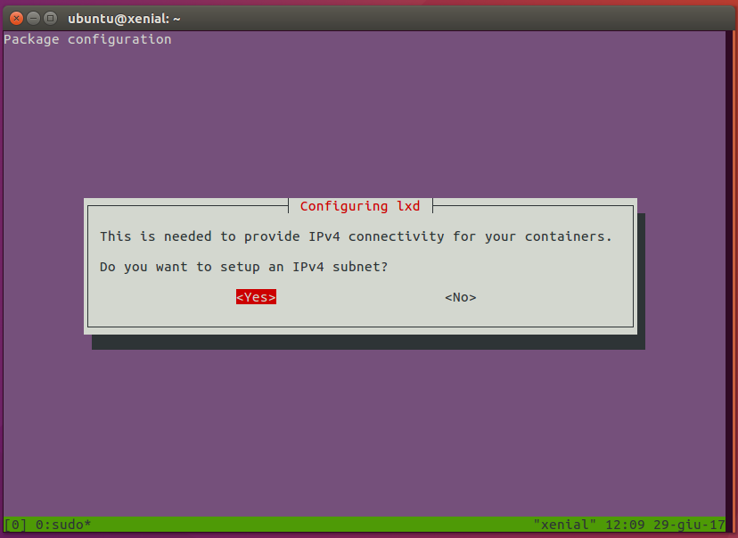

# Setting up LXD on Ubuntu 16.04

## Overview
Duration: 0:01

[LXD](https://linuxcontainers.org/lxd) is a container hypervisor providing a ReST API to manage LXC containers.


It allows running containers and managing related resources, like storage volumes and networks.

This tutorial will show how to install and setup LXD on Ubuntu 16.04 (Xenial Xerus), and how to launch a container and access it.

### Requirements

The tutorial requires an Ubuntu 16.04 installation (Desktop or Server), with internet access. This can be either a physical or virtual machine.


## Install LXD
Duration: 0:04

If you're running an Ubuntu 16.04 server installation, LXD is already preinstalled on your system.

On Desktop installs, it needs to be installed manually. Open a terminal and run the following commands to install LXD:

```bash
sudo apt update
```

followed by

```bash
sudo apt install lxd
```

### Add your user to the LXD group

To allow your user to access the LXD daemon locally, it must be part of the `lxd` group.

To do so, run

```bash
sudo adduser <USER> lxd
```

where `<USER>` is your username.

The new group will be effective at the next login session, to apply it to the current shell, run

```bash
newgrp lxd
```


### Install ZFS tools

For this tutorial, we'll set up LXD using the **ZFS** storage backend.

The ZFS filesystem provides copy-on-write functionality and allows using advanced LXD features, like per-container disk quotas, immediate snapshot/restore, optimized migration (send/receive) and instant container creation from an image.

To install ZFS tools, just run

```bash
sudo apt install zfsutils-linux
```

## Setup LXD
Duration: 0:04

We can now proceed to set up the LXD daemon.

To do that, run

```bash
sudo lxd init
```

which asks a series of questions on how to configure the daemon.

We can just go with the default answer (by pressing Enter) for most of them. You can pick the size of the loop device for the ZFS pool based on your available disk space.


As part of the LXD init setup, networking can be also set up, so that spawned containers can be accessed from the host.

So, let's select **Yes** at the first question, to create a network bridge:


Accept the default name for the bridge `lxdbr0`:


Let's set up IPv4 networking for the bridge by selecting **Yes**:



The configurator will ask for a few details on how to configure the IPv4
network, specifically:

 * address
 * CIDR
 * start/end address for DHCP
 * maximum number of DHCP clients

We can accept defaults for those questions too.

Finally, answer **Yes** to the question about NAT on the network:


A similar configuration is available for IPv6 networks, but we can ignore it, and just choose not to set up IPv6.


Done! LXD is now set up and ready to be used.


## Launch a container
Duration: 0:02

It's now time to start using our LXD.

First, let's make sure the client can connect to the daemon, by running

```bash
lxc list
```

The output should be similar to

```bash
Generating a client certificate. This may take a minute...
If this is your first time using LXD, you should also run: sudo lxd init
To start your first container, try: lxc launch ubuntu:16.04

+------+-------+------+------+------+-----------+
| NAME | STATE | IPV4 | IPV6 | TYPE | SNAPSHOTS |
+------+-------+------+------+------+-----------+
```

which shows there are no running containers.

Let's now launch our first container:

```bash
lxc launch ubuntu:16.04
```

The output will be something like this:

```bash
Creating stirring-beagle
Starting stirring-beagle
```

This will download the official Ubuntu 16.04 LTS (Xenial Xerus) image and launch a container with it.

If a container name is not provided (like in this case), a random one will be generated.

Let's check that our container is indeed running with `lxc list`:

```bash
+-----------------+---------+-----------------------+------+------------+-----------+
|      NAME       |  STATE  |         IPV4          | IPV6 |    TYPE    | SNAPSHOTS |
+-----------------+---------+-----------------------+------+------------+-----------+
| stirring-beagle | RUNNING | 10.147.177.171 (eth0) |      | PERSISTENT | 0         |
+-----------------+---------+-----------------------+------+------------+-----------+
```

We can execute commands in the container using `lxc exec`:

```bash
lxc exec stirring-beagle -- ls -la
```

which will run the provided command as root on the target container:

```bash
total 7
drwx------  3 root root    5 Jun 29 11:29 .
drwxr-xr-x 22 root root   22 Jun 19 23:52 ..
-rw-r--r--  1 root root 3106 Oct 22  2015 .bashrc
-rw-r--r--  1 root root  148 Aug 17  2015 .profile
drwx------  2 root root    3 Jun 29 11:29 .ssh
```

Shell access to the container can be obtained with `lxc exec stirring-beagle /bin/bash`

Note that since we also set up networking, the container has an IPv4 address (as shown by `lxc list`) and can be also reached via ssh from the host. This, however, requires importing an ssh key in the container first.

Once the container is no longer needed, it can be stopped

```bash
lxc stop stirring-beagle
```

and destroyed

```bash
lxc delete stirring-beagle
```


## That's all!

Your machine is now set up to run LXD containers.

LXD provides many more features and allows great flexibility in configuring containers, limiting container resources and access.

If you'd like to know more about LXD and its advanced uses, take a look at the following resources:

* [Getting started guide](https://linuxcontainers.org/lxd/getting-started-cli/)
* [LXD documentation in the source tree](https://github.com/lxc/lxd)

Also, if you have questions or need help, you can find direct help here:

* [Linux Containers forum](https://discuss.linuxcontainers.org/)
* [Ask Ubuntu](https://askubuntu.com/)
* The `#lxcontainers` IRC channel on Freenode
