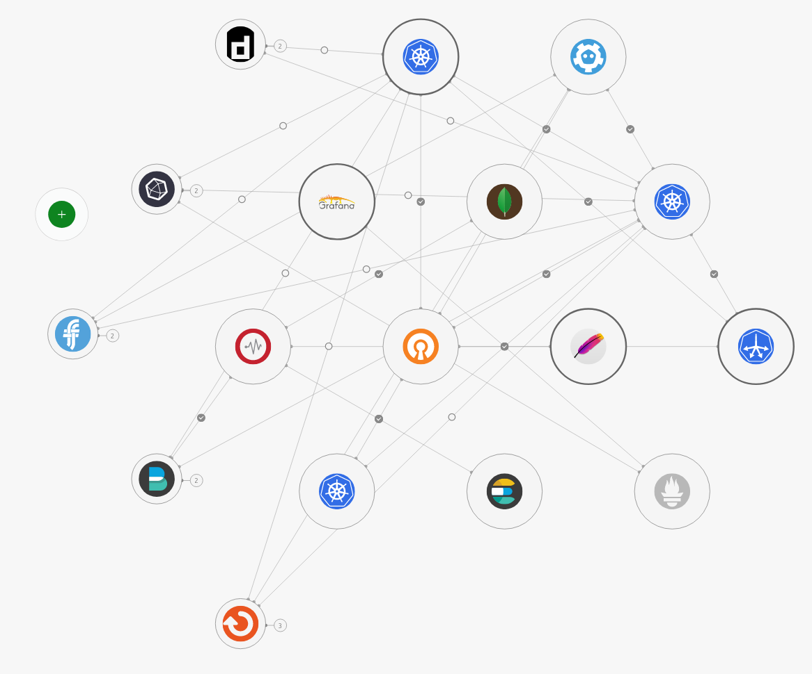
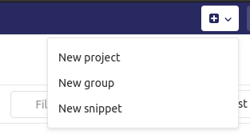
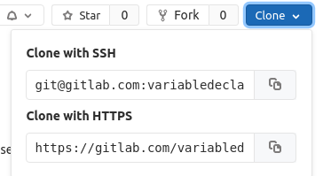
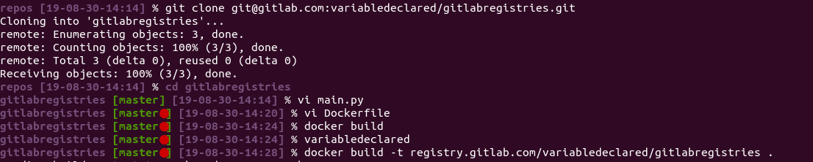
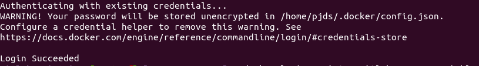
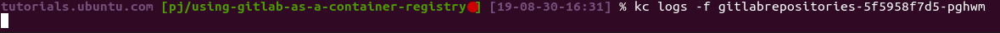
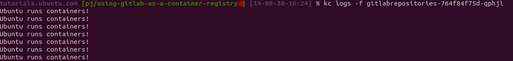

# Using GitLab as a container registry for Charmed Kubernetes

## Overview

Container orchestration solutions such as Kubernetes allow development teams to be quick and agile with their software deployments, a feature of these orchestration tools is the ability to reduce the deployment of version piece of software down to a simple tag name on the end of a string. For example `image: someApplication:canary`.

This opens the doors to streamlined deployment, but creates another problem. How do we streamline? We can do this manually, but it's not very streamlined, or we can do this automatically, but we need to be smart. We can't just deploy as soon as a new version is released. We need to check it first. This is where container registries and CI/CD come in.

GitLab has the ability to store upto 10GB in a container registry for projects, you can incorporate the building of these containers into your own CI/CD pipeline or you can use Gitlab’s own CI/CD functionality to do this for you. For the purposes of this tutorial post you will do this by hand so you can get a grasp of the process.

### You will only need

- Multipass [for Windows](6https://ubuntu.com/blog/kubernetes-on-windows-how-to-set-up) or [Mac](https://tutorials.ubuntu.com/tutorial/install-microk8s-on-mac-os#0) if using [MicroK8s](https://tutorials.ubuntu.com/tutorial/install-a-local-kubernetes-with-microk8s#0)
- or a Charmed Kubernetes deployment

Find yourself a healthy kubernetes cluster, or if you don’t have access to a cluster, head over to ) and install one on your laptop at no cost to yourself, if you’re on Windows you can follow


### In this tutorial you'll learn to:

- Create a private container registry on GitLab
- Create deployment keys
- Create a container
- Push to the container registry
- Pull using your deployment key

## Process

To create your container registry on gitlab you will need to complete the following steps:

- Create a project
- Add a Dockerfile
- Enable Container Registry
- Build our image
- Push our image
- Create a token
- Pull our image

These steps will create a private registry, but you can use them as a guide for a public registry, just miss the deployment token steps.

## Choose or create a project
Duration: 3

To begin with, you can use an existing project or create a new one, I will be creating a new project called gitlabregistries, for the purposes of experimentation, you will create a private project.



Grab the git repository address and clone the repository to a directory of your choice.



## Create the docker file

Firstly, get a terminal inside of the newly cloned directory:



To setup our shell project, you are going to do two things, create the dockerfile and add a small program to show that our image has deployed to Kubernetes.

Let's start with the program:

```
vi main.py
```

Add these lines to the new file:

```
import time


def main():
    while True:
       print("Ubuntu runs containers!")
       time.sleep(5)


 if __name__ == "__main__":
     main()

```
Now that is done you can move onto the Dockerfile:

```
vi Dockerfile
```

Add these lines:

```
FROM ubuntu:latest
RUN apt-get update && apt-get -y install python3
COPY ./ /opt/vb
CMD [“python3”, “/opt/vb/main.py”]
```

You can now build our container, but before this you need to enable container registries on Gitlab and grab the URL, here we have a screenshot of an already enabled projected, but you can find the settings to enable in **Settings > General > Visibility, project features, permissions** and press the expand button.


## Build our container
Duration: 5

The command here to build can be copied and used in your terminal:
```
docker build -t registry.gitlab.com/<YOUR_USERNAME>/gitlabregistries .
```
Before you can push to the repository you need to login to docker:
```
docker login registry.gitlab.com -u <USERNAME>
```
You should see a message similar to this if the login was successful:



## Push our container
Duration: 5

When can then push to our project’s repository:
```
docker push registry.gitlab.com/<YOUR_USERNAME>/gitlabregistries
```
## Pull our container
Duration: 10
### Create a token

Before you can pull from the private repository a secret for Kubernetes needs to be created to allow pulling:


In this case I have used the username k8s, take note of the token, and following the [Kubernetes documentation](https://kubernetes.io/docs/tasks/configure-pod-container/pull-image-private-registry/#registry-secret-existing-credentials), you can create a new secret:

```
kubectl create secret docker-registry regcred --docker-server=registry.gitlab.com --docker-username=k8s --docker-password=<token>
```

Run kubectl get secret regcred just to check, mine looks like this:

```
apiVersion: v1
data:
  .dockerconfigjson: eyJhdXRocyI6eyJyZWdpc3RyeS5naXRsYWIuY29tIjp7InVzZXJuYW1lIjoiazhzIiwicGFzc3dvcmQiOiJ6enJQNk0zUEJkX0tuZE5INmt1cCIsImF1dGgiOiJhemh6T25wNmNsQTJUVE5RUW1SZlMyNWtUa2cyYTNWdyJ9fX0=
kind: Secret
metadata:
  creationTimestamp: "2019-08-30T13:55:11Z"
  name: regcred
  namespace: default
  resourceVersion: "19552"
  selfLink: /api/v1/namespaces/default/secrets/regcred
  uid: be61c809-1572-431f-8a73-43c80e934923
type: kubernetes.io/dockerconfigjson
```

Now you can create a deployment with our newly uploaded container image:

```
kubectl create deployment gitlabrepositories --image=registry.gitlab.com/<YOUR_USERNAME>/gitlabregistries
```

Now wait for it to come up:

```
watch kubectl get pods
```

Initially kubernetes will fail to pull the image, and you should see something like this:

```
gitlabrepositories-86d4b9bf87-q86rx   0/1     ImagePullBackOff    0          3m39s
```

This is because there's no secret, you need to edit the deployment:

```
kubectl edit deployment gitlabrepositories
```

Under the `containers` spec you need to add imagePullSecrets so that it looks something like this:
```
     spec:
       containers:
       - image: registry.gitlab.com/variabledeclared/gitlabregistries
         imagePullPolicy: Always
         name: gitlabregistries
         resources: {}
         terminationMessagePath: /dev/termination-log
         terminationMessagePolicy: File
       dnsPolicy: ClusterFirst
       imagePullSecrets:
       - name: regcred
```

Check the pods again, your container should now have started.


If your pod has started then lets check the logs for logging!

```
kubectl logs -f <YOUR_POD_NAME>
```

Hmm, there seems to be a problem:



I forgot something! But that’s fine because you have a (semi) automatic process setup now, let's go into the docker file and add this line just before CMD:

```
ENV PYTHONUNBUFFERED=0
```

Rebuild:

```
docker build -t registry.gitlab.com/<YOUR_USERNAME>/gitlabregistries:v1 .
```

Push:

```
docker push registry.gitlab.com/variabledeclared/gitlabregistries:v1
```

And update our deployment with the new image tag:
```
   spec:
       containers:
       - image: registry.gitlab.com/variabledeclared/gitlabregistries:v1
         imagePullPolicy: Always
         name: gitlabregistries
         resources: {}
         terminationMessagePath: /dev/termination-log
         terminationMessagePolicy: File
       dnsPolicy: ClusterFirst
       imagePullSecrets:
       - name: regcred
       restartPolicy: Always
       schedulerName: default-scheduler
       securityContext: {}
      terminationGracePeriodSeconds: 30
```
OK lets check the logs now:



Voila!


## That's all folks!

In this tutorial you learnt how to use Gitlab as a container repository, albeit with some human labour involved, you can checkout Gitlab’s documentation on how to take your newly learned skills and apply them to your own CI/CD or create one in gitlab.

If you don’t wish to use a private repository then you can use these steps as a guide, ignoring the generate token steps.

### Where to go from here?

- [GitLab's CI/CD Docs](https://docs.gitlab.com/ee/ci/README.html)
- [Get up and running with upstream Kubernetes with Charmed Kubernetes](https://ubuntu.com/kubernetes/features)
- [Get in touch with Canonical](https://ubuntu.com/kubernetes?&_ga=2.217126934.1873394885.1568631318-1469716857.1560181917#get-in-touch)
