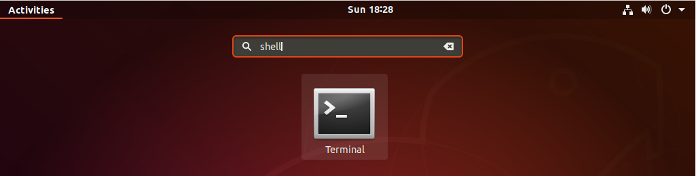
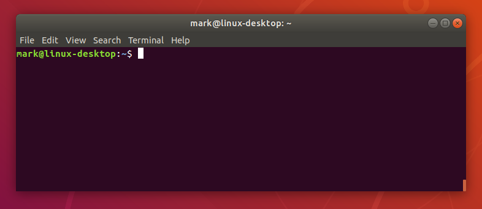
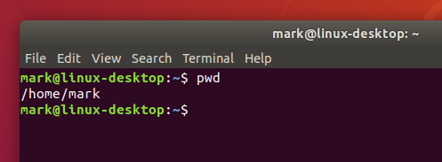
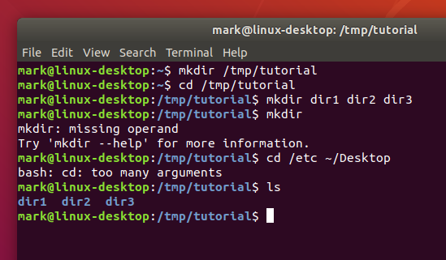
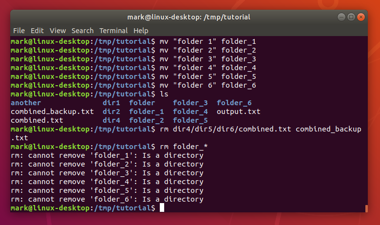
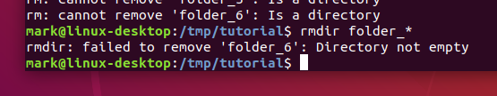
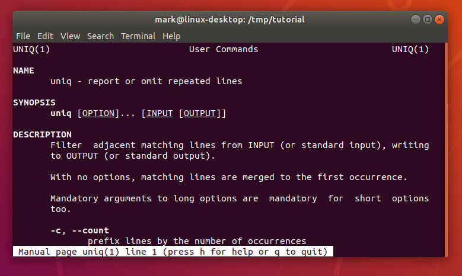
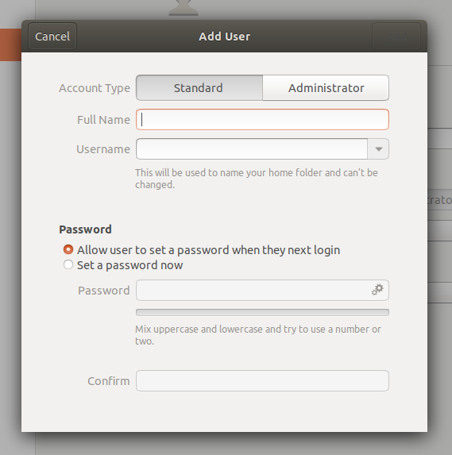
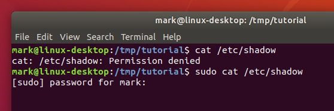
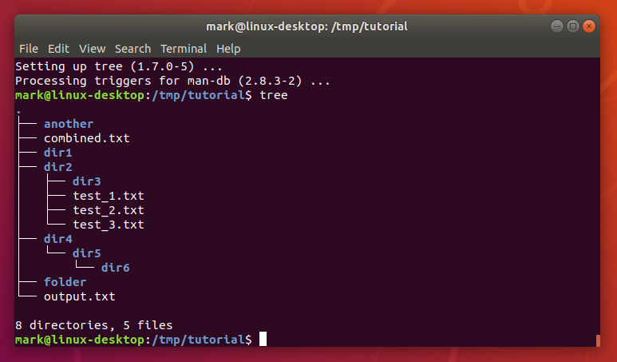

# The Linux command line for beginners

## Overview
Duration: 1:00

The Linux command line is a text interface to your computer. Often referred to as the shell, terminal, console, prompt or various other names, it can give the appearance of being complex and confusing to use. Yet the ability to copy and paste commands from a website, combined with the power and flexibility the command line offers, means that using it may be essential when trying to follow instructions online — including many on this very website!

This tutorial will teach you a little of the history of the command line, then walk you through some practical excercises to become familiar with a few basic commands and concepts. We'll assume no prior knowledge, but by the end we hope you'll feel a bit more comfortable the next time you're faced with some instructions that begin "Open a terminal…"


### What you'll learn
* A little history of the command line
* How to access the command line from your own computer
* How to perform some basic file manipulation
* A few other useful commands
* How to chain commands together to make more powerful tools
* The best way to use administrator powers


### What you'll need
* A computer running Ubuntu or some other version of Linux

Every Linux system includes a command line of one sort or another. This tutorial includes some specfic steps for Ubuntu 18.04 but most of the content should work regardless of your Linux distribution.


## A brief history lesson
Duration: 3:00

During the formative years of the computer industry, one of the early operating systems was called Unix. It was designed to run as a multi-user system on mainframe computers, with users connecting to it remotely via individual ***terminals***. These terminals were pretty basic by modern standards: just a keyboard and screen, with no power to run programs locally. Instead they would just send keystrokes to the server and display any data they received on the screen. There was no mouse, no fancy graphics, not even any choice of colour. Everything was sent as text, and received as text. Obviously, therefore, any programs that ran on the mainframe had to produce text as an output and accept text as an input.

Compared with graphics, text is very light on resources. Even on machines from the 1970s, running hundreds of terminals across glacially slow network connections (by today's standards), users were still able to interact with programs quickly and efficiently. The commands were also kept very terse to reduce the number of keystrokes needed, speeding up people's use of the terminal even more. This speed and efficiency is one reason why this text interface is still widely used today.

When logged into a Unix mainframe via a terminal users still had to manage the sort of file management tasks that you might now perform with a mouse and a couple of windows. Whether creating files, renaming them, putting them into subdirectories or moving them around on disk, users in the 70s could do everything entirely with a textual interface.

Each of these tasks required its own program or command: one to change directories (`cd`), another to list their contents (`ls`), a third to rename or move files (`mv`), and so on. In order to coordinate the execution of each of these programs, the user would connect to one single master program that could then be used to launch any of the others. By wrapping the user's commands this "shell" program, as it was known, could provide common capabilities to any of them — such as the ability to pass data from one command straight into another, or to use special wildcard characters to work with lots of similarly named files at once. Users could even write simple code (called "shell scripts") which could be used to automate long series of shell commands in order to make complex tasks easier. The original Unix shell program was just called `sh`, but it has been extended and superceded over the years, so on a modern Linux system you're most likely to be using a shell called `bash`. Don't worry too much about which shell you have — all the content in this tutorial will work on just about all of them.

Linux is a sort-of-descendent of Unix. The core part of Linux is designed to behave similarly to a Unix system, such that most of the old shells and other text-based programs run on it quite happily. In theory you could even hook up one of those old 1970s terminals to a modern Linux box, and access the shell through that. But these days it's far more common to use a software terminal: that same old Unix-style text interface, but running in a window alongside your graphical programs. Let's see how you can do that yourself…


## Opening a terminal
Duration: 8:00

On a Ubuntu 18.04 system you can find a launcher for the terminal by clicking on the **Activities** item at the top left of the screen, then typing the first few letters of "terminal", "command", "prompt" or "shell". Yes, the developers have set up the launcher with all the most common synonyms, so you should have no problems finding it.



Other versions of Linux, or other flavours of Ubuntu, will usually have a terminal launcher located in the same place as your other application launchers. It might be hidden away in a submenu or you might have to search for it from within your launcher, but it's likely to be there somewhere.

If you can't find a launcher, or if you just want a faster way to bring up the terminal, most Linux systems use the same default keyboard shortcut to start it: **Ctrl-Alt-T**.

However you launch your terminal, you should end up with a rather dull looking window with an odd bit of text at the top, much like the image below. Depending on your Linux system the colours may not be the same, and the text will likely say something different, but the general layout of a window with a large (mostly empty) text area should be similar.



Let's run our first command. Cick the mouse into the window to make sure that's where your keystrokes will go, then type the following command, ***all in lower case***, before pressing the **Enter** or **Return** key to run it.

```Bash
pwd
```

You should see a directory path printed out (probably something like `/home/YOUR_USERNAME`), then another copy of that odd bit of text.



There are a couple of basics to understand here, before we get into the detail of what the command actually did. First is that when you type a command it appears on the same line as the odd text. That text is there to tell you the computer is ready to accept a command — it's the computer's way of prompting you. In fact it's usually referred to as the ***prompt***, and you might sometimes see instructions that say "bring up a prompt", "open a command prompt", "at the bash prompt" or similar. They're all just different ways of asking you to open a terminal to get to a shell.

On the subject of synonyms, another way of looking at the prompt is to say that there's a line in the terminal into which you type commands. A command line, if you will. Again, if you see mention of "command line" — including in the title of this very tutorial — it's just another way of talking about a shell running in a terminal.

The second thing to understand is that when you run a command any output it produces will usually be printed directly in the terminal, then you'll be shown another prompt once it's finished. Some commands can output a lot of text, others will operate silently and won't output anything at all. Don't be alarmed if you run a command and another prompt immediately appears, as that usually means the command succeeded. If you think back to the slow network connections of our 1970s terminals, those early programmers decided that if everything went okay they may as well save a few precious bytes of data transfer by not saying anything at all.

negative
: **The importance of case**
Be extra careful with case when typing in the command line. Typing `PWD` instead of `pwd` will produce an error, but sometimes the wrong case can result in a command appearing to run, but not doing what you expected. We'll look at case a little more on the next page but, for now, just make sure to type all the following lines in exactly the case that's shown.

### A sense of location ###
Now to the command itself. `pwd` is an abbreviation of '**p**rint **w**orking **d**irectory'. All it does is print out the shell's current working directory. But what's a ***working directory***?

One important concept to understand is that the shell has a notion of a default location in which any file operations will take place. This is its working directory. If you try to create new files or directories, view existing files, or even delete them, the shell will assume you're looking for them in the current working directory unless you take steps to specify otherwise. So it's quite important to keep an idea of what directory the shell is "in" at any given time — after all, deleting files from the wrong directory could be disastrous. If you're ever in any doubt, the `pwd` command will tell you exactly what the current working directory is.

You can change the working directory using the `cd` command — an abbreviation for '**c**hange **d**irectory'. Try typing the following:

```Bash
cd /
pwd
```

positive
: Note that the directory separator is a forward slash ("/"), not the backslash that you may be used to from Windows or DOS systems


Now your working directory is "/". If you're coming from a Windows background you're probably used to each drive having its own letter, with your main hard drive typically being "C:". Unix-like systems don't split up the drives like that. Instead they have a single unified file system, and individual drives can be attached ("mounted") to whatever location in the file system makes most sense. The "/" directory — often referred to as the ***root*** directory — is the base of that unified file system. From there everything else branches out to form a tree of directories and subdirectories.

negative
: **Too many roots**
Beware: although the "/" directory is sometimes referred to as the ***root*** directory, the word "root" has another meaning. ***root*** is also the name that has been used for the superuser since the early days of Unix. The superuser, as the name suggests, has more powers than a normal user, so can easily wreak havoc with a badly typed command. We'll look at the superuser account more in section 7. For now you only have to know that the word "root" has multiple meanings in the Linux world, so context is important.

From the root directory, the following command will move you into the "home" directory (which is an immediate subdirectory of "/"):

```Bash
cd home
pwd
```

To go up to the parent directory — in this case back to "/" — use the special syntax of two dots (`..`) when changing directory (note the space between `cd` and `..` — unlike in DOS you can't just type `cd..` as one command):

```Bash
cd ..
pwd
```

Typing `cd` on its own is a quick shortcut to get back to your home directory:

```Bash
cd
pwd
```

You can also use `..` more than once if you have to move up through multiple levels of parent directories:

```Bash
cd ../..
pwd
```

Notice that in the previous example we described a route to take through the directories. The path we used means "starting from the working directory, move to the parent / from that new location move to the parent again". So if we wanted to go straight from our home directory to the "etc" directory (which is directly inside the root of the file system), we could use this approach:

```Bash
cd
pwd

cd ../../etc
pwd
```

### Relative and absolute paths
Most of the examples we've looked at so far use ***relative*** paths. That is, the place you end up at depends on your current working directory. Consider trying to `cd` into the "etc" folder. If you're already in the root directory that will work fine:

```Bash
cd /
pwd
cd etc
pwd
```

But what if you're in your home directory?

```Bash
cd
pwd
cd etc
pwd
```

You'll see an error saying "No such file or directory" before you even get to run the last `pwd`. Changing directory by specifying the directory name, or using `..` will have different effects depending on where you start from. The path only makes sense ***relative*** to your working directory.

But we have seen two commands that are ***absolute***. No matter what your current working directory is, they'll have the same effect. The first is when you run `cd` on its own to go straight to your home directory. The second is when you used `cd /` to switch to the root directory. In fact any path that starts with a forward slash is an ***absolute*** path. You can think of it as saying "switch to the root directory, then follow the route from there". That gives us a much easier way to switch to the `etc` directory, no matter where we currently are in the file system:

```Bash
cd
pwd
cd /etc
pwd
```

It also gives us another way to get back to your home directory — and even to the folders within it. Suppose you want to go straight to your "Desktop" folder from anywhere on the disk (note the upper-case "D"). In the following command you'll need to replace **USERNAME** with your own username — the `whoami` command will remind you of your username, in case you're not sure:

```Bash
whoami
cd /home/USERNAME/Desktop
pwd
```

There's one other handy shortcut which works as an absolute path. As you've seen, using "/" at the start of your path means "starting from the root directory…". Using the tilde character ("~") at the start of your path similarly means "starting from my home directory…".

```Bash
cd ~
pwd

cd ~/Desktop
pwd
```

Now that odd text in the prompt might make a bit of sense. Have you noticed it changing as you move around the file system? On a Ubuntu system it shows your username, your computer's network name and the current working directory. But if you're somewhere inside your home directory, it will use "~" as an abbreviation. Let's wander around the file system a little, and keep an eye on the prompt as you do so:

```Bash
cd
cd /
cd ~/Desktop
cd /etc
cd /var/log
cd ..
cd
```

You must be bored with just moving around the file system by now, but a good understanding of absolute and relative paths will be invaluable as we move on to create some new folders and files…


## Creating folders and files
Duration: 12:00

In this section we're going to create some real files to work with. To avoid accidentally trampling over any of your real files, we're going to start by creating a new directory, well away from your home folder, which will serve as a safer environment in which to experiment:

```Bash
mkdir /tmp/tutorial
cd /tmp/tutorial
```

Notice the use of an absolute path, to make sure that we create the ***tutorial*** directory inside ***/tmp***. Without the forward slash at the start the `mkdir` command would try to find a ***tmp*** directory inside the current working directory, then try to create a ***tutorial*** directory inside that. If it couldn't find a ***tmp*** directory the command would fail.

In case you hadn't guessed, `mkdir` is short for '**m**a**k**e **dir**ectory'. Now that we're safely inside our test area (double check with `pwd` if you're not certain), let's create a few subdirectories:

```Bash
mkdir dir1 dir2 dir3
```

There's something a little different about that command. So far we've only seen commands that work on their own (`cd`, `pwd`) or that have a single item afterwards (`cd /`, `cd ~/Desktop`). But this time we've added three things after the `mkdir` command. Those things are referred to as ***parameters*** or ***arguments***, and different commands can accept different numbers of arguments. The `mkdir` command expects at least one argument, whereas the `cd` command can work with zero or one, but no more. See what happens when you try to pass the wrong number of parameters to a command:

```Bash
mkdir
cd /etc ~/Desktop
```

Back to our new directories. The command above will have created three new subdirectories inside our folder. Let's take a look at them with the `ls` (**l**i**s**t) command:

```Bash
ls
```

If you've followed the last few commands, your terminal should be looking something like this:




Notice that `mkdir` created all the folders in one directory. It ***didn't*** create ***dir3*** inside ***dir2*** inside ***dir1***, or any other nested structure. But sometimes it's handy to be able to do exactly that, and `mkdir` does have a way:

```Bash
mkdir -p dir4/dir5/dir6
ls
```

This time you'll see that only ***dir4*** has been added to the list, because ***dir5*** is inside it, and ***dir6*** is inside that. Later we'll install a useful tool to visualise the structure, but you've already got enough knowledge to confirm it:

```Bash
cd dir4
ls
cd dir5
ls
cd ../..
```

The "-p" that we used is called an ***option*** or a ***switch*** (in this case it means "create the **p**arent directories, too"). Options are used to modify the way in which a command operates, allowing a single command to behave in a variety of different ways. Unfortunately, due to quirks of history and human nature, options can take different forms in different commands. You'll often see them as single characters preceded by a hyphen (as in this case), or as longer words preceded by two hyphens. The single character form allows for multiple options to be combined, though not all commands will accept that. And to confuse matters further, some commands don't clearly identify their options at all — whether or not something is an option is dictated purely by the order of the arguments! You don't need to worry about all the possibilities, just know that options exist and they can take several different forms. For example the following all mean exactly the same thing:

```Bash
# Don't type these in, they're just here for demonstrative purposes
mkdir --parents --verbose dir4/dir5
mkdir -p --verbose dir4/dir5
mkdir -p -v dir4/dir5
mkdir -pv dir4/dir5
```

Now we know how to create multiple directories just by passing them as separare arguments to the `mkdir` command. But suppose we want to create a directory with a space in the name? Let's give it a go:

```Bash
mkdir another folder
ls
```

You probably didn't even need to type that one in to guess what would happen: two new folders, one called ***another*** and the other called ***folder***. If you want to work with spaces in directory or file names, you need to ***escape*** them. Don't worry, nobody's breaking out of prison; ***escaping*** is a computing term that refers to using special codes to tell the computer to treat particular characters differently to normal. Enter the following commands to try out different ways to create folders with spaces in the name:

```Bash
mkdir "folder 1"
mkdir 'folder 2'
mkdir folder\ 3
mkdir "folder 4" "folder 5"
mkdir -p "folder 6"/"folder 7"
ls
```

Although the command line ***can*** be used to work with files and folders with spaces in their names, the need to escape them with quote marks or backslashes makes things a little more difficult. You can often tell a person who uses the command line a lot just from their file names: they'll tend to stick to letters and numbers, and use underscores ("_") or hyphens ("-") instead of spaces.


### Creating files using redirection
Our demonstration folder is starting to look rather full of directories, but is somewhat lacking in files. Let's remedy that by redirecting the output from a command so that, instead of being printed to the screen, it ends up in a new file. First, remind yourself what the `ls` command is currently showing:

```Bash
ls
```

Suppose we wanted to capture the output of that command as a text file that we can look at or manipulate further. All we need to do is to add the greater-than character (">") to the end of our command line, followed by the name of the file to write to:

```Bash
ls > output.txt
```

This time there's nothing printed to the screen, because the output is being redirected to our file instead. If you just run `ls` on its own you should see that the ***output.txt*** file has been created. We can use the `cat` command to look at its content:

```Bash
cat output.txt
```

Okay, so it's not ***exactly*** what was displayed on the screen previously, but it contains all the same data, and it's in a more useful format for further processing. Let's look at another command, `echo`:

```Bash
echo "This is a test"
```

Yes, `echo` just prints its arguments back out again (hence the name). But combine it with a redirect, and you've got a way to easily create small test files:

```Bash
echo "This is a test" > test_1.txt
echo "This is a second test" > test_2.txt
echo "This is a third test" > test_3.txt
ls
```

You should `cat` each of these files to theck their contents. But `cat` is more than just a file viewer - its name comes from 'con**cat**enate', meaning "to link together". If you pass more than one filename to `cat` it will output each of them, one after the other, as a single block of text:

```Bash
cat test_1.txt test_2.txt test_3.txt
```

Where you want to pass multiple file names to a single command, there are some useful shortcuts that can save you a lot of typing if the files have similar names. A question mark ("?") can be used to indicate "any single character" within the file name. An asterisk ("*") can be used to indicate "zero or more characters". These are sometimes referred to as "wildcard" characters. A couple of examples might help — the following commands all do the same thing:

```Batch
cat test_1.txt test_2.txt test_3.txt
cat test_?.txt
cat test_*
```

negative
: **More escaping required**
As you might have guessed, this capability also means that you need to escape file names with ? or * characters in them, too. It's usually better to avoid any punctuation in file names if you want to manipulate them from the command line.


If you look at the output of `ls` you'll notice that the only files or folders that start with "t" are the three test files we've just created, so you could even simplify that last command even further to `cat t*`, meaning "concatenate all the files whose names start with a ***t*** and are followed by zero or more other characters". Let's use this capability to join all our files together into a single new file, then view it:

```Batch
cat t* > combined.txt
cat combined.txt
```

What do you think will happen if we run those two commands a second time? Will the computer complain, because the file already exists? Will it append the text to the file, so it contains two copies? Or will it replace it entirely? Give it a try to see what happens, but to avoid typing the commands again you can use the **Up Arrow** and **Down Arrow** keys to move back and forth through the history of commands you've used. Press the **Up Arrow** a couple of times to get to the first `cat` and press **Enter** to run it, then do the same again to get to the second.

As you can see, the file looks the same. That's not because it's been left untouched, but because the shell clears out all the content of the file before it writes the output of your `cat` command into it. Because of this, you should be extra careful when using redirection to make sure that you don't accidentally overwrite a file you need. If you do want to append to, rather than replace, the content of the files, double up on the greater-than character:

```Batch
cat t* >> combined.txt
echo "I've appended a line!" >> combined.txt
cat combined.txt
```

Repeat the first `cat` a few more times, using the **Up Arrow** for convenience, and perhaps add a few more arbitrary ``echo`` commands, until your text document is so large that it won't all fit in the terminal at once when you use `cat` to display it. In order to see the whole file we now need to use a different program, called a ***pager*** (because it displays your file one "page" at a time). The standard pager of old was called `more`, because it puts a line of text at the bottom of each page that says "--More--" to indicate that you haven't read everything yet. These days there's a far better pager that you should use instead: because it replaces `more`, the programmers decided to call it `less`.

```Batch
less combined.txt
```

When viewing a file through `less` you can use the **Up Arrow**, **Down Arrow**, **Page Up**, **Page Down**, **Home** and **End** keys to move through your file. Give them a try to see the difference between them. When you've finished viewing your file, press **q** to **q**uit `less` and return to the command line.


### A note about case
Unix systems are case-sensitive — that is, they consider "A.txt" and "a.txt" to be two different files. If you were to run the following lines you would end up with three files:

```Bash
echo "Lower case" > a.txt
echo "Upper case" > A.TXT
echo "Mixed case" > A.txt
```

Generally you should try to avoid creating files and folders whose name only varies by case. Not only will it help to avoid confusion, but it will also prevent problems when working with different operating systems. Windows, for example, is case-***insensitive***, so it would treat all three of the file names above as being a single file, potentially causing data loss or other problems.

You might be tempted to just hit the **Caps Lock** key and use upper case for all your file names. But the vast majority of shell commands are lower case, so you would end up frequently having to turn it on and off as you type. Most seasoned command line users tend to stick primarily to lower case names for their files and directories so that they rarely have to worry about file name clashes, or which case to use for each letter in the name.

positive
: **Good naming practice**
When you consider both case sensitivity and escaping, a good rule of thumb is to keep your file names all lower case, with only letters, numbers, underscores and hyphens. For files there's usually also a dot and a few characters on the end to indicate the type of file it is (referred to as the "file extension"). This guideline may seem restrictive, but if you end up using the command line with any frequency you'll be glad you stuck to this pattern.


## Moving and manipulating files
Duration: 8:00

Now that we've got a few files, let's look at the sort of day-to-day tasks you might need to perform on them. In practice you'll still most likely use a graphical program when you want to move, rename or delete one or two files, but knowing how to do this using the command line can be useful for bulk changes, or when the files are spread amongst different folders. Plus, you'll learn a few more things about the command line along the way.

Let's begin by putting our ***combined.txt*** file into our ***dir1*** directory, using the `mv` (**m**o**v**e) command:

```Bash
mv combined.txt dir1
```

You can confirm that the job has been done by using `ls` to see that it's missing from the working directory, then `cd dir1` to change into ***dir1***, `ls` to see that it's in there, then `cd ..` to move the working directory back again. Or you could save a lot of typing by passing a path directly to the `ls` command to get straight to the confirmation you're looking for:

```Bash
ls dir1
```

Now suppose it turns out that file shouldn't be in ***dir1*** after all. Let's move it back to the working directory. We could `cd` into ***dir1*** then use `mv combined.txt ..` to say "move ***combined.txt*** into the parent directory". But we can use another path shortcut to avoid changing directory at all. In the same way that two dots ("..") represents the parent directory, so a single dot (".") can be used to represent the current working directory. Because we know there's only one file in ***dir1*** we can also just use "*" to match any filename in that directory, saving ourselves a few more keystrokes. Our command to move the file back into the working directory therefore becomes this (note the space before the dot — there are ***two*** parameters being passed to `mv`):

```Bash
mv dir1/* .
```

The `mv` command also lets us move more than one file at a time. If you pass more than two arguments, the last one is taken to be the destination directory and the others are considered to be files (or directories) to move. Let's use a single command to move ***combined.txt***, all our ***test_n.txt*** files and ***dir3*** into ***dir2***. There's a bit more going on here, but if you look at each argument at a time you should be able to work out what's happening:

```Bash
mv combined.txt test_* dir3 dir2
ls
ls dir2
```

With ***combined.txt*** now moved into ***dir2***, what happens if we decide it's in the wrong place again? Instead of ***dir2*** it should have been put in ***dir6*** — which is the one that's inside ***dir5***, which is in ***dir4***. With what we now know about paths, that's no problem either:

```Bash
mv dir2/combined.txt dir4/dir5/dir6
ls dir2
ls dir4/dir5/dir6
```

Notice how our `mv` command let us move the file from one directory into another, even though our working directory is something completely different. This is a powerful property of the command line: no matter where in the file system you are, it's still possible to operate on files and folders in totally different locations.

Since we seem to be using (and moving) that file a lot, perhaps we should keep a copy of it in our working directory. Much as the `mv` command moves files, so the `cp` command **c**o**p**ies them (again, note the space before the dot):

```Bash
cp dir4/dir5/dir6/combined.txt .
ls dir4/dir5/dir6
ls
```

Great! Now let's create another copy of the file, in our working directory but with a different name. We can use the `cp` command again, but instead of giving it a directory path as the last argument, we'll give it a new file name instead:

```Bash
cp combined.txt backup_combined.txt
ls
```

That's good, but perhaps the choice of backup name could be better. Why not rename it so that it will always appear next to the original file in a sorted list. The traditional Unix command line handles a rename as though you're ***moving*** the file from one name to another, so our old friend `mv` is the command to use. In this case you just specify two arguments: the file you want to rename, and the new name you wish to use.

```Bash
mv backup_combined.txt combined_backup.txt
ls
```

This also works on directories, giving us a way to sort out those difficult ones with spaces in the name that we created earlier. To avoid re-typing each command after the first, use the **Up Arrow** to pull up the previous command in the history. You can then edit the command before you run it by moving the cursor left and right with the arrow keys, and removing the character to the left with **Backspace** or the one the cursor is on with **Delete**. Finally, type the new character in place, and press **Enter** or **Return** to run the command once you're finished. Make sure you change both appearances of the number in each of these lines.

```Bash
mv "folder 1" folder_1
mv "folder 2" folder_2
mv "folder 3" folder_3
mv "folder 4" folder_4
mv "folder 5" folder_5
mv "folder 6" folder_6
ls
```


### Deleting files and folders

negative
: **Warning**
In this next section we're going to start deleting files and folders. To make absolutely certain that you don't accidentally delete anything in your home folder, use the `pwd` command to double-check that you're still in the ***/tmp/tutorial*** directory before proceeding.

Now we know how to move, copy and rename files and directories. Given that these are just test files, however, perhaps we don't really need three different copies of ***combined.txt*** after all. Let's tidy up a bit, using the `rm` (**r**e**m**ove) command:

```Bash
rm dir4/dir5/dir6/combined.txt combined_backup.txt
```

Perhaps we should remove some of those excess directories as well:

```Bash
rm folder_*
```



What happened there? Well, it turns out that `rm` does have one little safety net. Sure, you can use it to delete every single file in a directory with a single command, accidentally wiping out thousands of files in an instant, with no means to recover them. But it won't let you delete a directory. I ***suppose*** that does help prevent you accidentally deleting thousands ***more*** files, but it does seem a little petty for such a destructive command to balk at removing an empty directory. Luckily there's an `rmdir` (**r**e**m**ove **dir**ectory) command that will do the job for us instead:

```Bash
rmdir folder_*
```



Well that's a little better, but there's still an error. If you run `ls` you'll see that most of the folders have gone, but ***folder_6*** is still hanging around. As you may recall, ***folder_6*** still has a ***folder 7*** inside it, and `rmdir` will only delete empty folders. Again, it's a small safety net to prevent you from accidentally deleting a folder full of files when you didn't mean to.

In this case, however, we ***do*** mean to. The addition of options to our `rm` or `rmdir` commands will let us perform dangerous actions without the aid of a safety net! In the case of `rmdir` we can add a `-p` switch to tell it to also remove the parent directories. Think of it as the counterpoint to `mkdir -p`. So if you were to run `rmdir -p dir1/dir2/dir3` it would first delete ***dir3***, then ***dir2***, then finally delete ***dir1***. It still follows the normal `rmdir` rules of only deleting empty directories though, so if there was also a file in ***dir1***, for example, only ***dir3*** and ***dir2*** would get removed.

A more common approach, when you're really, ***really***, **really** sure you want to delete a whole directory and anything within it, is to tell `rm` to work recursively by using the `-r` switch — in which case it will happily delete folders as well as files. With that in mind, here's the command to get rid of that pesky ***folder_6*** and the subdirectory within it:

```Bash
rm -r folder_6
ls
```

Remember: although `rm -r` is quick and convenient, it's also dangerous. It's safest to explicitly delete files to clear out a directory, then `cd ..` to the parent before using `rmdir` to remove it.


negative
: **Important Warning**
Unlike graphical interfaces, `rm` doesn't move files to a folder called "trash" or similar. Instead it deletes them totally, utterly and irrevocably. You need to be ultra careful with the parameters you use with `rm` to make sure you're only deleting the file(s) you intend to. You should take particular care when using wildcards, as it's easy to accidentally delete more files than you intended. An errant space character in your command can change it completely: `rm t*` means "delete all the files starting with ***t***", whereas `rm t *` means "delete the file ***t*** as well as any file whose name consists of zero or more characters — which would be everything in the directory! If you're at all uncertain use the `-i` (**i**nteractive) option to `rm`, which will prompt you to confirm the deletion of each file; enter **Y** to delete it, **N** to keep it, and press **Ctrl-C** to stop the operation entirely.


## A bit of plumbing
Duration: 8:00

Today's computers and phones have the sort of graphical and audio capabilities that our 70s terminal users couldn't even begin to imagine. Yet still text prevails as a means to organise and categorise files. Whether it's the file name itself, GPS coordintates embedded in photos you take on your phone, or the metadata stored in an audio file, text still plays a vital role in every aspect of computing. It's fortunate for us that the Linux command line includes some powerful tools for manipulating text content, and ways to join those tools together to create something more capable still.

Let's start with a simple question. How many lines are there in your ***combined.txt*** file? The `wc` (**w**ord **c**ount) command can tell us that, using the `-l` switch to tell it we only want the line count (it can also do character counts and, as the name suggests, word counts):

```Bash
wc -l combined.txt
```

Similarly, if you wanted to know how many files and folders are in your home directory, and then tidy up after yourself, you could do this:

```Bash
ls ~ > file_list.txt
wc -l file_list.txt
rm file_list.txt
```

That method works, but creating a temporary file to hold the output from `ls` only to delete it two lines later seems a little excessive. Fortunately the Unix command line provides a shortcut that avoids you having to create a temporary file, by taking the output from one command (referred to as ***standard output*** or ***STDOUT***) and feeding it directly in as the input to another command (***standard input*** or ***STDIN***). It's as though you've connected a pipe between one command's output and the next command's input — so much so that this process is actually referred to as ***piping*** the data from one command to another. Here's how to pipe the output of our `ls` command into `wc`:

```Bash
ls ~ | wc -l
```

Notice that there's no temporary file created, and no file name needed. Pipes operate entirely in memory, and most Unix command line tools will expect to receive input from a pipe if you don't specify a file for them to work on. Looking at the line above, you can see that it's two commands, `ls ~` (list the contents of the home directory) and `wc -l` (count the lines), separated by a vertical bar character ("|"). This process of piping one command into another is so commonly used that the character itself is often referred to as the ***pipe*** character, so if you see that term you now know it just means the vertical bar.

Note that the spaces around the pipe character aren't important — we've used them for clarity, but the following command works just as well, this time for telling us how many items are in the ***/etc*** directory:

```Bash
ls /etc|wc -l
```

Phew! That's quite a few files. If we wanted to list them all it would clearly fill up more than a single screen. As we discovered earlier, when a command produces a lot of output, it's better to use `less` to view it, and that advice still applies when using a pipe (remember, press **q** to quit):

```Bash
ls /etc | less
```

Going back to our own files, we know how to get the number of lines in ***combined.txt***, but given that it was created by concatenating the same files multiple times, I wonder how many unique lines there are? Unix has a command, `uniq`, that will only output unique lines in the file. So we need to `cat` the file out and pipe it through `uniq`. But all we want is a line count, so we need to use `wc` as well. Fortunately the command line doesn't limit you to a single pipe at a time, so we can continue to chain as many commands as we need:

```Bash
cat combined.txt | uniq | wc -l
```

That line probably resulted in a count that's pretty close to the total number of lines in the file, if not exactly the same. Surely that can't be right? Lop off the last pipe to see the output of the command for a better idea of what's happening. If your file is very long, you might want to pipe it through `less` to make it easier to inspect:

```Bash
cat combined.txt | uniq | less
```

It appears that very few, if any, of our duplicate lines are being removed. To understand why, we need to look at the documentation for the `uniq` command. Most command line tools come with a brief (and sometimes not-so-brief) instruction manual, accessed through the `man` (**man**ual) command. The output is automatically piped through your pager, which will typically be `less`, so you can move back and forth through the output, then press **q** when you're finished:

```Bash
man uniq
```




Because this type of documentation is accessed via the `man` command, you'll hear it referred to as a "man page", as in "check the man page for more details". The format of man pages is often terse — think of them more as a quick overview of a command than a full tutorial. They're often highly technical, but you can usually skip most of the content and just look for the details of the option or argument you're using.

The `uniq` man page is a typical example in that it starts with a brief one-line description of the command, moves on to a synopsis of how to use it, then has a detailed description of each option or parameter. But whilst man pages are invaluable, they can also be inpenetrable. They're best used when you need a reminder of a particular switch or parameter, rather than as a general resource for learning how to use the command line. Nevertheless, the first line of the **DESCRIPTION** section for `man uniq` does answer the question as to why duplicate lines haven't been removed: it only works on ***adjacent*** matching lines.

The question, then, is how to rearrange the lines in our file so that duplicate entries are on adjacent lines. If we were to sort the contents of the file alphabetically, that would do the trick. Unix offers a `sort` command to do exactly that. A quick check of `man sort` shows that we can pass a file name directly to the command, so let's see what it does to our file:

```Bash
sort combined.txt | less
```

You should be able to see that the lines have been reordered, and it's now suitable for piping straight into `uniq`. We can finally complete our task of counting the unique lines in the file:

```Bash
sort combined.txt | uniq | wc -l
```

As you can see, the ability to pipe data from one command to another, building up long chains to manipulate your data, is a powerful tool — as well as reducing the need for temporary files, and saving you a ***lot*** of typing. For this reason you'll see it used quite often in command lines. A long chain of commands might look intimidating at first, but remember that you can break even the longest chain down into individual commands (and look at their man pages) to get a better understanding of what it's doing.

positive
: **Many manuals**
Most Linux command line tools include a man page. Try taking a brief look at the pages for some of the commands you've already encountered: `man ls`, `man cp`, `man rmdir` and so on. There's even a man page for the man program itself, which is accessed using `man man`, of course.


## The command line and the superuser
Duration: 8:00

One good reason for learning some command line basics is that instructions online will often favour the use of shell commands over a graphical interface. Where those instructions require changes to your machine that go beyond modifying a few files in your home directory, you'll inevitably be faced with commands that need to be run as the machine's administrator (or ***superuser*** in Unix parlance). Before you start running arbitrary commands you find in some dark corner of the internet, it's worth understanding the implications of running as an administrator, and how to spot those instructions that require it, so you can better gauge whether they're safe to run or not.

The superuser is, as the name suggests, a user with super powers. In older systems it was a real user, with a real username (almost always "root") that you could log in as if you had the password. As for those super powers: ***root*** can modify or delete any file in any directory on the system, regardless of who owns them; ***root*** can rewrite firewall rules or start network services that could potentially open the machine up to an attack; ***root*** can shutdown the machine even if other people are still using it. In short, ***root*** can do just about ***anything***, skipping easily round the safeguards that are usually put in place to stop users from overstepping their bounds.

Of course a person logged in as ***root*** is just as capable of making mistakes as anyone else. The annals of computing history are filled with tales of a mistyped command deleting the entire file system or killing a vital server. Then there's the possibility of a malicious attack: if a user is logged in as ***root*** and leaves their desk then it's not too tricky for a disgruntled colleague to hop on their machine and wreak havoc. Despite that, human nature being what it is, many administrators over the years have been guilty of using ***root*** as their main, or only, account.

Negative
: **Don't use the root account**
If anyone asks you to enable the ***root*** account, or log in as ***root***, be very suspicious of their intentions.


In an effort to reduce these problems many Linux distributions started to encourage the use of the `su` command. This is variously described as being short for '**s**uper**u**ser' or '**s**witch **u**ser', and allows you to change to another user on the machine without having to log out and in again. When used with no arguments it assumes you want to change to the ***root*** user (hence the first interpretation of the name), but you can pass a username to it in order to switch to a specific user account (the second interpretation). By encouraging use of `su` the aim was to persuade administrators to spend most of their time using a normal account, only switch to the superuser account when they needed to, and then use the `logout` command (or **Ctrl-D** shortcut) as soon as possible to return to their user-level account.

By minimising the amount of time spent logged in as ***root***, the use of `su` reduces the window of opportunity in which to make a catastrophic mistake. Despite that, human nature being what it is, many administrators have been guilty of leaving long-running terminals open in which they've used `su` to switch to the ***root*** account. In that respect `su` was only a small step forward for security.

Negative
: **Don't use su**
If anyone asks you to use `su`, be wary. If you're using Ubuntu the ***root*** account is disabled by default, so `su` with no parameters won't work. But it's still not worth taking the risk, in case the account has been enabled without you realising. If you are asked to use `su` with a username then (if you have the password) you will have access to all the files of that user — and could accidentally delete or modify them.


When using `su` your entire terminal session is switched to the other user. Commands that don't need ***root*** access — something as mundane as `pwd` or `ls` — would be run under the auspices of the superuser, increasing the risk of a bug in the program causing major problems. Worse still, if you lose track of which user you're currently operating as, you might issue a command that is fairly benign when run as a user, but which could destroy the entire system if run as ***root***.

Better to disable the ***root*** account entirely and then, instead of allowing long-lived terminal sessions with dangerous powers, require the user to specifically request superuser rights on a per-command basis. The key to this approach is a command called `sudo` (as in "**s**witch **u**ser and **do** this command").

`sudo` is used to prefix a command that has to be run with superuser privileges. A configuration file is used to define which users can use `sudo`, and which commands they can run. When running a command like this, the user is prompted for ***their own*** password, which is then cached for a period of time (defaulting to 15 minutes), so if they need to run multiple superuser-level commands they don't keep getting continually asked to type it in.

On a Ubuntu system the first user created when the system is installed is considered to be the superuser. When adding a new user there is an option to create them as an administrator, in which case they will also be able to run superuser commands with `sudo`. In this screenshot of Ubuntu 18.04 you can see the option at the top of the dialog:



Assuming you're on a Linux system that uses `sudo`, and your account is configured as an administrator, try the following to see what happens when you try to access a file that is considered sensitive (it contains encrypted passwords):

```Bash
cat /etc/shadow
sudo cat /etc/shadow
```



If you enter your password when prompted you should see the contents of the `/etc/shadow` file. Now clear the terminal by running the `reset` command, and run `sudo cat /etc/shadow` again. This time the file will be displayed without prompting you for a password, as it's still in the cache.


Negative
: **Be careful with sudo**
If you are instructed to run a command with `sudo`, make sure you understand what the command is doing before you continue. Running with `sudo` gives that command all the same powers as a superuser. For example, a software publisher's site might ask you to download a file and change its permissions, then use `sudo` to run it. Unless you know exactly what the file is doing, you're opening up a hole through which malware could potentially be installed onto your system. `sudo` may only run one command at a time, but that command could itself run many others. Treat any new use of `sudo` as being just as dangerous as logging in as ***root***.


For instructions targeting Ubuntu, a common appearance of `sudo` is to install new software onto your system using the `apt` or `apt-get` commands. If the instructions require you to first add a new software repository to your system — using the `apt-add-repository` command, by editing files in `/etc/apt`, or by using a "PPA" (Personal Package Archive) — you should be careful as these sources are not curated by Canonical. But often the instructions just require you to install software from the standard repositories, which should be safe.


Negative
: **Installing new software**
There are lots of different ways to install software on Linux systems. Installing directly from your distro's official software repositories is the safest option, but sometimes the application or version you want simply isn't available that way. When installing via any other mechanism, make sure you're getting the files from an official source for the project in question.
<br />Indications that files are coming from outside the distribution's repositories include (but are not limited to) the use of any of the following commands: `curl`, `wget`, `pip`, `npm`, `make`, or any instructions that tell you to change a file's permissions to make it executable.
<br />Increasingly, Ubuntu is making use of "snaps" — a new package format which offers some security improvements by more closely confining programs to stop them accessing parts of the system they don't need to. But some options can reduce the security level so, if you're asked to run `snap install` with any parameters other than the name of the snap, it's worth checking exactly what the command is trying to do.


Let's install a new command line program from the standard Ubuntu repositories to illustrate this use of `sudo`:

```Bash
sudo apt install tree
```

Once you've provided your password the `apt` program will print out quite a few lines of text to tell you what it's doing. The `tree` program is only small, so it shouldn't take more than a minute or two to download and install for most users. Once you are returned to the normal command line prompt, the program is installed and ready to use. Let's run it to get a better overview of what our collection of files and folders looks like:

```Bash
cd /tmp/tutorial
tree
```



Going back to the command that actually installed the new program (`sudo apt install tree`) it looks slightly different to those you've see so far. In practice it works like this:

1. The `sudo` command, when used without any options, will assume that the first parameter is a command for it to run with superuser privileges. Any other parameters will be passed directly to the new command. `sudo`'s switches all start with one or two hyphens and must immediately follow the `sudo` command, so there can be no confusion about whether the second parameter on the line is a command or an option.

2. The command in this case is `apt`. Unlike the other commands we've seen, this isn't working directly with files. Instead it expects its first parameter to be an instruction to perform (`install`), with the rest of the parameters varying based on the instruction.

3. In this case the `install` command tells `apt` that the remainder of the command line will consist of one or more package names to install from the system's software repositories. Usually this will add new software to the machine, but packages could be any collection of files that need to be installed to particular locations, such as fonts or desktop images.


You can put `sudo` in front of any command to run it as a superuser, but there's rarely any need to. Even system configuration files can often be viewed (with `cat` or `less`) as a normal user, and only require ***root*** privileges if you need to edit them.


Negative
: **Beware of sudo su**
One trick with `sudo` is to use it to run the `su` command. This will give you a ***root*** shell even if the ***root*** account is disabled. It can be useful when you need to run a series of commands as the superuser, to avoid having to prefix them all with `sudo`, but it opens you up to exactly the same kind of problems that were described for `su` above. If you follow any instructions that tell you to run `sudo su`, be aware that every command after that will be running as the ***root*** user.


In this section you've learnt about the dangers of the ***root*** account, and how modern Linux systems like Ubuntu try to reduce the risk of danger by using `sudo`. But ***any*** use of superuser powers should be considered carefully. When following instructions you find online you should now be in a better position to spot those commands that might require greater scrutiny.


## Hidden files
Duration: 3:00

Before we conclude this tutorial it's worth mentioning ***hidden files*** (and folders). These are commonly used on Linux systems to store settings and configuration data, and are typically hidden simply so that they don't clutter the view of your own files. There's nothing special about a hidden file or folder, other than it's name: simply starting a name with a dot (".") is enough to make it disappear.

```Bash
cd /tmp/tutorial
ls
mv combined.txt .combined.txt
ls
```

You can still work with the hidden file by making sure you include the dot when you specify its file name:

```Bash
cat .combined.txt
mkdir .hidden
mv .combined.txt .hidden
less .hidden/.combined.txt
```

If you run `ls` you'll see that the `.hidden` directory is, as you might expect, hidden. You can still list its contents using `ls .hidden`, but as it only contains a single file which is, itself, hidden you won't get much output. But you can use the `-a` (show **a**ll) switch to `ls` to make it show everything in a directory, including the hidden files and folders:

```Bash
ls
ls -a
ls .hidden
ls -a .hidden
```

Notice that the shortcuts we used earlier, `.` and `..`, also appear as though they're real directories.

As for our recently installed `tree` command, that works in a similar way (except without an appearance by `.` and `..`):

```Bash
tree
tree -a
```

Switch back to your home directory (`cd`) and try running `ls` without and then with the `-a` switch. Pipe the output through `wc -l` to give you a clearer idea of how many hidden files and folders have been right under your nose all this time. These files typically store your personal configuration, and is how Unix systems have always offered the capability to have system-level settings (usually in `/etc`) that can be overridden by individual users (courtesy of hidden files in their home directory).

You shouldn't usually need to deal with hidden files, but occasionally instructions might require you to `cd` into `.config`, or edit some  file whose name starts with a dot. At least now you'll understand what's happening, even when you can't easily see the file in your graphical tools.

### Cleaning up
We've reached the end of this tutorial, and you should be back in your home directory now (use `pwd` to check, and `cd` to go there if you're not). It's only polite to leave your computer in the same state that we found it in, so as a final step, let's remove the experimental area that we were using earlier, then double-check that it's actually gone:

```Bash
rm -r /tmp/tutorial
ls /tmp
```

As a last step, let's close the terminal. You can just close the window, but it's better practice to log out of the shell. You can either use the `logout` command, or the **Ctrl-D** keyboard shortcut. If you plan to use the terminal a lot, memorising **Ctrl-Alt-T** to launch the terminal and **Ctrl-D** to close it will soon make it feel like a handy assistant that you can call on instantly, and dismiss just as easily.


## Conclusion
Duration: 1:00

This tutorial has only been a brief introduction to the Linux command line. We've looked at a few common commands for moving around the file system and manipulating files, but no tutorial could hope to provide a comprehensive guide to every available command. What's more important is that you've learnt the key aspects of working with the shell. You've been introduced to some widely used terminology (and synonyms) that you might come across online, and have gained an insight into some of the key parts of a typical shell command. You've learnt about absolute and relative paths, arguments, options, man pages, `sudo` and ***root***, hidden files and much more.

With these key concepts you should be able to make more sense of any command line instructions you come across. Even if you don't understand every single command, you should at least have an idea of where one command stops and the next begins. You should more easily be able to tell what files they're manipulating, or what other switches and parameters are being used. With reference to the man pages you might even be able to glean exactly what the command is doing — or at least get a general idea.

There's little we've covered here that is likely to make you abandon your graphical file manager in favour of a prompt, but file manipulation wasn't really the main goal. If, however, you're intrigued by the ability to affect files in disparate parts of your hard drive with just a few keypresses, there's still a lot more for you to learn.


### Further reading
There are many online tutorials and commercially published books about the command line, but if you do want to go deeper into the subject a good starting point might be the following book:

* [The Linux Command Line](http://linuxcommand.org/tlcl.php) by ***William Shotts***

The reason for recommending this book in particular is that it has been released under a Creative Commons licence, and is available to download free of charge as a PDF file, making it ideal for the beginner who isn't sure just how much they want to commit to the command line. It's also available as a printed volume, should you find yourself caught by the command line bug and wanting a paper reference.


