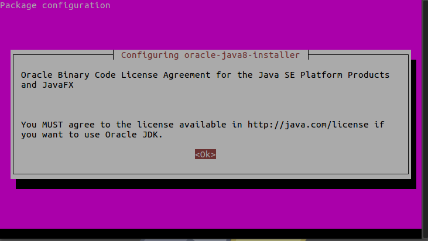
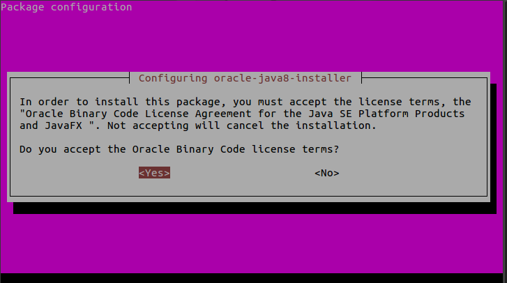

# Install Java Runtime Environment (JRE)

## Overview
Duration: 1:00

Java Runtime Environment (JRE) is required to run Java programs. There are several versions of Java and the ones we can install on our Ubuntu machines are OpenJRE and Oracle JRE. Both of them are similar and should not have any functional difference but some prefer OpenJRE over Oracle JRE as it is easier to install because it requires no additional repositories to be added. However, there are cases where you might need the other one.

In this guide, we'll be going through the installation of both of them. Of course, you generally only need one so pick one that best suites your need.

### What you'll learn
- How to install OpenJRE
- How to install Oracle JRE

### What you'll need
- A machine running Ubuntu 16.04 LTS

That's all you need. If you have that, let's proceed to the next step!


## Installing OpenJRE
Duration: 1:00

To install OpenJRE, we run:
```bash
sudo apt install openjdk-8-jre
```

We can check if OpenJRE was properly installed by running:
```bash
java -version
```

The following should be its output:
```bash
openjdk version "1.8.0_151"
OpenJDK Runtime Environment (build 1.8.0_151-8u151-b12-0ubuntu0.16.04.2-b12)
OpenJDK 64-Bit Server VM (build 25.151-b12, mixed mode)

```
And that's it!

In the next step we'll install Oracle JRE.

## Install Oracle JRE
Duration: 2:00

Oracle doesn't provide an official install package for Ubuntu but luckily **WebUp8Team** created a script that installs Oracle JRE for us.

We start by installing **WebUpd8Team**'s repository for their script:
```bash
sudo add-apt-repository ppa:webupd8team/java
```
After adding it we run:
```bash
sudo apt update
```
Then finally:
```bash
sudo apt install oracle-java8-installer
```
After agreeing to the install prompt, we'll be greeted with the following screen:

Read their license terms over at the link provided then press enter.

Another screen will pop up asking if you agree to their terms.

If you do, select yes and the installation will proceed. All we have to do now is sit back and let the script do the rest of the work for us.

When it's done, we can check if it was set up correctly by typing:
```bash
java -version
```

You should see the following output:
```bash
java version "1.8.0_151"
Java(TM) SE Runtime Environment (build 1.8.0_151-b12)
Java HotSpot(TM) 64-Bit Server VM (build 25.151-b12, mixed mode)
```

And that concludes our tutorial. But don't let that stop you, there's a link below if you want to learn more!

positive
: **Read more:**
https://help.ubuntu.com/community/Java#Installation_of_Java_Runtime_Environment
