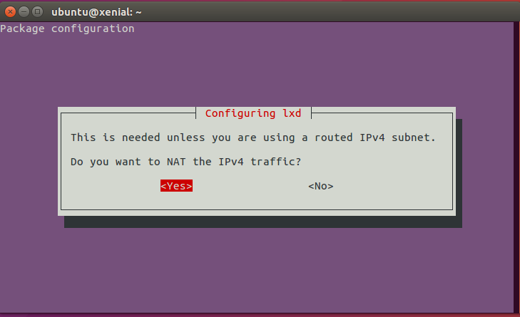

# Configuration de LXD sur Ubuntu 16.04

## Aperçu
Duration: 0:01

Positive
: Switch language: FR | [EN](tutorial-setting-up-lxd-1604)

[LXD](https://linuxcontainers.org/lxd) est un hyperviseur de conteneur fournissant une API ReST pour gérer les conteneurs LXC.


Il permet d'utiliser des conteneurs et de gérer des ressources connexes, comme les volumes de stockage et les réseaux.

Ce tutoriel montrera comment installer et configurer LXD sur Ubuntu 16.04 (Xenial Xerus), comment lancer un conteneur et y accéder.

### Pré-requis

Le tutoriel nécessite une installation d'Ubuntu 16.04 (version de Bureau ou Serveur), avec un accès à Internet. Cela peut être une machine physique ou une machine virtuelle.

## Installer LXD
Duration: 0:04

Si vous utilisez une installation d'Ubuntu Server 16.04, LXD est déjà installé sur votre système.

Sur les installations bureautiques, il doit être installé manuellement. Ouvrez un terminal et exécutez les commandes suivantes pour installer LXD :

```bash
sudo apt update
```

suivi de :

```bash
sudo apt install lxd
```

### Ajouter votre utilisateur au groupe LXD

Pour permettre à votre utilisateur d'accéder localement au démon LXD, il doit faire partie du groupe `lxd`.

Pour ce faire, exécutez :

```bash
sudo adduser <USER> lxd
```

où `<USER>` est votre nom d'utilisateur.

Le nouveau groupe sera effectif à la prochaine session de connexion, pour l'appliquer au shell actuel, exécutez :

```bash
newgrp lxd
```


### Installer les outils ZFS

Pour ce tutoriel, nous configurerons LXD en utilisant le back-end de stockage **ZFS**.

Le système de fichiers ZFS fournit une fonctionnalité de copie-sur-écriture et permet d'utiliser des fonctionnalités avancées de LXD, comme les quotas de disques par conteneur, les snapshots et restaurations instantanés, la migration optimisée (envoi/réception) et la création instantanée de conteneurs à partir d'une image.

Pour installer les outils ZFS, exécutez simplement :

```bash
sudo apt install zfsutils-linux
```

## Paramétrage de LXD
Duration: 0:04

Nous pouvons maintenant procéder au paramétrage du démon LXD.

Pour le faire, exécutez :

```bash
sudo lxd init
```

qui pose une série de questions sur la façon de configurer le démon.

Nous pouvons simplement sélectionner la réponse par défaut (en appuyant sur Entrée) pour la plupart d'entre elles. Vous pouvez choisir la taille du périphérique de boucle pour le pool ZFS en fonction de votre espace disque disponible.


Dans le cadre de la configuration d'initialisation de LXD, le réseau peut également être configuré, de sorte que les conteneurs créés puissent être consultés depuis l'hôte.

Alors, choisissons **Yes** à la première question, afin de créer un pont réseau :


Acceptez le nom par défaut pour le pont `lxdbr0`:


Configurez la mise en réseau IPv4 pour le pont en sélectionnant **Yes** :


Le configurateur vous demandera quelques détails sur la configuration du réseau IPv4, en particulier:

 * l'adresse
 * le CIDR
 * la plage d'adresse pour le DHCP
 * nombre maximum de clients DHCP

Nous pouvons accepter les réponses par défaut pour ces questions également.

Finallement, répondre **Yes** à la question à propos du NAT sur le réseau :



Une configuration similaire est disponible pour les réseaux IPv6, mais nous pouvons l'ignorer et choisir de ne pas configurer IPv6.


C'est fini ! LXD est maintenant configuré et prêt à être utilisé.

## Lancer un conteneur
Duration: 0:02

Il est maintenant temps d'utiliser LXD.

Tout d'abord, veillons à ce que le client puisse se connecter au démon, en exécutant :

```bash
lxc list
```

Le résultat devrait être similaire à :

```bash
Generating a client certificate. This may take a minute...
If this is your first time using LXD, you should also run: sudo lxd init
To start your first container, try: lxc launch ubuntu:16.04

+------+-------+------+------+------+-----------+
| NAME | STATE | IPV4 | IPV6 | TYPE | SNAPSHOTS |
+------+-------+------+------+------+-----------+
```

qui montre qu'il n'y a pas de conteneur en cours d'exécution.

Lançons maintenant notre premier conteneur :

```bash
lxc launch ubuntu:16.04
```

Le résultat devrait ressembler à ceci :

```bash
Creating stirring-beagle
Starting stirring-beagle
```

Cela va télécharger l'image officielle Ubuntu 16.04 LTS (Xenial Xerus) et l'utiliser comme système d'exploitation de notre conteneur.

Si un nom de conteneur n'est pas fourni (comme dans ce cas), un nom aléatoire sera généré.

Vérifions que notre conteneur est effectivement en cours d'exécution avec `lxc list` :

```bash
+-----------------+---------+-----------------------+------+------------+-----------+
|      NAME       |  STATE  |         IPV4          | IPV6 |    TYPE    | SNAPSHOTS |
+-----------------+---------+-----------------------+------+------------+-----------+
| stirring-beagle | RUNNING | 10.147.177.171 (eth0) |      | PERSISTENT | 0         |
+-----------------+---------+-----------------------+------+------------+-----------+
```

Nous pouvons exécuter des commandes dans le conteneur en utilisant `lxc exec` :

```bash
lxc exec stirring-beagle -- ls -la
```

ce qui exécutera la commande fournie en tant que `root` sur le conteneur ciblé :

```bash
total 7
drwx------  3 root root    5 Jun 29 11:29 .
drwxr-xr-x 22 root root   22 Jun 19 23:52 ..
-rw-r--r--  1 root root 3106 Oct 22  2015 .bashrc
-rw-r--r--  1 root root  148 Aug 17  2015 .profile
drwx------  2 root root    3 Jun 29 11:29 .ssh
```

L'accès au shell du conteneur peut être obtenu avec `lxc exec stir-beagle /bin/bash`

Notez que, puisque nous avons également configuré le réseau, le conteneur a une adresse IPv4 (comme indiqué par `lxc list`) et peut également être atteint via SSH depuis l'hôte. Ceci nécessitera d'importer au préalable une clé SSH dans le conteneur.

Une fois que vous n'avez plus besoin du conteneur, il peut être arrêté :

```bash
lxc stop stirring-beagle
```

et détruit :

```bash
lxc delete stirring-beagle
```


## C'est tout !

Votre machine est maintenant configurée pour exécuter des conteneurs LXD.

LXD fournit beaucoup d'autres fonctionnalités et permet une grande flexibilité dans la configuration des conteneurs, dans la gestion des ressources et de leurs permissions d'accès.

Si vous désirez en savoir plus sur LXD et ses applications avancées, jetez un oeil sur les ressources suivantes :

* [Guide de démarrage](https://linuxcontainers.org/lxd/getting-started-cli/)
* [Documentation de LXD dans l'arborescence source](https://github.com/lxc/lxd)

De plus, si vous avez des questions ou avez besoin d'aide, vous pouvez trouver de l'aide directe ici :

* [Forum de Linux Containers](https://discuss.linuxcontainers.org/)
* [Ask Ubuntu](https://askubuntu.com/)
* Le canal IRC `#lxcontainers` sur Freenode
