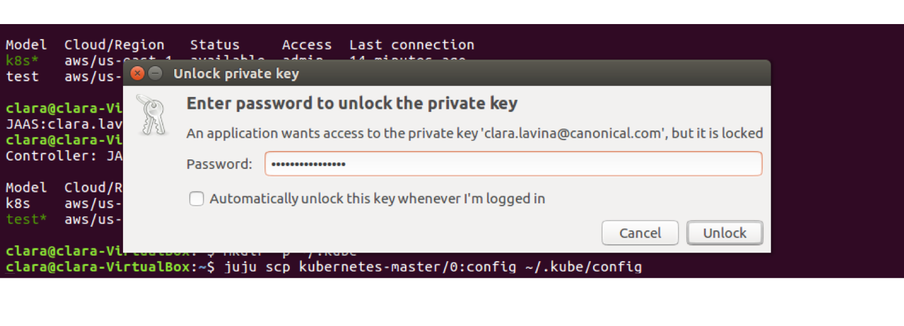
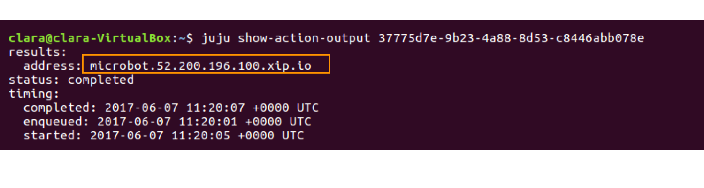

---
 
id: get-started-canonical-kubernetes
summary: Learn how to operate a production-ready Kubernetes cluster. Kubernetes is a great open-source orchestration system for cloud native infrastructure. 
categories: jaas 
tags: jaas, juju, kubernetes, beginner, container, docker, cloud
difficulty: 2
status: Published
Published: 2017-06-01
 
---
 
 
# Get started with Canonical Kubernetes
 
 
## Overview
Duration: 1:00
 
### About the Canonical Distribution of Kubernetes
 
This solution is a highly available (HA) production ready Kubernetes cluster — with 2 masters, 3 workers, 3 etcd nodes and a load balancer for the HA control plane. It includes logging, monitoring, and the operational tools to automate deployment, scaling, and lifecycle management of your cluster. 
 
[Learn more about this bundle](https://jujucharms.com/canonical-kubernetes/).
To learn more about Kubernetes check out its [website](https://kubernetes.io/).
 

 
 
### In this tutorial you’ll learn how to...
 
- Get your Kubernetes cluster up and running.
- Open the K8s dashboard.
- Control your cluster from the kubectl CLI client.
- Deploy your first container workload.
- Add extra features to your Kubernetes cluster.
 
 
### You will need...
 
* An [Ubuntu One account](https://login.ubuntu.com/).
* An SSH key in your JAAS account. If you haven’t done this already, [learn how to add your SSH key](https://jujucharms.com/docs/2.1/users-auth#credentials-and-ssh-keys).
* Basic knowledge of command line.
 
 
 
## Deploying your model with JAAS
Duration: 1:00
 
With JAAS, you don’t need to deal with the setup and configuration of Juju. All you will need is your preferred cloud credentials.
 
If you haven’t already deployed The Canonical Distribution of Kubernetes, do so by clicking [direct deploy](https://jujucharms.com/new?dd=bundle/canonical-kubernetes). 
 
Deployment will take several minutes as Juju creates new instances in the cloud and sets up the Kubernetes cluster components. Pending units are outlined in *orange*. Up and running are outlined in *black*.

 
 
 
## Getting started
Duration: 5:00
 
### Install the Juju client
 
**You will need to have Juju installed locally to operate your cluster. Skip this step if you already have it. **
 
Juju is available as a client on many platforms and distributions. Regardless of your operating system, getting all the required tools is very easy. Visit the [install docs](https://jujucharms.com/docs/stable/reference-install#getting-the-latest-juju) to get the latest version of Juju on **macOS**, **Windows** or **CentOS**.
 
If you are running **Ubuntu**, you can install Juju through the following steps:
 
1. It’s helpful to Install Snappy if you don’t have it already. 
`$ sudo apt install snapd`
 
2. Install Juju to get the command line client. 
`$ sudo snap install juju --classic`
 
3. Verify you can run Juju. You will see a summary and a list of common commands.
‘$ juju’
 
You’re done! To learn more on how to get started with Juju, visit the [documentation](https://jujucharms.com/docs/stable/getting-started). 
 
For general help in the CLI: 
`$ juju help`
 
 
### Operate your cluster with kubectl 
 
To deploy and manage applications on Kubernetes you need *kubectl*. You can get more information from the [official documentation](https://kubernetes.io/docs/tasks/tools/install-kubectl/).
 
1. For **Ubuntu** users, install the [kubectl command line](https://kubernetes.io/docs/tasks/tools/install-kubectl/): 
`$ sudo snap install kubectl --classic`
If you are running **macOS**:
`$ brew install kubectl`
**Windows** users can use [Chocolatey](https://chocolatey.org/install):
`$ choco install kubectl’
For **Centos and other Linuxes**:
‘ $ sudo snap install kubectl --classic’. 
 
2. Verify you can run kubectl. You will see a list of commands to control your cluster.
`$ kubectl`
 
3. To connect to JAAS from the command line you'll need to register with the JAAS controller. You’ll only need to do this the first time.
`$ juju register jimm.jujucharms.com`
 
4. This command will open a new window in your browser. Use Ubuntu SSO to login and authorise your account. 
 
5. You will then be asked to enter a descriptive name for the JAAS controller.  We suggest using *jaas*. 
 
6. JAAS users with existing models, might first need to switch to the relevant model:
`$ juju models`
`$ juju switch <model-name>`
 
 
 
## Operating your Kubernetes cluster 
Duration: 5:00
 
1. Fetch the credentials from the Kubernetes Master charm. 
`$ mkdir -p ~/.kube`
`$ juju scp kubernetes-master/0:config ~/.kube/config`
This might open a separate modal window, in which you should enter the passphrase for your SSH key.

 
2. Establish a secure proxy to the apiserver with the command:
`$ kubectl proxy`
 
3. Navigate to the Kubernetes dashboard UI through the proxy **xxx.xxx.xxx.xxx:8001/ui**.

**Note**: The browser may warn you that the connection is not private or secure. Bypass the warnings (via the ‘Advanced’) option. The browser will then ask you to login. The default username and password are both **admin**.
 
4. You can now use the Kubernetes Dashboard to drive your cluster.

 
 
 
## Running your first workload 
Duration: 10:00
 
Spin up a simple static website in your Kubernetes cluster. 
 
1. You can run a Juju action to create an example microbot web application, deploying 5 replicas inside the Kubernetes cluster:
`$ juju run-action kubernetes-worker/0 microbot replicas=5`  
 
2. This action creates a deployment titled *microbots* comprised of 5 replicas defined during the run of the action. It also creates a service named *microbots* which binds an *endpoint*, using all 5 of the microbots pods. Finally, it will create an ingress resource, which points at a **xip.io** domain to simulate a proper DNS service.
 
3. To see the result of this action, run:
 `$ juju show-action-output [id above]`
You should get a similar response to:

**Note**: Your FQDN will be different and contains the address of the cloud instance.
 
4. Copy and paste the microbot address into your web browser: **microbot.xxx.xxx.xxx.xip.io**. It’s normal to see a 502/503 error during initial application turnup.

 
5. You've successfully connected to a microbot container! Within a few seconds your microbot example application will be online, and load balanced across the 5 pods running the microbot application. Refresh and the hostname at the bottom should change with each request. 
 
To learn more about this, go to the *Running the packaged example* section in the [bundle details](https://jujucharms.com/canonical-kubernetes/).
 
 
 
## That’s all folks!
Duration: 1:00
 
Congratulations! You’ve made it! 
 
By now you should have your Kubernetes cluster up and running.

 
 
### Next steps
 
Now that you have your production cluster, you can put it to work:
 
* [The easy way to commoditise GPUs for Kubernetes](https://medium.com/intuitionmachine/how-we-commoditized-gpus-for-kubernetes-7131f3e9231f).
* [Build a transcoding platform in minutes](https://github.com/deis/workflow).
* [Transform your solution into a private PaaS](https://insights.ubuntu.com/2017/03/27/job-concurrency-in-kubernetes-lxd-cpu-pinning-to-the-rescue/).
 
 
### Further reading
 
* Learn more about the [Canonical Distribution of Kubernetes](https://jujucharms.com/canonical-kubernetes/) bundle.
* Discover [Kubernetes ](https://jujucharms.com/kubernetes).
* Get involved and connect with the [Kubernetes community](https://kubernetes.io/community/).
 
