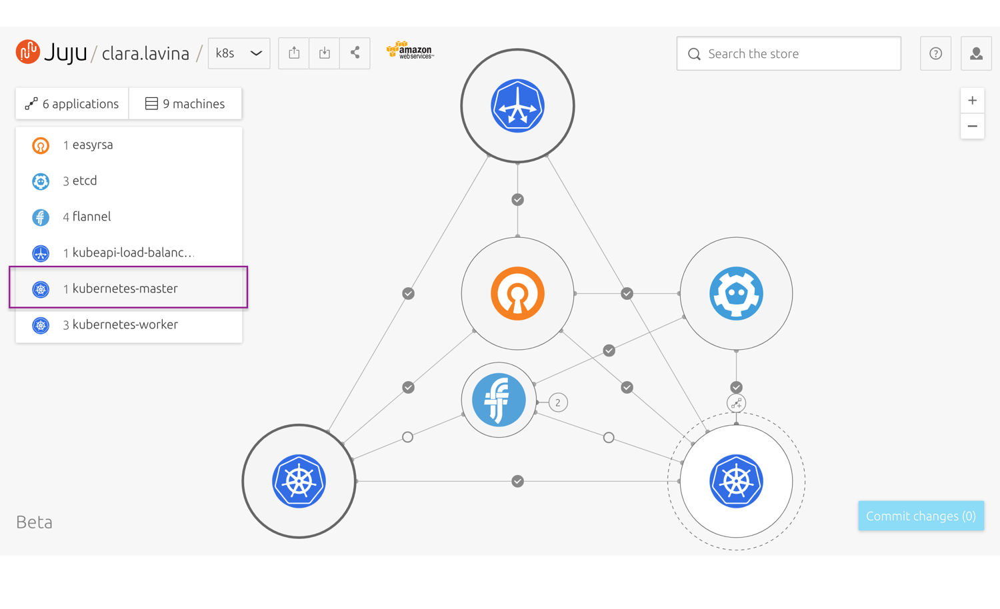
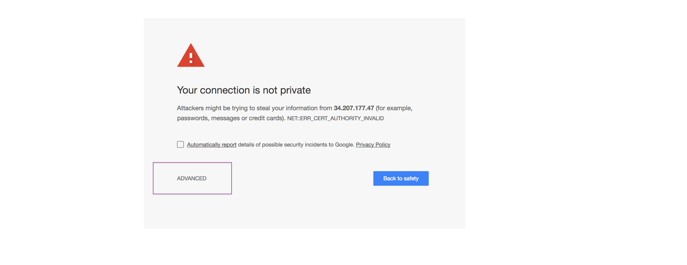
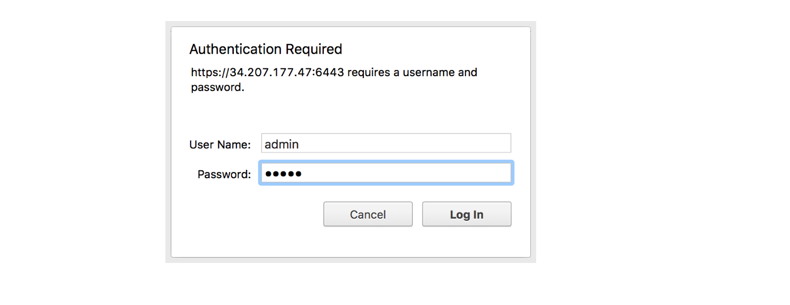
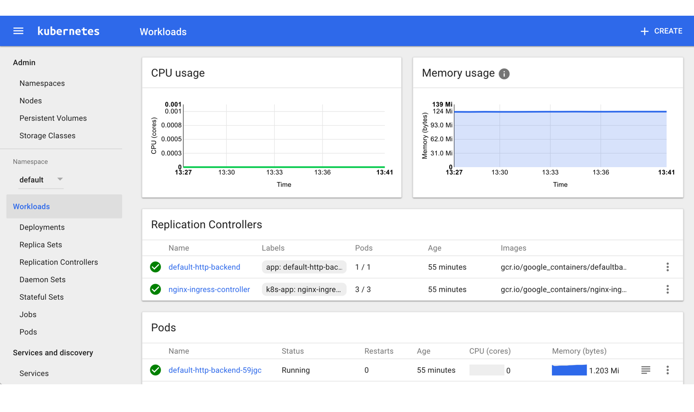

# Get started with Canonical Kubernetes

## Overview
Duration: 1:00

In this tutorial we are going to cover the very basics on how to deploy a fully featured Kubernetes cluster, the open-source orchestration system for cloud native infrastructures. 

The easiest way to automate the deployment, scaling, lifecycle and management of your applications. Operate the latest Kubernetes, from the experts behind Ubuntu and the Kubernetes community.

[Learn more about this bundle](https://jujucharms.com/canonical-kubernetes/).

### What you’ll learn

- How to get your Kubernetes cluster up and running.
- How to operate your cluster.
- Some useful examples to create your first workload.
- Different extra features you can add to your cluster.

### What you’ll need

* You have already deployed your [production cluster Kubernetes](https://jujucharms.com/canonical-kubernetes/) with JAAS into your preferred cloud.
* You have provided your SSH public key to control your cluster. [If you didn’t provide SSH public key earlier](https://jujucharms.com/docs/2.1/users-auth#credentials-and-ssh-keys).
* Signing in with an Ubuntu One account is required.
* The Juju command line client for Ubuntu, Windows, macOS or CentOS. You can find more info [here](https://jujucharms.com/docs/stable/getting-started#use-the-command-line).
* The Kubectl command line. Learn more [here](https://kubernetes.io/docs/user-guide/kubectl-overview/).
* Some very basic knowledge of command line use, and how to edit files.

## Getting started
Duration: 1:00

### About the Canonical Distribution of Kubernetes

This is a highly available production ready Kubernetes cluster — with 2 masters, 3 workers, 3 etcd nodes and a load balancer for HA Control plane. It includes logging, monitoring, and the operational knowledge to automate: deployment, scaling, and lifecycle management of your application containers. 

Perfect for production, it will run on 9 machines in your cloud.

[Learn more about this bundle](https://jujucharms.com/canonical-kubernetes/).

### Deploying your model with JAAS

With JAAS, you don’t need to deal with setup and configuration. All you will need is your preferred cloud credentials.

Wait for deployment to complete. This can take a few minutes – pending units are outlined in *orange*. Up and running are outlined in *black*.

## Get your Kubernetes cluster up and running
Duration: 5:00

1. Select the Kubernetes Master charm.

2. Select Expose and set the toggle *ON*,  so you can connect to this unit. If deployment has not completed, no public address will be available.

3. Click *Commit changes* and *Deploy* to complete the exposing.

4. Once deployment is complete, you can visit the K8s dashboard with your web browser. Copy the public IP number and port (e.g. *xxx.xxx.xxx.xxx:6443*) and paste it in a new browser window in the form *https://xxx.xxx.xxx.xxx:6443/ui*. 

Please notice that you will need to type the **https://** protocol and path to **/ui** in the browser bar.

5. The browser may warn you that the connection is not private or secure - this is normal for a new K8s cluster. Bypass the warnings (via the ‘Advanced’) option.

6. The browser will ask you to login. The default username and password are both **admin**.

7. You can use the Kubernetes Dashboard to drive and get an overview of applications running on your cluster.

 

## How to operate your cluster 
Duration: 10:00

After the cluster is deployed you may assume control over the cluster from any kubernetes-master, or kubernetes-worker node.
 
Visit the docs to learn more about how to [set up Kubernetes](https://kubernetes.io/docs/home/) or how to [get started with Juju](https://jujucharms.com/docs/stable/getting-started). 
 
 
### Juju client
 
Juju is available as a client on many platforms and distributions. Regardless of your operating system, getting all the required tools is very easy.
 
Visit the install docs to get started with [macOS](https://jujucharms.com/docs/stable/reference-install#macos), [Windows](https://jujucharms.com/docs/stable/reference-install#windows) and [CentOS](https://jujucharms.com/docs/stable/reference-install#centos-and-other-linuxes).
 
 
If you are running Ubuntu, you can install it though via:
 
1. It’s helpful to Install Snappy if you don’t have it already. 
`$ sudo apt install snap`
 
2. Install Juju to get the command line client. 
`$ sudo snap install juju --classic`
 
 
### Operating your cluster with kubectl
 

To deploy and manage applications on Kubernetes you need kubectl, a command line interface for running commands against Kubernetes clusters.
 

If you are running **macOS**, visit the install instructions for [kubectl](https://kubernetes.io/docs/tasks/tools/install-kubectl/#install-with-homebrew-on-macos).
 

For **Ubuntu**, you can follow these simple steps:
 

1. Install the kubectl command line. Visit the [Kubernetes documentation](https://kubernetes.io/docs/tasks/tools/install-kubectl/) if you need help.
`$ sudo snap install kubectl --classic`

 
2. Check kubectl has installed correctly.
`$ kubectl`

 
3. Create a kubectl config directory.
`$ mkdir -p ~/.kube`

 
4. To connect to JAAS from the command line you'll need to register with the JAAS controller. You will be required to do this just the first time.
`$ juju register jimm.jujucharms.com`

 
5. This command will open a new window in your default web browser. Use Ubuntu SSO to authorise your account. You will be asked to enter a descriptive name for the JAAS controller (we suggest *JAAS*). Now you can operate your models or applications in JAAS from the command line. 
To learn more:
`$ juju help`

 
6. Now use juju to copy the kubernetes config file from the kubernetes master to your client machine.
`$ juju scp kubernetes-master/0:config ~/.kube/config`

 
7. If you have more than one model, switch to the relevant one.
`$ juju switch <model-name>`

 
8. Issue the cluster info command  to lean how to reach your cluster.
`$ kubectl cluster-info`

## Add extra features to your cluster
Duration: 3:00

You can get the most from your Kubernetes cluster by adding some optional components. 

- [Prometheus](https://jujucharms.com/u/prometheus-charmers/prometheus/): Monitor, profile and debug your applications.

- [ElasticSearch](https://jujucharms.com/elasticsearch/trusty/): Centralise all logs and metrics and get awesome dashboards.

- [Ceph](https://jujucharms.com/ceph/): Run stateful applications on bare metal or private clouds.

## That’s all folks!
Duration: 1:00

Congratulations! You made it! 

By now you should have up and running your Kubernetes cluster, the easiest way to automate the deployment, scaling, lifecycle and management of your applications.

### Next steps

Now that you have your production cluster, you can learn different examples of how you can put your cluster to work.

* [The easy way to commoditise GPUs for Kubernetes](https://medium.com/intuitionmachine/how-we-commoditized-gpus-for-kubernetes-7131f3e9231f).
* [Build a transcoding platform in minutes](https://github.com/deis/workflow).
* [Transform your solution into a private PaaS](https://insights.ubuntu.com/2017/03/27/job-concurrency-in-kubernetes-lxd-cpu-pinning-to-the-rescue/).

### Further reading

* Learn more about the [Canonical Distribution of Kubernetes](https://jujucharms.com/canonical-kubernetes/) bundle.
* Discover [Kubernetes ](https://jujucharms.com/kubernetes).
* Get involved and connect with the [Kubernetes community](https://kubernetes.io/community/).