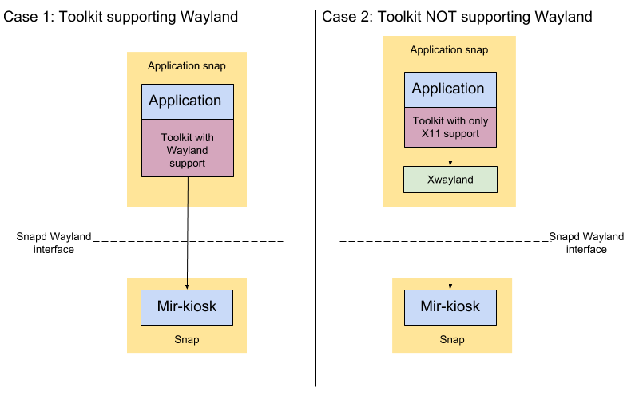

# Graphical Snaps for Ubuntu IoT Devices: Using Xwayland

## Overview
duration: 1:00

This tutorial is a guide on how to *use Xwayland* to create graphical snaps for Ubuntu with a single GUI application running fullscreen on the display. This addresses situations like:
* Digital signage
* Web kiosk
* Industrial machine User Interface

positive
: The combination of Snap, the "mir-kiosk" Wayland server and Ubuntu Core ensures reliability and security of any graphical embedded device application.

negative
: This tutorial assumes you are familiar with the material in [Graphical Snaps for Ubuntu Core](tutorial/graphical-snaps). In particular, techniques for debugging problems in your snap are not covered.

### What you'll learn

How to create graphical snaps for Ubuntu Core using a toolkit that requires Xwayland to support Wayland.

### What you'll need

* An Ubuntu desktop running any current release of Ubuntu

* Your Target Device
 * Ubuntu Core is available on a range of devices.
This guide shows you how to set up an existing device: [https://developer.ubuntu.com/core/get-started/installation-medias](https://developer.ubuntu.com/core/get-started/installation-medias). If there's no supported image that fits your needs you can [create your own core image](https://tutorials.ubuntu.com/tutorial/create-your-own-core-image).
 * Using a VM
You don't *have* to have a physical "Target Device", you can follow the tutorial with Ubuntu Core on a VM:
```bash
snap install --beta ubuntu-core-vm --devmode
```
For the first run, create a VM running the latest Core image:
```bash
sudo ubuntu-core-vm init edge
```
From then on, you can spin it up with:
```bash
sudo ubuntu-core-vm
```
 * Using Ubuntu Classic
You don't *have* to use Ubuntu Core, you can use also a "Target Device" with Ubuntu Classic. You just need to install an SSH server on the device.
```bash
sudo apt install openssh-server
```

## Using Wayland
duration: 3:00

*You may have seen this discussion in [Graphical Snaps for Ubuntu Core](tutorial/graphical-snaps), but it is repeated here as an introduction to the requirement for Xwayland.*

Graphics on Ubuntu Core uses Wayland as the primary interface. Mir is a graphical display server that supports Wayland clients. Snapd supports Wayland as an interface, so confinement can be achieved.

positive
: We do not support X11 directly on Ubuntu Core with Mir.
The primary reason for this is security: the X11 protocol was not designed with security in mind, a malicious application connected to an X11 server can obtain much information from the other running X11 applications.

Not all toolkits have native support for Wayland. So, depending on the graphical toolkit your application uses, there may be some additional setup (for Xwayland) required.



### Native support for Wayland

* GTK3/4 
* Qt5
* SDL2

This is not an exhaustive list. There may be other toolkits that can work with Wayland but we know these work with Mir.
 
Native support for Wayland is the simplest case, as the application can talk to Mir directly.

positive
: You do not need this tutorial for these toolkits.

### No Wayland support

* GTK2
* Qt4
* Electron apps
* Java apps
* Chromium

This is a more complex case, as the toolkits require the legacy X11 protocol to function.

To enable these applications we will introduce an intermediary “Xwayland” which translates X11 calls to Wayland ones. Each snapped X11 application should have its own X11 server (Xwayland) which then talks Wayland - a far more secure protocol.

Xwayland will live in the application snap.

## Introducing glxgears, Xwayland and i3 
duration: 2:00

A large fraction of applications are still written for X11 - there are those written with Qt4 and Gtk2, but also Java, Mono or Wine-based. We can snap these for a kiosk just fine, we just need to add some extra bits to the snap.
   
As before, we’ll take a trivial example to start with (glxgears). glxgears is again a handy snap to have, as it will help prove OpenGL is working for X11 apps inside Ubuntu Core.
   
Install a few extra bits:
```bash
sudo apt install xwayland mesa-utils i3-wm
```

Now launch
```bash
miral-app -kiosk -launcher 'Xwayland -wr :1'
```
(the -wr is optional, causes Xwayland to create a white window, so we see it is running in Mir-on-X, the “:1” specifies a local socket which won’t collide with your desktop’s X11 server which uses “:0”).

If we run `glxgears` right now, it will appear on your desktop, not inside the Mir-on-X window. Mir doesn’t talk X11 itself, but it relies on an intermediary “Xwayland” to translate.
and we now can launch glxgears and tell it to connect to Xwayland:
```bash
DISPLAY=:1 glxgears
```
You should see gear animation in the Mir-on-X window. 

But it’s not perfect - why is it not fullscreen? The reason is that in the X11 world, a window manager is a separate process which takes the responsibility of sizing and positioning windows. Xwayland does not do this, so we need an additional process to manage this. We'll use the “i3” window manager, as it is simple to configure with a text file.

i3 needs to be told what X11 window should be fullscreen. To do this, we need to identify a unique property of the window to be fullscreened. Run glxgears, this time on your desktop:
```bash
glxgears
```
and in a separate terminal, run
```bash
xprop
```
your cursor will change to a cross-hairs - click on the GlxGears window. You’ll see window metadata printed to your terminal like this:
```
_NET_WM_STATE(ATOM) = _NET_WM_STATE_FOCUSED
WM_STATE(WM_STATE):
       window state: Normal
       icon window: 0x0
_NET_WM_DESKTOP(CARDINAL) = 0
_GTK_EDGE_CONSTRAINTS(CARDINAL) = 170
_NET_FRAME_EXTENTS(CARDINAL) = 0, 0, 30, 0
_NET_WM_ALLOWED_ACTIONS(ATOM) = _NET_WM_ACTION_MOVE, _NET_WM_ACTION_RESIZE, _NET_WM_ACTION_FULLSCREEN, _NET_WM_ACTION_MINIMIZE, _NET_WM_ACTION_SHADE, _NET_WM_ACTION_MAXIMIZE_HORZ, _NET_WM_ACTION_MAXIMIZE_VERT, _NET_WM_ACTION_CHANGE_DESKTOP, _NET_WM_ACTION_CLOSE, _NET_WM_ACTION_ABOVE, _NET_WM_ACTION_BELOW
WM_ICON_NAME(STRING) = "glxgears"
WM_NAME(STRING) = "glxgears"
WM_NORMAL_HINTS(WM_SIZE_HINTS):
       user specified location: 0, 0
       user specified size: 300 by 300
```
We can use the “name” option above. Create a text file called “i3.conf” and insert the following:
```
# i3 config file (v4)
font pango:monospace 8
# always start in fullscreen
for_window [title="glxgears"] fullscreen
```

See [https://i3wm.org/docs/userguide.html#configuring](https://i3wm.org/docs/userguide.html#configuring) for info on the syntax used. Start Mir-on-X again:
```bash
miral-app -launcher 'Xwayland -wr :1'
```
Then launch i3 with:
```bash
DISPLAY=:1 i3 -c i3.conf &
```
you won’t see any evidence of it running on screen though. But running
```bash
DISPLAY=:1 glxgears
```
you see that glxgears is now fullscreen.

This is the basic setup that we’ll have in our snap. It seems like a lot of work, but there’s a helper that does it all automatically: xwayland-kiosk-helper! We’ll use that from now on.

## First Pass Snapping: Test on Desktop
duration: 5:00

For our first pass we will snap glxgears and run it in DevMode (i.e. unconfined) on our Ubuntu desktop. We use `xwayland-kiosk-helpers` to make life easier. xwayland-kiosk-helpers looks after running the commands we did above.

This guide assumes you are familiar with creating snaps. If not, please read here first. Create the snap directory by forking https://github.com/snapcrafters/fork-and-rename-me

```bash
git clone https://github.com/snapcrafters/fork-and-rename-me.git glxgears
```
Inside the glxgears directory edit the "snap/snapcraft.yaml" file, and let's try the following:

```yaml
name: glxgears-kiosk
version: 0.1
summary: glxgears on XWayland
description: |
   glxgears on XWayland
confinement: strict
grade: devel

apps:
 glxgears-kiosk:
   command: xwayland-kiosk-launch glxgears
   environment:
     XWAYLAND_FULLSCREEN_WINDOW_HINT: title="glxgears"
     WAYLAND_SOCKET_DIR: /run/user/1000
   plugs:
     - opengl
     - wayland

parts:
 glxgears:
   plugin: nil
   after: [ xwayland-kiosk-helper ]
   stage-packages:
     - mesa-utils
```
`xwayland-kiosk-helper` uses `XWAYLAND_FULLSCREEN_WINDOW_HINT` to set up the i3 configuration (as we did manually in the previous step) and `WAYLAND_SOCKET_DIR` to locate the Wayland socket.

Create the snap by returning to the "glxgears" directory and running

```bash
snapcraft cleanbuild
```
You should be left with a "glxgears-kiosk_0.1_amd64.snap" file.

Let's test it!

```bash
miral-kiosk&
sudo snap install --dangerous ./glxgears-kiosk_0.1_amd64.snap --devmode
sudo snap run glxgears-kiosk
```

You should see a fullscreen gear animation in the Mir-on-X window. 

## Second Pass Snapping: Your Device
duration: 5:00

### Device Setup

Open another terminal and ssh login to your device and logged in install the “mir-kiosk” snap.
```bash
sudo snap install --beta mir-kiosk
```

Now you should have a black screen with a white mouse cursor.

"mir-kiosk" provides the graphical environment needed for running a graphical snap.

Next, you will need to enable the experimental “layouts” feature as we did on desktop:

```bash
sudo snap set core experimental.layouts=true
```

## Snapping to use mir-kiosk
duration: 3:00

Changing this snapcraft.yaml to work with mir-kiosk requires one main alteration: Wayland is provided by another snap: mir-kiosk, so we need to get the Wayland socket from it somehow.
    
The mir-kiosk snap has a content interface called “wayland-socket-dir” to share the Wayland socket with application snaps. Use this by making the following alterations to the YAML file:

Set WAYLAND_SOCKET_DIR to "$SNAP_DATA/wayland":
```yaml
...
     WAYLAND_SOCKET_DIR: $SNAP_DATA/wayland
...
```

Add a `plugs` stanza:
```yaml
...
plugs:
  wayland-socket-dir:
    content: wayland-socket-dir
    interface: content
    target: $SNAP_DATA/wayland
    default-provider: mir-kiosk
...
```
   
This additional snippet causes snapd to bind-mount the mir-kiosk Wayland socket directory into the glmark2-wayland’s namespace, in a location of its desire: $SNAP_DATA/wayland. Then we update the WAYLAND_SOCKET_DIR variable to match.

### The full YAML file:

```yaml
name: iot-example-graphical-xwayland-snap
version: 0.1
summary: glxgears on XWayland
description: |
   glxgears on XWayland
confinement: strict
grade: devel

apps:
 glxgears-kiosk:
   command: xwayland-kiosk-launch glxgears
   environment:
     XWAYLAND_FULLSCREEN_WINDOW_HINT: title="glxgears"
     WAYLAND_SOCKET_DIR: $SNAP_DATA/wayland
   plugs:
     - opengl
     - wayland

parts:
 glxgears:
   plugin: nil
   after: [ xwayland-kiosk-helper ]
   stage-packages:
     - mesa-utils

plugs:
  wayland-socket-dir:
    content: wayland-socket-dir
    interface: content
    target: $SNAP_DATA/wayland
    default-provider: mir-kiosk
```

Check this builds locally:
```bash
snapcraft cleanbuild
```

## Building for different architectures
duration: 10:00

One day, perhaps, snapcraft will fully support cross building with the `--target-arch` option. But getting that to work is beyond the scope of this tutorial. Instead we'll make use of Launchpad's builders to build the snap for all architectures (including the one your device provides).

Create a github repository for your snap and push your changes to the snap project there:

```bash
git commit -a
git remote remove origin
git remote add origin https://github.com/<project>/<repo>.git
git push -u origin master
```

Now [setup your build on Launchpad](https://docs.snapcraft.io/build-snaps/ci-integration). *Note that you will need to use the same snap name in the store as in name in `name:`, so chose something unique to make your life easier.*

Don't bother with publishing to the store (yet) you can download the snap and deploy it as follows:

On your desktop go to the snaps webpage (e.g. https://code.launchpad.net/~/+snaps), find the build for your device architecture and download it and copy to your device. For example:
```bash
wget https://code.launchpad.net/~alan-griffiths/+snap/iot-example-graphical-xwayland-snap/+build/228782/+files/iot-example-graphical-xwayland-snap_0.1_arm64.snap
scp iot-example-graphical-xwayland-snap_0.1_arm64.snap alan-griffiths@192.168.1.159:~
```
On your ssh session to your device:
```bash
sudo snap install --dangerous iot-example-graphical-xwayland-snap_0.1_arm64.snap --devmode
sudo snap connect iot-example-graphical-xwayland-snap:wayland-socket-dir mir-kiosk:wayland-socket-dir
sudo snap run iot-example-graphical-xwayland-snap.glxgears-kiosk
```

On your device, you should see the same graphical animation you saw earlier (and statistics printed to your console).

## Confining Xwayland
duration: 10:00

One thing still needs to be resolved: this snap is installed with the `--devmode` option.

To use fully confined snaps which use Xwayland internally, you will need a build of snapd that allows Xwayland to work in a confined snap. At the time of writing snapd "edge" already has [the necessary patch](https://github.com/snapcore/snapd/pull/4545). In the fullness of time this feature (to allow X11 slot implementations) will be be available on "stable", but for now we need to switch "core" to edge.

In your ssh session to your device:
```bash
sudo snap refresh core --edge
```
This will take a while and cause your device to reboot. So leave that running and reconnect ssh once we've updated the snap.

To update the snap to use the X11 interface we also need to update the "snap/snapcraft.yaml" file to add the X11 plug & slot. The full file again:
```yaml
name: iot-example-graphical-xwayland-snap
version: 0.1
summary: glxgears on XWayland
description: |
   glxgears on XWayland
confinement: strict
grade: devel

apps:
 glxgears-kiosk:
   command: xwayland-kiosk-launch glxgears
   environment:
     XWAYLAND_FULLSCREEN_WINDOW_HINT: title="glxgears"
     WAYLAND_SOCKET_DIR: $SNAP_DATA/wayland
   plugs:
     - opengl
     - wayland
     - x11-plug
   slots:
     - x11

parts:
 glxgears:
   plugin: nil
   after: [ xwayland-kiosk-helper ]
   stage-packages:
     - mesa-utils

plugs:
  wayland-socket-dir:
    content: wayland-socket-dir
    interface: content
    target: $SNAP_DATA/wayland
    default-provider: mir-kiosk
  x11-plug: # because cannot have identical plug/slot name in same yaml.
    interface: x11
```
The new lines are just these:
```yaml
     - x11-plug
   slots:
     - x11
...
  x11-plug: # because cannot have identical plug/slot name in same yaml.
    interface: x11
```

Then we need to push the changes, import the changes to launchpad and rebuild.

On your desktop go to the snaps webpage (e.g. https://code.launchpad.net/~/+snaps), find the build for your device architecture and download it and copy to your device. For example:
```bash
wget https://code.launchpad.net/~alan-griffiths/+snap/iot-example-graphical-xwayland-snap/+build/238926/+files/iot-example-graphical-xwayland-snap_0.1_arm64.snap
scp iot-example-graphical-xwayland-snap_0.1_arm64.snap alan-griffiths@192.168.1.159:~
```
In your ssh session to your device *(note: in addition to the commands you've seen before we also "connect" X11)*:
```bash
snap install --dangerous iot-example-graphical-xwayland-snap_0.1_arm64.snap
sudo snap connect iot-example-graphical-xwayland-snap:wayland-socket-dir mir-kiosk:wayland-socket-dir
sudo snap connect iot-example-graphical-xwayland-snap:x11-plug iot-example-graphical-xwayland-snap:x11
sudo snap run iot-example-graphical-xwayland-snap.glxgears-kiosk
```
On your device, you should see the same graphical animation you saw earlier (and statistics printed to your console).

Note: on *Ubuntu Classic*, at the time of writing, the above doesn't yet work correctly: you may find you still need to add `--devmode` to the install command.

## Congratulations
duration: 1:00

Congratulations, you have created your first graphical snap using Xwayland for Ubuntu Core.
