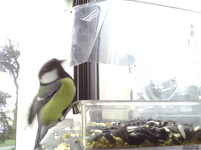
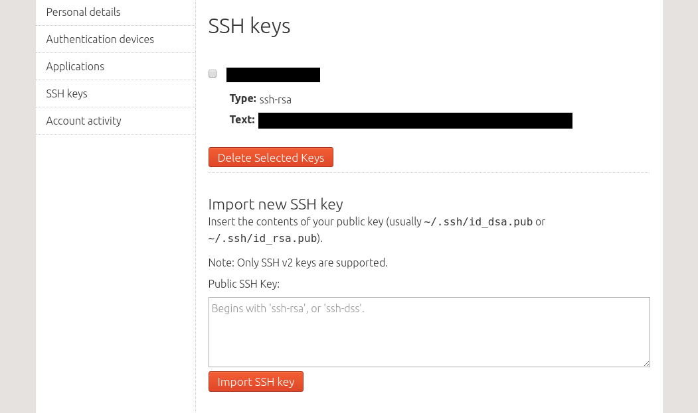
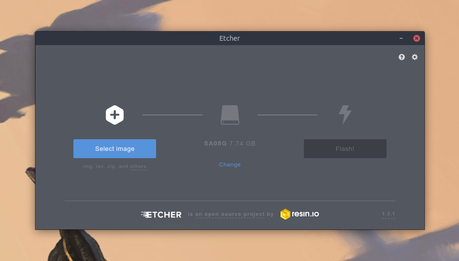
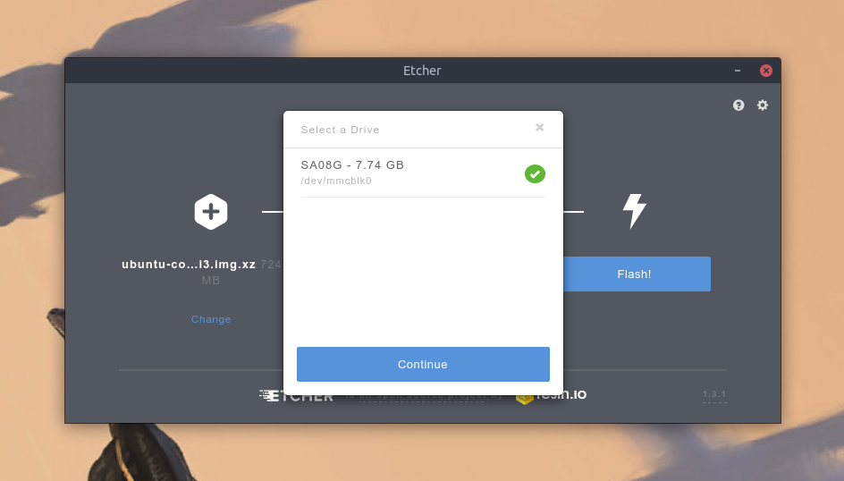
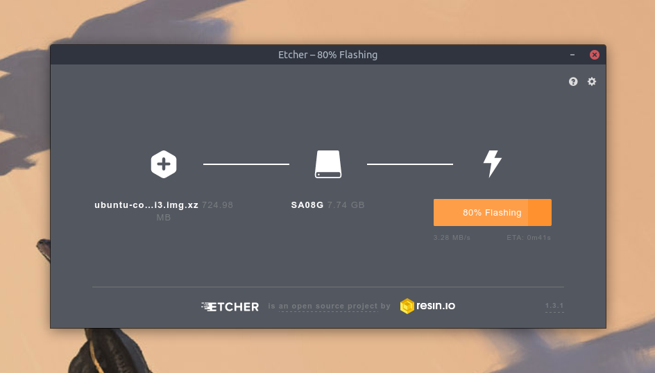

# Build a wildlife camera with a Raspberry Pi

## Overview
Duration: 1:00

In less than an hour, you are going to build a motion-sensing Raspberry Pi wildlife camera. When you are done, you will have an autonomous device that takes short videos of wildlife activity when motion is detected.

Like this:



To do so, we are going to use off-the-shelf components, such as a USB webcam and a micro USB cable to power it. Communication between the camera and your computer will happen over WiFi, but the device won't need to stay permanently connected to it.

positive
: **No programming knowledge required**
This tutorial has two levels of learning: if your goal is a quick setup, you can skip the software building steps and simply install the version I've built for this tutorial. If you are willing to learn more about creating your own software package (and eventually improve the existing version!), you won't need advanced programming knowledge, other than the ability to read a bit of bash.

### What you'll learn

* How to install and manage Ubuntu Core as the device OS
* How to build and customise a motion detection software snap
* How to enable automated code builds and automated updates
* How to setup your wildlife camera to get the best shots

### What you'll need

* A Raspberry Pi 2 or 3
* A USB webcam
* An alimentation cable (micro USB) for the Pi
* A microSD card (4GB or more)
* A microSD to SD card adapter
* The Etcher app to flash the OS on the microSD card (available [here](https://etcher.io/))
* An HDMI screen and a USB keyboard (or a USB TTL Serial cable that will replace both)
* A computer running Ubuntu (16.04 or above), Windows or Mac OS
* A WiFi network to connect remotely to the Raspberry Pi

#### And if you intend to build the software (Ubuntu users only)

* The `git` command-line tool (that you can install by running `sudo apt install git`)
* The `snapcraft` command-line tool (that you can install by running `sudo snap install snapcraft`)
* A [GitHub](https://github.com) account to enable automated builds

Depending on the topic and your level of experience, writing a tutorial can be a very easy task, but following these guidelines is important to keep the whole set of published tutorials consistent. Let's get started!

## Installing Ubuntu Core
Duration: 10:00

positive
: **What's Ubuntu Core?**
Ubuntu Core is a version of Ubuntu with very restricted access between apps and the rest of the system. It is primarily intended for IoT devices and is a good fit for our use case. Our camera will be mostly unattended and we want an OS that: automatically updates itself and its apps, automatically rollbacks to a working version in case of failure, has a small install footprint and all its apps sandboxed. 

### Download the image

First, we are going to download the OS image that we will install on our Pi.

* Raspberry Pi 2: [http://cdimage.ubuntu.com/ubuntu-core/16/stable/current/ubuntu-core-16-pi2.img.xz](http://cdimage.ubuntu.com/ubuntu-core/16/stable/current/ubuntu-core-16-pi2.img.xz)
* Raspberry Pi 3: [http://cdimage.ubuntu.com/ubuntu-core/16/edge/current/ubuntu-core-16-armhf+raspi3.img.xz](http://cdimage.ubuntu.com/ubuntu-core/16/edge/current/ubuntu-core-16-armhf+raspi3.img.xz)


### Set up secure remote login

While the image is downloading, go to [login.ubuntu.com](https://login.ubuntu.com/) to create an Ubuntu SSO account. It's used by Ubuntu Core to store the SSH keys that will be pushed to the Pi on first boot and allow it to create a user, so you can connect to it remotely.

Once the account is created, you need to add an SSH key to it. If you don't have one, here is how to generate one on Ubuntu and macOS (Windows users can refer to [this short tutorial](https://tutorials.ubuntu.com/tutorial/tutorial-ssh-keygen-on-windows)).

On Ubuntu or macOS, open a terminal and run the following commands:

``` bash
mkdir ~/.ssh
chmod 700 ~/.ssh
ssh-keygen -t rsa
```

The first two commands will create the `~/.ssh` directory and make it readable only to your user.

The last command will generate the key and prompt you for the location of the key (keep the default one: `~/.ssh/id_rsa`) and a passphrase to protect the key (at your discretion).

When this is done, you can import your key (the content of the `~/.ssh/id_rsa.pub` file) on the [SSK keys page](https://login.ubuntu.com/ssh-keys) of your Ubuntu SSO account.



The image should have finished downloading now, let's flash it.

### Flash the image on the microSD card

When the download has finished, put your microSD card into the SD adapter and insert it in your computer. We are going to *flash* the image to it, using an app called Etcher.

If you haven't done so already, download Etcher from [etcher.io](https://etcher.io), unzip it and install it by double-clicking on the resulting file. When this is done, start Etcher.

Click on **Select image** and select the `ubuntu-core-16-armhf+raspi3.img.xz` image.



Then, click on **Select drive** and select your microSD card.



Click on **Flash!**



When the flashing process is over, you can eject the microSD card and insert it into your Pi.

We are ready to boot!

## Booting the Raspberry Pi
Duration: 2

To boot the Raspberry Pi for the first time and use the Ubuntu Core first boot wizard, you are going to need a way to see what's happening on the board and interact with it. You can either connect your Pi to an HDMI display and a USB keyboard, or use a serial cable.

### With an HDMI display and USB keyboard

Connect the USB keyboard and the HDMI display to the board, then plug in the micro USB alimentation cable. The boot process will start on the display.

### With a USB TTL Serial cable

-- SERIAL STEPS

### First boot wizard

Once Ubuntu Core has booted, you will be prompted to "Press enter to configure".

The first configuration step is to setup your WiFi connection:

Start by selection wlan

-- SCREENSHOT

Then enter you WiFi network name and password

-- SCREENSHOT

Click "Done" to go the next step.

You will then be asked for your Ubuntu SSO credentials in order to create the user account that will be accessible remotely:

-- SCREENSHOT

When the user has been created, the wizard will give you the user name and the IP address of the board.

-- SCREENSHOT

We are now going to open a terminal on our computer and connect to the device using SSH.

Simply paste the SSH command displayed at the end of the wizard, which is in the format:

``` bash
ssh username@ip-address
```

Press enter and you should see the following welcome message:

``` bash
Welcome to Ubuntu Core 16 (GNU/Linux 4.4.0-1085-raspi2 armv7l)
Welcome to Snappy Ubuntu Core, a transactionally updated Ubuntu.

 * See https://ubuntu.com/snappy

It's a brave new world here in Snappy Ubuntu Core! This machine
does not use apt-get or deb packages. Please see 'snap --help'
for app installation and transactional updates.
```

**We are logged in!**

You can disconnect the serial cable or the keyboard and HDMI display, we won't need them anymore as we now have a secure remote connection to access the Pi.

### Install your first app

Ubuntu Core can only install apps packaged in the snap format. Let's try to install a simple hello-world snap.

Run:

``` bash
snap install hello-world
```

then start the app with:

```
hello-world
```

Which should return:

```
Hello World!
```

Easy!

negative
: **Raspberry Pi 3: living on the edge**
Ubuntu Core has the concept of distribution channels, with increasing levels of testing and stability: `edge`, `beta`, `candidate` and `stable`. If you have a Pi 3, the image you are using comes from the `edge` channel. It is for convenience, as the `stable` image has an older kernel causing WiFi configuration issues on first boot.<br>
Now that WiFi configuration is done, you can refresh the OS to the `stable` channel. To do so, run this command on the Pi: `snap refresh core --channel=stable`<br>
This will download Ubuntu Core from the `stable` channel. Reboot the Pi to start using the `stable` version of the OS.

In the next step, we are going to put the Pi aside for a moment and build a much more interesting piece of software on your main computer...

## Building the motion detection software
Duration: 20:00

positive
: **Building the software**
This step if for people who are using Ubuntu and are interested in learning the ropes of building and packaging software for Ubuntu Core and Linux in general. If you simply want to get your motion detection camera up and running, you can go directly to step 6.

Our motion detection is going to be based on _Motion_, a widely used open source project. In this step, we are going to pull motion from source, build it and add a custom configuration. We are not going to do it by hand, though. We are going to use snapcraft to package it as a snap, so our package will be modular, easy to tweak, test, install, share, and ultimately distribute.

As an example, you will be able to tell people running almost any Linux distribution to run:

``` bash
snap install --channel=edge my-wildlife-camera-app
```

And they will get an automated update each time you change the source code.

### Let's get started

First, we need to initialize a new snapcraft project.

Open a terminal and create a new directory called `wildlife-camera-tutorial` and enter it:

``` bash
mkdir wildlife-camera-tutorial
cd wildlife-camera-tutorial
```

In this empty directory, run `snapcraft init` to initialize an new snapcraft project. This will create a `snap` directory containing a `snapcraft.yaml` file.

### Adding general metadata

This `snapcraft.yaml` file contains some boilerplate that we are going to change. Open it with your favourite text editor and at the top of the file, edit the existing values to match this:

``` yaml
name: wildlife-camera-tutorial
version: 0.1
summary: A wildlife motion-sensing camera app
description: |
 A wildlife camera app that will record small videos from a USB webcam
 when motion is detected.
grade: stable
confinement: strict
```

You have just prepared the scene to create a snap. You have declared its:

* `name`: a unique lowercase string that will identify your snap on the command-line and in the store
* `version`: a human-readable version string so users know what they are running
* `summary`: a short description appearing in store search results
* `description`: a longer, multi-line description
* `grade`: the state of the app. It can be `devel` (for software still in development) or `stable`, which will affect how it can be released to the store
* `confinement`: our app is going to be strictly confined and won't be able to read or write anything on the host system outside of its confinement area

### Adding a "motion" part

Under the general metadata, we are going to add a "part". A declaration for a piece of code that will be included in our package.

Add:

``` yaml
parts:
  motion:
    plugin: autotools
    source: https://github.com/Motion-Project/motion.git
    build-packages:
      - libzip-dev
      - libjpeg-dev
      - libavformat-dev
      - libavcodec-dev
      - libavutil-dev
      - libswscale-dev
      - libavdevice-dev
      - libwebp-dev
      - pkg-config
    stage-packages:
      - gettext-base
      - zlib1g
      - libpulse0
```

This part we are calling "motion" declares how to build Motion from source. Without entering into too much details, here is what we have declared:

* `parts`: the top level YAML subsection in which each part is declared
* `motion`: the name of the part
* `plugin`: snapcraft comes with many built-in plugins to build different types of source code and languages. Motion can be built the `autotools` plugin: you can read more about what the `autotools` plugin does by running `snapcraft help autotools`, and you can list all available plugins with the `snapcraft plugins` command.
* `source`: the location of the Motion source code, which is on GitHub
* `build-packages`: a list of packages from the Ubuntu archive that are required to build Motion
* `stage-packages`: a list of packages, also from the Ubuntu archive, that will be included in the final package, since they are required to run Motion

With this declaration in place, we can be confident that the latest version of Motion will be built and pulled into our snap when we package it.

You can even try it right now. If you run `snapcraft` at the root of our project, it will start the packaging process and create a `snap` file named `wildlife-camera-tutorial` containing a build of Motion.

### A bit of customisation

A pristine build of Motion sets up the stage for the app, but to be able to call it our own, we are going to customise it by adding another part:

Under the "motion" part declaration (and at the same indentation level, as its a child of "parts"), add a new "assets" part:

``` yaml
  assets:
    plugin: dump
    source: .
    prime:
      - motion-wrapper.sh
      - motion-wildlife-camera.conf
    stage-packages:
      - gettext-base
```

Some explanations:

* The `dump` plugin is used to copy files inside the snap, without any build step.
* The `prime` keyword declares the list of files that will be copied from the `source` ("." indicates the root of the project) into the snap.

The two files we are adding to our snap with this part are:

* `motion-wrapper.sh`: a very small launch wrapper for Motion, where we are going to customise how motion is launched
* `motion-wildlife-camera.conf`: a Motion configuration file, tuned to take small videos when a certain amount of motion is detected

You can download them by running, from the root of your project:

``` bash
wget https://raw.githubusercontent.com/caldav/wildlife-camera-tutorial/master/motion-wrapper.sh
wget https://raw.githubusercontent.com/caldav/wildlife-camera-tutorial/master/motion-wildlife-camera.conf
```

These two files are heavily commented to explain the purpose of each line, feel free to dive into them!

### Starting Motion as a service

Finally, we want the app to automatically run when the Raspberry Pi starts, to do so we are going to declare it as a service.

To your `snapcraft.yaml`, add the following "apps" entry:

``` yaml
apps:
  motion: 
    command: motion-wrapper.sh
    daemon: simple
    plugs:
      - opengl
      - camera
```

We are declaring many important things here. This is how we are turning our snap from a fancy zip file into an actual app that can be launched:

* `apps`: the top level YAML subsection in which apps contained in the snap are declared
* `motion`: the name of the app, which we are calling "motion" since it's what its going to launch
* `command`: what the `motion` command will run, meaning our launch wrapper containing our customisation
* `daemon`: we declare the app as a "simple" daemon, which means it will start as a single process when the host system is turned on
* `plugs`: a list of interfaces the app can request access to on the host system. Snaps are confined but can still access hardware and host system functionalities through pre-defined interfaces: in this case we will request access to OpenGL system calls and plugged-in video devices.

### Configuration at run time

Before we build our final snap, we are going to add some flair to it. Snaps installed on a system are read-only, and can't be tampered with, but in our case, we will definitely want to be able to test and adjust motion detection to specific framerates, luminosity, or even just change the size of recorded videos.

To do so, we are going to use a "configure hook", a script inside the snap that we will be able to call from the command-line to edit values inside the config file.

Create a `hooks` sub directory in the `snap` directory and enter it:

``` bash
mkdir snap/hooks
cd snap/hooks
```

Now, download the `configure` script:

``` bash
wget https://raw.githubusercontent.com/caldav/wildlife-camera-tutorial/master/snap/hooks/configure
```

This script is well commented too, so we won't go into too many details, but once the snap installed on a system, this script will be called when the command `snap set wildlife-camera-tutorial` is ran. It will allow us to modify any value inside the motion configuration file, for example:

``` bash
snap set wildlife-camera-tutorial framerate=20
```

Which will update the configuration file accordingly.

### Our final build

Now is the time to put everything together with a `snapcraft` command.

Instead of running `snapcraft` that would use our system and its libraries as a build environment, we are going to run `snapcraft cleanbuild` that will create a containerised Ubuntu 16.04 LTS image. It will be our pristine, reproducible, build environment.

``` bash
snapcraft cleanbuild
```

After running this command, the terminal output is going to be pretty busy. Here is what's happening:

1. An Ubuntu image is downloaded and used to create a LXD container
2. Snapcraft and some common build dependencies are installed inside
3. Your project directory is compressed and copied into the container
4. snapcraft builds your snap inside the container
5. Resulting files are copied back to your original project directory and the container is destroyed

You can now install your snap with:

``` bash
sudo snap install --dangerous wildlife-camera-tutorial.*snap
```

For security, snaps don't have access to camera devices by default, you need to enable the connection manually with:

```bash
snap connect wildlife-camera-tutorial:camera
```

Move something in front of your webcam and a video file should appear in `/var/snap/wildlife-camera-tutorial/current/`! 

Note that `/var/snap/<snap name>/current/` is the conventional place where snaps running as services save data files.

### We have a snap, now what?

We have a piece of software that works (success!) and we understand how it's built, but:

- We don't have an arm version of it (arm is the architecture of the Raspberry Pi) which means we would need to rebuild the snap on the Pi itself in order to have a version installable there. Which is easy to do but would take some time as the Pi is a slower device than your computer.
- More importantly, if we want to share this snap with someone else, they won't benefit from our future changes and improvements!

Let's kill these two birds with one stone: automated cross-architecture building. This will take 5 minutes and make our life much easier.

## Setting up automated builds
Duration: 5:00

In this step, we are going to use build.snapcraft.io. It's a free service that pulls snap declarations from GitHub repositories, build snaps for multiple architectures (i386, amd64, armhf) and push them to the snap store so you can install them easily on all sort of devices.

Before starting, make sure you have a GitHub account with an SSH key added to it.

### Push your code to GitHub

Start by creating a [new GitHub repository](https://github.com/new). Pick a name and click "Create repository", do NOT intialize it with a README as we are going to initialize it locally.

-- SCREENSHOT

Now, you need to turn your project folder into a GitHub repository. To do so, run the following commands at the root of your project (make sure you replace "username" and "repository" by the appropriate values):

``` bash
git init
git commit -am "Init awesome snapcraft project"
git remote add origin git@github.com:<username>/<repository>.git
git push -u origin master
```

Your repo on GitHub should now contain your project. Make sure it's the case!

### Connect the repo to the build service

Go to [build.snapcraft.io](https;//build.snapcraft.io) and click the "Set up in minutes" button.

You will be prompted to authorize the service to access your GitHub repositories. When done, you will be able to connect your new repository to the build service.

-- SCREENSHOT

Connect it and click the "Not registered" drop down next to your repo name to register your snap on the store. The snap name you are going to use *needs* to match the `name` field of your `snapcraft.yaml` file.

-- SCREENSHOT

### Build and release: this is automatic

The service will automatically start to build your snap for multiple architectures. Note that builds and releases will be triggered each time you do a change on the master branch of the GitHub repository.

When the builds are done, they will be automatically released to the `edge` channel of the store, which means the snap will not appear in store searches and will be invisible to anyone not knowing its exact name.

Upon successful release, you will receive an email on the address connected to your Ubuntu SSO account.


After that, it's just a matter of running...

``` bash
sudo snap install --edge <snap name>
```

...on any snap-enabled Linux, like your Raspberry Pi!

## Testing on the Pi
Duration: 5:00

We have a running device, and we have an app to install. It's time to start testing our wildlife camera!

Power on the Pi and plug the USB webcam.

Like before, we are going to access the device with SSH:

``` bash
ssh username@ip-address
```

Once connected, install the app. If you have been following the software building steps, you should know the name you have given to it:

``` bash
snap install <snap name> --edge
```

Otherwise, install the version this tutorial is based on:

``` bash
snap install wildlife-camera-tutorial --edge
```

### Following logs

Since we are going to test it, we want to also see what's happening under the hood, by following the snap output. To do so, open another terminal, connect it to the board with the `ssh` command and run:

``` bash
sudo tail -f /var/log/syslog | grep wildlife
```

Which will display in real-time every new "wildlife" related log message on the system, which means: messages from our snap.

### Let's take our first shot!

For security, snaps don't have access to camera devices by default, you need to enable the connection manually with:

``` bash
snap connect wildlife-camera-tutorial:camera
```

This step is only needed after installing the snap and this access will persist across reboots.

Once you have enabled camera access, wait a couple seconds for the motion detection service to restart and move your hand in front of the webcam, the `syslog` output should have a new line reading:

``` bash
Feb 16 11:09:31 localhost wildlife-camera-tutorial.motion[2841]: 
[1:ml1] [NTC] [EVT] event_newfile: 
File of type 8 saved to: /var/snap/wildlife-camera-tutorial/3/41-20180216110930.mkv
```

This is our motion detection service in action, it's taking a video and saving it to `/var/snap/wildlife-camera-tutorial/`!

Now, let's look at it.

### Export videos

Since the Pi has no user interface, you need to export the video somewhere else. To see it, we are going to open an SFTP (Secure FTP) connection to the board.

If you are using Ubuntu, open the file manager and click on **Other locations** in the left pane.

In the "Connect to server" field at the bottom, type:

```
sftp://username@ip-address/var/snap/wildlife-camera-tutorial/current
```

Make sure you replace 'username' and 'ip-address' by your SSH connection values.

It will show the directory where captured videos are stored on the Pi. Simply open the oldest file you see there, and it should be your hand!

-- SCREENSHOT

Success!

Motion detection will automatically start when the board is powered on, videos will start recording and be accessible through SFTP.

One drawback that you will notice when testing the device is that motion detection quality depends on several factors. One of them is the noisiness of the background: moving trees, cars, people passing and luminosity changes can trigger unwanted recordings.

In the next step we are going to configure motion detection and try to filter out some of this noise.

## Configuring motion detection
Duration: 3:00

### Adjust the detection threshold

### Adjust the framerate

### Adjust video duration

### Further project customisations

-- Improving picture export. Eg. uploading them somewhere.

-- Adding new commands. Eg. listing configuration options.

## Conclusion
Duration: 1:00


