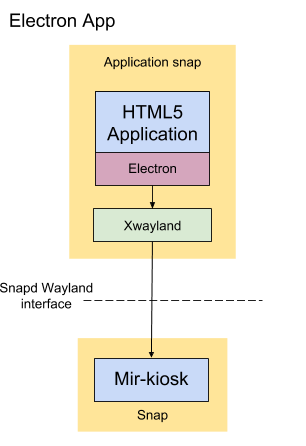

# Make a HTML5/Electron-based Kiosk Snap


## Overview

duration: 1:00


### What you'll learn

In this tutorial we will create a snap of a HTML5/Electron application to act as the graphical user interface for an IoT or kiosk device. For the introduction to this tutorial series and the Mir display server, please visit [here](/tutorial/secure-ubuntu-kiosk).

This tutorial assumes you are familiar with the material in [Make an X11-based Kiosk Snap](/tutorial/x11-kiosk).


### What you'll need


*   An Ubuntu desktop running any current release of Ubuntu or an Ubuntu Virtual Machine on another OS.
*   A 'Target Device' from one of the following:
    *   **A device running [Ubuntu Core](https://www.ubuntu.com/core).**<br />
[This guide](https://developer.ubuntu.com/core/get-started/installation-medias) shows you how to set up a supported device. If there's no supported image that fits your needs you can [create your own core image](/tutorial/create-your-own-core-image).
    *   **Using a VM**
You don't have to have a physical "Target Device", you can follow the tutorial with Ubuntu Core in a VM. Install the ubuntu-core-vm snap:
`snap install --beta ubuntu-core-vm --devmode`
For the first run, create a VM running the latest Core image:
`sudo ubuntu-core-vm init`
From then on, you can spin it up with:
`sudo ubuntu-core-vm`
You should see a new window with Ubuntu Core running inside. Setting up Ubuntu Core on this VM is the same as for any other device or VM. See, for example, [https://developer.ubuntu.com/core/get-started/kvm](https://developer.ubuntu.com/core/get-started/kvm).
    *   **Using Ubuntu Classic**
You don't _have_ to use Ubuntu Core, you can use also a "Target Device" with Ubuntu Classic. You just need to install an SSH server on the device.
`sudo apt install ssh`
For IoT use you will want to make other changes (e.g. uninstalling the desktop), but that is outside the scope of the current tutorial.
Note: On Classic snapd doesn't currently provide confinement for snapped wayland or x11 servers, so you'll need to use devmode.


## Architecture of Electron snaps with Wayland

duration: 3:00

We use Wayland as the primary display interface. We will use Mir to manage the display and support connections from Wayland clients and Snapd will confine the applications and enable Wayland protocol interactions through Mir, securely.

Currently Electron does not have Wayland support, so we will use a tiny intermediary X11 server called Xwayland.




[Click here](/tutorial/x11-kiosk) for more information on this architecture.


## Snapping Electron apps

duration: 5:00

Due to the myriad of Electron app packaging systems, this tutorial will assume you already have a snap of your Electron app for Ubuntu Classic. Details on achieving this are available here:

[https://docs.snapcraft.io/build-snaps/electron](https://docs.snapcraft.io/build-snaps/electron)

This guide will start with a working hello-world snap for Electron, that functions solely on Ubuntu Classic. Take this YAML as a starting point:


```yaml
name: electron-hello-world-kiosk
version: 0.1
summary: Hello World Electron app
description: |
  Simple Hello World Electron app as an example
confinement: strict
grade: devel

apps:
  electron-hello-world-kiosk:
    command: desktop-launch "$SNAP/electron-helloworld/electron-quick-start"
    plugs:
    - browser-sandbox
    - network
    - network-bind
    - opengl
    - pulseaudio
    - wayland
    - x11

plugs:
  browser-sandbox:
    interface: browser-support
    allow-sandbox: true

parts:
  electron-helloworld:
    plugin: nodejs
    source: https://github.com/electron/electron-quick-start.git
    after: [desktop-gtk2]
    override-build: |
        case $SNAPCRAFT_ARCH_TRIPLET in
          "i386-linux-gnu") ARCH="ia32";;
          "x86_64-linux-gnu") ARCH="x64";;
          "arm-linux-gnueabihf") ARCH="armv7l";;
          "aarch64-linux-gnu") ARCH="arm64";;
          *) echo "ERROR: electron does not support the '$SNAPCRAFT_ARCH_TRIPLET' architecture" && exit 1;;
        esac
        npm install electron-packager &&
        ./node_modules/.bin/electron-packager . --overwrite --platform=linux --arch=$ARCH --output=release-build --prune=true
        cp -v -R ./electron-quick-start-linux-$ARCH $SNAPCRAFT_PART_INSTALL/electron-helloworld
    stage-packages:
    - libasound2
    - libgconf-2-4
    - libnss3
    - libxss1
    - libxtst6
```


Some points about this YAML


*   [snapcraft-desktop-helpers](https://github.com/ubuntu/snapcraft-desktop-helpers/blob/master/snapcraft.yaml#L1) is used to ease environment setup for electron
*   npm is the packaging tool being used
*   It uses "[electron-packager](https://www.npmjs.com/package/electron-packager)" to build the electron app.
*   the"[override-build](https://docs.snapcraft.io/build-snaps/scriptlets#overriding-the-build-step)" scriptlet is used to run commands to install electron-packager, build the package and install the final binary into a suitable location in the snap.
*   the stage-packages are those we find necessary for the final binary to function. You may need to add more depending on the complexity of your application.
*   it supports i386, amd64, armhf and arm64.


### Build and test

Build the snap with:


```bash
snapcraft cleanbuild
```


and on your desktop, install, connect the required interface(s) and run:


```bash
sudo snap install --dangerous ./electron-hello-world-kiosk_0.1_amd64.snap
sudo snap connect electron-hello-world-kiosk:browser-sandbox :browser-support
snap run electron-hello-world-kiosk
```


This should pop up a window with "Hello World" printed.


## Converting the Electron snap into a Kiosk snap

duration: 5:00

Once the snap is running on your Ubuntu desktop, we need to perform a few alterations to have it function as a kiosk app snap. We will follow the [xwayland-kiosk-helper documentation](https://github.com/MirServer/xwayland-kiosk-helper/blob/master/snapcraft.yaml#L4):


1.  add `xwayland-kiosk-helper` to the `after:` parts list
1.  to the app `command:`, add `xwayland-kiosk-launch` after the `desktop-launch`
1.  and make it a daemon by adding `daemon: simple `and` restart-condition: always`
1.  set the `XWAYLAND_FULLSCREEN_WINDOW_HINT` environment variable to `window_role="browser-window"`
1.  have `x11` be both a socket and a plug - involves creating a x11-plug to avoid duplicate names.

Finally we want this snap to start on boot and be restarted if it fails, so make it a daemon.

The final YAML file will look like this:


```yaml
name: electron-hello-world-kiosk
version: 0.1
summary: Hello World Electron app for a Kiosk
description: |
  Simple Hello World Electron app as an example of a HTML5 Kiosk
confinement: strict
grade: devel

apps:
  electron-hello-world-kiosk:
    daemon: simple
    restart-condition: always
    command: desktop-launch xwayland-kiosk-launch "$SNAP/electron-helloworld/electron-quick-start"
    environment:
      XWAYLAND_FULLSCREEN_WINDOW_HINT: window_role="browser-window"
    slots: [ x11 ]
    plugs:
    - browser-sandbox
    - network
    - network-bind
    - opengl
    - pulseaudio
    - wayland
    - x11-plug

plugs:
  browser-sandbox:
    interface: browser-support
    allow-sandbox: true
  x11-plug: # because cannot have identical plug/slot name in same yaml.
    interface: x11

parts:
  electron-helloworld:
    plugin: nodejs
    source: https://github.com/electron/electron-quick-start.git
    after: [desktop-gtk2, xwayland-kiosk-helper]
    override-build: |
        case $SNAPCRAFT_ARCH_TRIPLET in
          "i386-linux-gnu") ARCH="ia32";;
          "x86_64-linux-gnu") ARCH="x64";;
          "arm-linux-gnueabihf") ARCH="armv7l";;
          "aarch64-linux-gnu") ARCH="arm64";;
          *) echo "ERROR: electron does not support the '$SNAPCRAFT_ARCH_TRIPLET' architecture" && exit 1;;
        esac
        npm install electron-packager &&
        ./node_modules/.bin/electron-packager . --overwrite --platform=linux --arch=$ARCH --output=release-build --prune=true
        cp -v -R ./electron-quick-start-linux-$ARCH $SNAPCRAFT_PART_INSTALL/electron-helloworld
    stage-packages:
    - libasound2
    - libgconf-2-4
    - libnss3
    - libxss1
    - libxtst6
```


Build as usual with


```bash
snapcraft cleanbuild
```


(for building for other architectures, [follow this guide](/tutorial/wayland-kiosk#13))


## Deploying on a Device

duration: 3:00

Once you have a snap of your electron-based app, push it to your device:


```bash
scp electron-hello-world-kiosk_0.1_amd64.snap <user>@<ip-address>:~
```


using your device's SSH username & IP address details.

We now have the .snap file on the device in its home directory. We need to install the snap, configure it to talk Wayland to mir-kiosk, allow browser support, and run the application. In your ssh session to your device:


```bash
snap install --dangerous ./electron-hello-world-kiosk_0.1_arm64.snap 
snap connect electron-hello-world-kiosk:browser-sandbox :browser-support
snap restart electron-hello-world-kiosk
```


On your device, you should see the "Hello world" screen you saw earlier.

Your device is now a kiosk! Rebooting will restart mir-kiosk and electron-hello-world-kiosk automatically.


## Congratulations

duration: 1:00

Congratulations, you have created your first graphical kiosk snap using Electron for Ubuntu Core.

If you have a kiosk or digital signage product and need help deploying an Electron app, [talk to us!](https://www.ubuntu.com/internet-of-things/contact-us)
