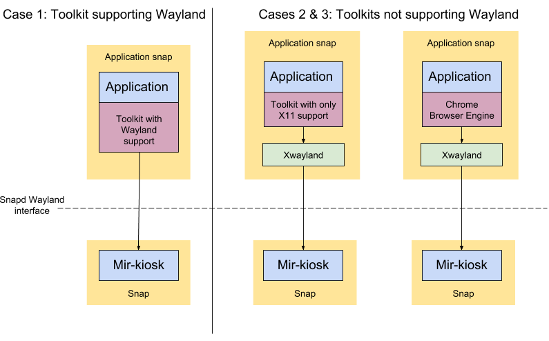

# Make a secure Ubuntu kiosk


## Overview

duration: 1:00

A kiosk or smart display is a full-screen application running on a secure device, with the sole purpose of driving that display to provide specific information or a particular function at that location.

Ubuntu is popular for these applications thanks to its excellent security track record and widespread developer familiarity. We compiled this guide to a reference kiosk architecture to enable anybody, anywhere to make a highly secure kiosk using any of the popular application display frameworks - HTML5/web, X11, or native Wayland.

Since these devices are often left unattended for long periods of time, and run in sensitive environments like airports, hospitals and public areas we also want to raise the bar on security and update management. So this tutorial includes the option to use Ubuntu Core, which is a minimal, self-updating OS for your application to run on.

You can also integrate touchscreen or keyboard capabilities, which enables this tutorial to serve for industrial control interfaces and any environment where user feedback is needed.


### What you'll learn

How to create a graphical kiosk on Ubuntu Core running a single full-screen demonstration application. We'll also discuss the basic architecture and its security benefits.


### What you'll need


*   An Ubuntu desktop running any current release of Ubuntu or an Ubuntu Virtual Machine on another OS.
*   A 'Target Device' from one of the following:
    *   **A device running [Ubuntu Core](https://www.ubuntu.com/core).**<br />
[This guide](https://developer.ubuntu.com/core/get-started/installation-medias) shows you how to set up a supported device. If there's no supported image that fits your needs you can [create your own core image](/tutorial/create-your-own-core-image).
    *   **Using a Virtual Machine (VM)**
You don't need to have a physical "Target Device", you can follow the tutorial with Ubuntu Core in a VM. Install the ubuntu-core-vm snap:
`snap install --beta ubuntu-core-vm --devmode`
For the first run, create a VM running the latest Core image:
`sudo ubuntu-core-vm init`
From then on, you can spin it up with:
`sudo ubuntu-core-vm`
You should see a new window with Ubuntu Core running inside. Setting up Ubuntu Core on this VM is the same as for any other device or VM. See, for example, [https://developer.ubuntu.com/core/get-started/kvm](https://developer.ubuntu.com/core/get-started/kvm).
    *   **Using Ubuntu Classic (Desktop/Server)**
You don't _have_ to use Ubuntu Core, you can use also a "Target Device" with Ubuntu Classic. You just need to install an SSH server on the device.
`sudo apt install ssh`
For IoT use you may want to make other changes (e.g. uninstalling the desktop), but that is outside the scope of the current tutorial.
Note: On Classic snapd doesn't currently provide confinement for snapped wayland or x11 servers, so you'll need to use devmode.


## Basic Infrastructure

duration: 3:00

We use [Wayland](https://wayland.freedesktop.org/) as the primary display interface. We will use [Mir](https://mir-server.io/) to manage the display and support connections from Wayland clients. Snapd will confine the applications and enable Wayland protocol interactions through Mir, securely.

For your display application you have a number of choices, it could be a simple web interface, a native Wayland application, or even a traditional X11 application. Regardless of what your application uses, under the hood we always use Wayland and Mir for secure display management and graphics abstractions. A native Wayland application can talk to that directly without any intermediate translation layer. If your application is a web interface, or an X11 application, then we will show you how to wrap it up to sit on top of Wayland without modifying the application itself to become Wayland compatible.

Your graphics approach largely depends on the toolkit your application uses:


1.  GTK3/4 and Qt5 - have native support for Wayland
This is the simplest case, as the application can talk Wayland to Mir directly.
1.  GTK2, Qt4, Java - do not have Wayland support
This is a more complex case, as the toolkits require a legacy X11 server to function. To enable these applications we will embed a tiny X11 server into your application package,  which translates X11 calls to Wayland ones.
1.  Electron, HTML5, Chromium - do not have Wayland support
We will need to use the embedded browser together with a tiny embedded X11 server to handle the translation.

Where we need an X11 server it is much more secure to embed it in the confined snap environment together with the application. The X11 protocol was not designed with security in mind and a malicious application connected to an X11 server can obtain information from other running X11 applications. For instance X11 servers do not protect sensitive information like keystrokes between applications using them.  To avoid this, each snapped X11 application should have its own embedded X11 server (Xwayland) which then talks Wayland - a far more secure protocol.



One additional detail to note is how a Wayland client connects to a Wayland server. This is done via Wayland sockets, which need to be shared between client (your app) and server (mir-kiosk). Snapd has robust and secure ways to provide this kind of communication channel between two snap applications, called '[interfaces](https://docs.snapcraft.io/core/interfaces)'. 


### Snap Interfaces

Snapd provides a large number of [interfaces](https://docs.snapcraft.io/core/interfaces), permitting access to everything from hardware to other services on the system. The entire list is available here:

[https://docs.snapcraft.io/reference/interfaces](https://docs.snapcraft.io/reference/interfaces)

You can use the `snap interfaces` command to list the interfaces available on your system, the slots providing them and the plugs consuming them.

For our kiosk application, we will need to plug into at a very minimum the following interfaces:


*   opengl - access to OpenGL hardware
*   wayland - allows sharing Wayland sockets between server and client

Using snapd interfaces your app can securely connect to Mir using the Wayland protocol and yet remain fully confined.


## Demonstration Kiosk on Ubuntu Core

duration: 5:00

This step assumes you have [Ubuntu Core installed and have SSHed into it](#0).

Install the "mir-kiosk" snap:


```bash
snap install mir-kiosk
```


Now you should have a black screen with a white mouse cursor.

Let's install a demo kiosk snap to try it out:


```bash
snap install --beta chromium-mir-kiosk
```


and you should see a fullscreen webpage in your VM! (There are some configuration options in the snap, to find out more about this snap's options, [click here](/tutorial/ubuntu-web-kiosk)).


## Building your own Kiosk Snap

duration: 2:00

As mentioned above, the approach to building a kiosk snap from your application depends on whether your application has native support for Wayland (i.e. uses GTK3/4 or Qt5), is Electron/HTML5 based, or not (everything else).

We have written up a series of tutorials to address each of these possibilities. We recommend working through the tutorials in order, as each builds upon the knowledge gained from the previous. But for the impatient you can jump directly to the materials that interests you here:


1.  [Make a Wayland-native Kiosk Snap](/tutorial/wayland-kiosk)
1.  [Make an X11-native Kiosk Snap](/tutorial/x11-kiosk)
1.  [Make an HTML5/Electron-based Kiosk Snap](/tutorial/electron-kiosk)
