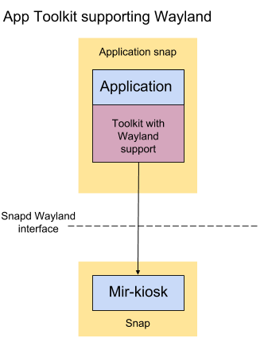

# Make a Wayland-native Kiosk snap


## Overview

duration: 1:00


### What you'll learn

In this tutorial we will create a snap of a Wayland-native application to act as the graphical user interface for an IoT or kiosk device. For the introduction to this tutorial series and the Mir display server please visit [here](/tutorial/secure-ubuntu-kiosk).

We will walk through the process for a simple application, solving common problems along the way.

positive
: The combination of Snap, the "mir-kiosk" Wayland server and Ubuntu Core ensures the reliability and security for any graphical embedded device application.


### What you'll need


*   An Ubuntu desktop running any current release of Ubuntu or an Ubuntu Virtual Machine on another OS.
*   A 'Target Device' from one of the following:
    *   **A device running [Ubuntu Core 18](https://www.ubuntu.com/core).**<br />
[This guide](https://developer.ubuntu.com/core/get-started/installation-medias) shows you how to set up a supported device. If there's no supported image that fits your needs you can [create your own core image](/tutorial/create-your-own-core-image).
    *   **Using a VM**
You don't have to have a physical "Target Device", you can follow the tutorial with Ubuntu Core in a VM. Install the ubuntu-core-vm snap:
`sudo snap install --beta ubuntu-core-vm --devmode`
For the first run, create a VM running the latest Core 18 image:
`sudo ubuntu-core-vm init`
From then on, you can spin it up with:
`sudo ubuntu-core-vm`
You should see a new window with Ubuntu Core running inside. Setting up Ubuntu Core on this VM is the same as for any other device or VM. See, for example, [https://developer.ubuntu.com/core/get-started/kvm](https://developer.ubuntu.com/core/get-started/kvm).
    *   **Using Ubuntu Classic**
You don't _have_ to use Ubuntu Core, you can use also a "Target Device" with Ubuntu Classic. Read [this guide](https://discourse.ubuntu.com/t/howto-run-your-kiosk-snap-on-your-desktop/11180) to understand how to run kiosk snaps on your desktop, as the particular details won't be repeated here.

## Using Wayland

duration: 3:00

We use Wayland as the primary display interface. We will use Mir to manage the display and support connections from Wayland clients. Snapd will confine the applications and enable Wayland protocol interactions through Mir, securely.



### Toolkits with Wayland support


*   GTK3/4
*   Qt5
*   SDL2

This is not an exhaustive list. There may be other toolkits that can work with Wayland but we know these work with Mir.

positive
: Native support for Wayland is the simplest case, as the application can talk to Mir directly.

negative
: If your application does not use the above toolkits, or fails to run with Wayland, fret not! In [this tutorial we will describe how to snap X11-based applications](/tutorial/x11-kiosk).


## Preparation

duration: 2:00


### Install Mir

On your Ubuntu desktop, install Mir:


```bash
sudo apt-add-repository --update ppa:mir-team/release
sudo apt install mir-demos mir-graphics-drivers-desktop
```


### Snapcraft setup

To build snaps, you need to install snapcraft:


```bash
sudo snap install snapcraft --classic
```


and install [Multipass](https://snapcraft.io/multipass):


```bash
sudo snap install multipass --classic --beta
```


## Test your application supports Wayland

duration: 2:00

Try to run your application like this:


```bash
miral-app -kiosk -launcher '/path/to/my_application'
```


This command runs a Mir server, and executes your application in a Wayland environment.

You should see a window pop up - Mir is running in this window (Mir-on-X) - and if your application supports Wayland, your application should appear _inside_ this window.

If your application fails to start, or appears outside the Mir window, it may require X11 after all. To snap it, [follow this guide instead](/tutorial/x11-kiosk).


## Introducing glmark2-wayland

duration: 5:00

Let’s begin with a trivial example: `glmark2-wayland` - it is a test application that uses OpenGL and Wayland. This is a useful snap for verifying that the graphics stack of your hardware is correctly set up.


### Install glmark2-wayland

Following the principle of detecting problems as early as possible we first prove our example works with Mir kiosk *before* snapping it.

Install glmark2-wayland from the "deb" archive:


```bash
sudo apt install glmark2-wayland
```


### Verify glmark2-wayland runs on Mir


```bash
miral-app -kiosk -launcher 'glmark2-wayland --fullscreen'
```


Inside the Mir-on-X window, you should see various graphical animations, and statistics printed to your console. All should be fine before proceeding.


## First Pass Snapping: Test on Desktop

duration: 5:00

For our first pass we will snap glmark2-wayland and run it in DevMode (i.e. unconfined) on our Ubuntu desktop.

This guide assumes you are familiar with creating snaps. If not, please read [here](https://docs.snapcraft.io/build-snaps/) first. 

Create the snap directory by forking [https://github.com/snapcrafters/fork-and-rename-me](https://github.com/snapcrafters/fork-and-rename-me).


```bash
git clone https://github.com/snapcrafters/fork-and-rename-me.git glmark2-example
```


Inside the glmark2-example directory edit the “`snap/snapcraft.yaml`” file, and let’s try the following (SPOILER, won’t work immediately, read on for troubleshooting):


```yaml
name: glmark2-example
version: '0.1'
summary: GLMark2 IoT example kiosk
description: GLMark2 IoT example kiosk, using Wayland
base: core18
confinement: devmode
grade: devel

apps:
  glmark2-example:
    command: "usr/bin/glmark2-wayland --fullscreen"

plugs:
  opengl:
  wayland:

parts:
  glmark2-wayland:
    plugin: nil
    stage-packages:
      - glmark2-wayland

  mesa:
    plugin: nil
    stage-packages:
      - libgl1-mesa-dri
      - libwayland-egl1-mesa
      - libglu1-mesa
```


### Building the snap

Create the snap by returning to the "glmark2-example" directory and running


```bash
snapcraft
```


You should be left with a "glmark2-example_0.1_amd64.snap" file.


### Testing the snap

Run Miral-kiosk to launch a Wayland server, then install this snap and run it


```bash
miral-kiosk&
sudo snap install --dangerous ./glmark2-example_0.1_amd64.snap --devmode
snap run glmark2-example
```


(“dangerous” needed as local snap file being installed, and “devmode” required as we need to debug it)

Oh no! It fails with these errors:


```
Error: Failed to open models directory '/usr/share/glmark2/models'
Error: Failed to open models directory '/usr/share/glmark2/textures'
Error: main: Could not initialize canvas
[1]    16532 segmentation fault (core dumped)  snap run glmark2-example
```


We need to solve these.

Leave `miral-kiosk` running while we work through the issues.


## Common Problem 1: Files are not where they’re expected to be!

duration: 5:00

One important thing to remember about snaps is that all its files are located in a subdirectory `$SNAP` which maps to `/snap/<snap_name>/<version>`. To prove this, try the following:


```bash
snap run --shell glmark2-example
```


This lands us inside a shell which exists inside the same snap environment the glmark2-wayland application will have. A quick "ls" tells us our theory is correct:


```bash
user@in-snap:~$ ls /usr/share/glmark2
ls: cannot access '/usr/share/glmark2': No such file or directory
```


If binaries have paths to resources hard-coded in, then in a snap environment it will fail to locate those resources.

Here glmark2-wayland is looking for files within `/usr/share/glmark2`, which in actuality are located in `$SNAP/usr/share/glmark2`:


```bash
user@in-snap:~$ ls $SNAP/usr/share/glmark2
models    shaders  textures
```


This is extremely common when snapping applications, therefore there are a few approaches to solving this:


### 1. Your application may read an environment variable

Your application may read an environment variable that specifies where it should look for those resources. In that case, adjust your YAML file to add it with something like this:


```yaml
apps:
  glmark2-example:
  command: "usr/bin/glmark2-wayland --fullscreen"
  environment:
    RESOURCES_PATH: $SNAP/usr/share/glmark2
```


In our case, glmark2-wayland has the path `/usr/share/glmark2` hard-coded in, so this is not going to work for us.


### 2. Changing the application

Sometimes you can edit/recompile the application to add the environment variable mentioned above. If it is your own code you are snapping, this is a good approach.

We could do this, but glmark2-wayland is not our own code and this adds an unnecessary maintenance overhead.


### 3. Using layouts for hard-coded paths

[This snapd feature](https://docs.snapcraft.io/snap-layouts) bind-mounts directories inside the snap into any location, so that the binaries' hard-coded paths are correct. To use, append this to the YAML file:


```yaml
layout:
  /usr/share/glmark2:
    bind: $SNAP/usr/share/glmark2
```


## First Pass Snapping (resumed)

duration: 3:00

For this guide we are going to use "layouts" frequently whenever paths are hard-coded into binaries. So adding the snippet above, our YAML becomes


```yaml
name: glmark2-example
version: '0.1'
summary: GLMark2 IoT example kiosk
description: GLMark2 IoT example kiosk, using Wayland
base: core18
confinement: devmode
grade: devel

apps:
  glmark2-example:
    command: "usr/bin/glmark2-wayland --fullscreen"

plugs:
  opengl:
  wayland:

parts:
  glmark2-wayland:
    plugin: nil
    stage-packages:
      - glmark2-wayland

  mesa:
    plugin: nil
    stage-packages:
      - libgl1-mesa-dri
      - libwayland-egl1-mesa
      - libglu1-mesa

layout:
  /usr/share/glmark2:
    bind: $SNAP/usr/share/glmark2
```


Build this, install and try running the snap again. Unfortunately it still is not working, but we have got rid of the initial error messages:


```
Error: main: Could not initialize canvas
[1] 16532 segmentation fault (core dumped)  snap run glmark2-example
```


If you `snap run --shell` into the snap environment, you'll see that `/usr/share/glmark2` now contains the resources glmark2 needs - so one problem solved!


## Common Problem 2: Unable to connect to Wayland server

duration: 3:00


```
Error: main: Could not initialize canvas
```


This error message is not too helpful, but an important thing to check is if the Wayland socket can be found. If not, glmark2-wayland cannot create a surface/canvas.

The convention is that the Wayland socket directory is specified by the `$XDG_RUNTIME_DIR` environment variable. The default name for the socket is `wayland-0` but it can be different (specified by `$WAYLAND_DISPLAY`).

Generally, `$XDG_RUNTIME_DIR` is set to `/run/user/$UID` where `$UID` is the user id. 


*   Ubuntu Desktop: miral-shell creates the Wayland socket at `/run/user/$UID/wayland-0`, where `$UID` is your user id.
*   Ubuntu Core: Mir-kiosk runs as root on Core, thus the Mir-kiosk snap's Wayland socket is located at `/run/user/0/wayland-0`

However inside each snap's environment, `$XDG_RUNTIME_DIR` is a custom subdirectory. To see this, this command gives a shell inside the same snap environment your application lives:


```
snap run --shell glmark2-example
user@in-snap:~# echo $XDG_RUNTIME_DIR
/run/user/1000/snap.glmark2-example
```


This reveals a problem with the Wayland socket not being in the right location for the application snap.

The solution we use is to symlink the Wayland socket into the in-snap `$XDG_RUNTIME_DIR` (and to be safe, ensure the directory exists before adding the link):


```bash
user@in-snap:~# mkdir -p $XDG_RUNTIME_DIR
user@in-snap:~# ln -s $XDG_RUNTIME_DIR/../wayland-0 $XDG_RUNTIME_DIR/
```


positive
: We _could_ override the value of `$XDG_RUNTIME_DIR` in the app snap to be /run/user/0. The reason we do not is for avoiding later problems with strict confinement. In strict mode on Ubuntu Core, AppArmor will deny access to anything in that directory aside from the Wayland socket:


```
root@in-snap-strict:~# ls /run/user/0
ls: cannot open directory '/run/user/0': Permission denied
root@in-snap-strict:~# ls /run/user/0/wayland-0
/run/user/0/wayland-0
```


"`sudo journalctl -r`" will show the AppArmor denial:


```
AVC apparmor="DENIED" operation="open" profile="snap.glmark2-example.glmark2-example" name="/run/user/0/" pid=24664 comm="ls" requested_mask="r" denied_mask="r" fsuid=0 ouid=0)
```


Let's test it:


```bash
user@in-snap:~# $SNAP/usr/bin/glmark2-wayland
/snap/glmark2-example/x1/usr/bin/glmark2-wayland: error while loading shared libraries: libjpeg.so.8: cannot open shared object file: No such file or directory
```


Yikes! What's happened?

Once again: files are not where they’re expected to be! Don’t forget, we’re in the snap environment still. All the libraries glmark2-wayland needs are not in the usual places - we need to tell it where. 

Run these commands to set the linker paths `$LD_LIBRARY_PATH` and executable paths `$PATH` to commonly required locations in the snap environment (snapd does this before running your snap):


```bash
root@in-snap:~# export PATH="$SNAP/usr/sbin:$SNAP/usr/bin:$SNAP/sbin:$SNAP/bin:$PATH"
root@in-snap:~# export LD_LIBRARY_PATH="${LD_LIBRARY_PATH}:${SNAP}/usr/lib/:${SNAP}/usr/lib/x86_64-linux-gnu/"
```


Note: you should add any additional library paths that the binary requires.

Snapcraft creates a script in `$SNAP` that contains the command specified to run. Have a look at


```bash
root@in-snap:~# cat $SNAP/command-glmark2-example.wrapper
#!/bin/sh
exec "$SNAP/usr/bin/glmark2-wayland" "--fullscreen" "$@"
```


It is this script which is called when you do “snap run …”. As we are still in the snap environment, we get the same result by running it:


```bash
root@in-snap:~# $SNAP/command-glmark2-example.wrapper
```


Oh, still fails with a bunch of errors like


```
Error: eglGetDisplay() failed with error: 0x3000
Error: eglGetDisplay() failed with error: 0x3000
Error: main: Could not initialize canvas
```


Courage! This is progress, we’re almost done in fact. There’s just one more thing to fix…


## Common Problem 3: GL drivers are not where they usually are

duration: 2:00

This is another typical problem for snapping graphics applications: the GL drivers it needs are bundled inside the snap, and the application needs to be configured to use these drivers.

Is this "files are not where they're expected to be" yet again? Yes, but here we are lucky as there’s environment variables we can use to specify the correct location for the GL driver files (you could use layouts too, but this is more efficient).

Simply use:


```bash
root@in-snap:~# export __EGL_VENDOR_LIBRARY_DIRS="$SNAP/etc/glvnd/egl_vendor.d:$SNAP/usr/share/glvnd/egl_vendor.d"
root@in-snap:~# export LIBGL_DRIVERS_PATH="/snap/glmark2-example/x8/usr/lib/x86_64-linux-gnu/dri"
root@in-snap:~# export LIBVA_DRIVERS_PATH="/snap/glmark2-example/x8/usr/lib/x86_64-linux-gnu/dri"
```


Now try once more:


```bash
root@in-snap:~# $SNAP/command-glmark2-example.wrapper
```


It works! Woo! Finally! You deserve a nice cup of tea for that. Now we know what to fix, exit the snap environment with Ctrl+D.


positive
: **On a Desktop Environment that supports Wayland** you may find that glmark connects to your Wayland-based desktop shell and not Mir.

This is easy to work around: use a different Wayland socket name to avoid confusion:


```bash
miral-kiosk --wayland-socket-name mir-kiosk&
export WAYLAND_DISPLAY=mir-kiosk
snap run glmark2-example
```


negative
: **Referring to "x86_64-linux-gnu" means the snap will only function on amd64 machines.**

We will revisit this later to ensure the snap can be compiled to function on other architectures.


## First Pass Snapping: The Final Bits

duration: 4:00

We need to set up the symlink of the Wayland socket into the $XDG_RUNTIME_DIR directory, and set the libgl environment variable before executing the binary inside the snap. The easiest option is using `mir-kiosk-snap-launch` a utility maintained by the Mir team to make this easy. Add the following to the .yaml in the `parts` section:

```yaml
  mir-kiosk-snap-launch:
    plugin: dump
    source: https://github.com/MirServer/mir-kiosk-snap-launch.git
    override-build:  $SNAPCRAFT_PART_BUILD/build-with-plugs.sh opengl wayland
```


…and change `command:` in the snapcraft.yaml file to use the `wayland-launch` it supplies. Like this:


```
…
    command: wayland-launch $SNAP/usr/bin/glmark2-wayland --fullscreen
…
```


We can ask snapcraft to set the environment variables to fix graphics by adding an `environment` section to the .yaml:


```
…
environment:
  LD_LIBRARY_PATH: ${LD_LIBRARY_PATH}:${SNAP}/usr/lib/:${SNAP}/usr/lib/${SNAPCRAFT_ARCH_TRIPLET}/
  PATH: $SNAP/bin/:$SNAP/usr/bin/:${PATH}
  # Prep EGL
  __EGL_VENDOR_LIBRARY_DIRS: $SNAP/etc/glvnd/egl_vendor.d:$SNAP/usr/share/glvnd/egl_vendor.d
  LIBGL_DRIVERS_PATH: ${SNAP}/usr/lib/${SNAPCRAFT_ARCH_TRIPLET}/dri
  LIBVA_DRIVERS_PATH: ${SNAP}/usr/lib/${SNAPCRAFT_ARCH_TRIPLET}/dri
…
```


We can also enable strict confinement and see if everything works. Due to the care we took above, it does. Your own application may require more tweaking to function fully confined however.


### The working YAML file:


```yaml
name: glmark2-example
version: '0.1'
summary: GLMark2 IoT example kiosk
description: GLMark2 IoT example kiosk, using Wayland
base: core18
confinement: strict
grade: devel

apps:
  glmark2-example:
    command: wayland-launch $SNAP/usr/bin/glmark2-wayland --fullscreen

plugs:
  opengl:
  wayland:

environment:
  LD_LIBRARY_PATH: ${LD_LIBRARY_PATH}:${SNAP}/usr/lib/:${SNAP}/usr/lib/${SNAPCRAFT_ARCH_TRIPLET}/
  PATH: $SNAP/bin/:$SNAP/usr/bin/:${PATH}
  # Prep EGL
  __EGL_VENDOR_LIBRARY_DIRS: $SNAP/etc/glvnd/egl_vendor.d:$SNAP/usr/share/glvnd/egl_vendor.d
  LIBGL_DRIVERS_PATH: ${SNAP}/usr/lib/${SNAPCRAFT_ARCH_TRIPLET}/dri
  LIBVA_DRIVERS_PATH: ${SNAP}/usr/lib/${SNAPCRAFT_ARCH_TRIPLET}/dri

parts:
  glmark2-wayland:
    plugin: nil
    stage-packages:
      - glmark2-wayland

  mesa:
    plugin: nil
    stage-packages:
      - libgl1-mesa-dri
      - libwayland-egl1-mesa
      - libglu1-mesa

  mir-kiosk-snap-launch:
    plugin: dump
    source: https://github.com/MirServer/mir-kiosk-snap-launch.git
    override-build:  $SNAPCRAFT_PART_BUILD/build-with-plugs.sh opengl wayland

layout:
  /usr/share/glmark2:
    bind: $SNAP/usr/share/glmark2
```


Rebuild the snap and install it


```bash
snapcraft
sudo snap install --dangerous ./glmark2-example_0.1_amd64.snap --devmode
snap run glmark2-example
```


Inside the Mir-on-X window, you should see the same graphical animations you saw earlier, and statistics printed to your console. The difference is that this time they are coming from your fully snapped application!


## First Pass Snapping: Notes

duration: 1:00


### Why did we step through that process instead of simply presenting the working .yaml?

Because snapping applications can reveal lots of hard-coded paths and assumptions that applications make, which snap confinement will break. It is good to understand the steps needed to debug and solve these problems.

There can be many, many environment variables and support files that need to be set up inside snaps, for applications to run correctly. Thankfully much of this work has already been done and automated in the _snapcraft-desktop-helpers_ project, which we will be using in a follow-up tutorial.


### We now have a snap working with a desktop Wayland server

_But our goal is to have it working as a confined snap, with mir-kiosk on your chosen device._


## Second Pass Snapping: Your Device

duration: 3:00

The goal here is to have our graphical snap running full-screen on your device.

Before we proceed, you need to have Ubuntu Core 18 [already running on your device](#0).


### Device Setup

Open another terminal and ssh login to your device and from this login install the "mir-kiosk" snap.


```
snap install mir-kiosk
```


It auto-starts, so now you should have a black screen with a white mouse cursor.

"mir-kiosk" provides the graphical environment needed for running a graphical snap.


### Differences between running on Desktop and Ubuntu Core

The main difference is a current technical limitation with snaps:


*   Graphical snaps need to run as root

You need not worry about this being a security issue however, the snap security model is designed to make this safe.

Another difference is that we want the graphical app to start automatically (and restart if it crashes).

We can address these differences with a simple change to the snapcraft.yaml file: add a "daemon" command to apps:


```
…
apps:
…
  daemon:
    command: run-daemon wayland-launch $SNAP/usr/bin/glmark2-wayland --fullscreen
    daemon: simple
    restart-condition: always
…
```

The `run-daemon` utility (like `wayland-launch`) comes from `mir-kiosk-snap-launch`. It ensures that the daemon runs on Ubuntu Core and (by default) not on Classic systems.

The explicit [restart-condition](https://docs.snapcraft.io/build-snaps/syntax#restart-condition) ensures glmark2 is restarted, even when it quits successfully.

Note this results in the console output from the application being sent to the journal. To view its output while running, do `sudo snap logs -f glmark2-example`.

That's all the changes we need to make! We just need to snap it up for the target device.


### The final full YAML file:


```yaml
name: glmark2-example
version: '0.1'
summary: GLMark2 IoT example kiosk
description: GLMark2 IoT example kiosk, using Wayland
base: core18
confinement: strict
grade: devel

apps:
  glmark2-example:
    command: wayland-launch $SNAP/usr/bin/glmark2-wayland --fullscreen

  daemon:
    command: run-daemon wayland-launch $SNAP/usr/bin/glmark2-wayland --fullscreen
    daemon: simple
    restart-condition: always

plugs:
  opengl:
  wayland:

environment:
  LD_LIBRARY_PATH: ${LD_LIBRARY_PATH}:${SNAP}/usr/lib/:${SNAP}/usr/lib/${SNAPCRAFT_ARCH_TRIPLET}/
  PATH: $SNAP/bin/:$SNAP/usr/bin/:${PATH}
  # Prep EGL
  __EGL_VENDOR_LIBRARY_DIRS: $SNAP/etc/glvnd/egl_vendor.d:$SNAP/usr/share/glvnd/egl_vendor.d
  LIBGL_DRIVERS_PATH: ${SNAP}/usr/lib/${SNAPCRAFT_ARCH_TRIPLET}/dri
  LIBVA_DRIVERS_PATH: ${SNAP}/usr/lib/${SNAPCRAFT_ARCH_TRIPLET}/dri

parts:
  glmark2-wayland:
    plugin: nil
    stage-packages:
      - glmark2-wayland

  mesa:
    plugin: nil
    stage-packages:
      - libgl1-mesa-dri
      - libwayland-egl1-mesa
      - libglu1-mesa

  mir-kiosk-snap-launch:
    plugin: dump
    source: https://github.com/MirServer/mir-kiosk-snap-launch.git
    override-build:  $SNAPCRAFT_PART_BUILD/build-with-plugs.sh opengl wayland

layout:
  /usr/share/glmark2:
    bind: $SNAP/usr/share/glmark2
```


## Building for different architectures

duration: 10:00

If your target device has the same CPU architecture as your PC, you can just build it with the usual:


```bash
snapcraft
```


However you need to build the snap for a different CPU architecture, it is not quite as simple. However we provide a build service to help with this.


### Building snaps using the Snapcraft build service

One day, perhaps, snapcraft will fully support cross building with the `--target-arch` option. But getting that to work is beyond the scope of this tutorial. Instead we'll make use of [Snapcraft builders](https://snapcraft.io/build) to build the snap for all architectures (including the one your device provides).

[Create a GitHub repository](https://github.com/new) for your snap and push your changes to the snap project there:


```bash
git init
git commit -a
git remote remove origin
git remote add origin https://github.com/<username>/<repo>.git
git push -u origin master
```


Now [visit Snapcraft Build](https://snapcraft.io/build) and follow the "Set up in Minutes" link. You can configure Snapcraft Build to watch your GitHub repository, and it will auto-build Snaps supporting multiple architectures: amd64, i386, armhf and amd64, ppc64el and s390x. This is a free shared build service so there can be delays before your build is started.

Visiting the link

```
https://build.snapcraft.io/user/<username>/<repo>
```

will show you your build status, allow you to find where the built Snaps are, and trigger a new build.

To download the built Snap, you need to click on the build number of the architecture you need, and the first line of the build log will be a URL pointing at Launchpad (of this form):

```
https://launchpad.net/~build.snapcraft.io/+snap/91eff219d76d5721eb24ffb6a83032b6/+build/593821
```

Visiting this URL, you can find the built Snap under the "Built files" section.

To test your snap on your target device, find the build for your device architecture and download it. Or you can grab its URL and download it directly to your device:


```bash
wget https://launchpad.net/~build.snapcraft.io/+snap/91eff219d76d5721eb24ffb6a83032b6/+build/593821/+files/glmark2-wayland_0.1_armhf.snap
```


## Deploy the snap on the device

duration: 4:00

Push the snap to your device:


```bash
scp glmark2-example_0.1_amd64.snap <user>@<ip-address>:~
```


using your device's SSH username & IP address details.

We now have the .snap file on the device in its home directory. We need to install the snap, configure it to talk Wayland to mir-kiosk and run the application. In your ssh session to your device:


```bash
snap install --dangerous ./glmark2-example_0.1_amd64.snap
```


On your device, you should see the same graphical animations you saw earlier (and statistics logged to the journal). It will continue to run until you run "`snap stop glmark2-example`".

Your device is now a kiosk! Rebooting will restart mir-kiosk and glmark2-example automatically.

Should you wish to share this snap, the next step would be to [push your snap to the Snap Store](https://forum.snapcraft.io/t/releasing-to-the-snap-store/6848).


## Congratulations

duration: 1:00

Congratulations, you have created a snap of a Wayland kiosk application and deployed it to an Ubuntu Core device.

### Note

For more details on `mir-kiosk-snap-launch` visit: [Kiosk snaps made easy](https://discourse.ubuntu.com/t/kiosk-snaps-made-easy/12621)