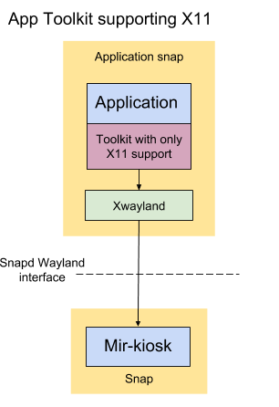

# Make a X11-based Kiosk Snap


## Overview

duration: 1:00


### What you'll learn

In this tutorial we will create a snap of an X11 application to act as the graphical user interface for an IoT or kiosk device. For the introduction to this tutorial series and the Mir display server please visit [here](/tutorial/secure-ubuntu-kiosk).

X11 is a legacy protocol, it is known to be insecure, so we need to take steps to ensure it is secured correctly. To do this we shall embed an intermediary Xwayland server in the application snap and use snapd's infrastructure to maintain security.

positive
: The combination of Snap, the "mir-kiosk" Wayland server and Ubuntu Core ensures the reliability and security of any graphical embedded device application. 

This tutorial assumes you are familiar with the material in [Make a Wayland-native Kiosk snap](/tutorial/wayland-kiosk). In particular, techniques for debugging problems in your snap are not repeated here.

negative
: Depending on the toolkit your application is written in, it may work on the newer and more secure Wayland protocol. If so, the snapping process is simpler. To check, please read [this guide](/tutorial/wayland-kiosk).


### What you'll need


*   An Ubuntu desktop running any current release of Ubuntu or an Ubuntu Virtual Machine on another OS.
*   A 'Target Device' from one of the following:
    *   **A device running [Ubuntu Core](https://www.ubuntu.com/core).**<br />
[This guide](https://developer.ubuntu.com/core/get-started/installation-medias) shows you how to set up a supported device. If there's no supported image that fits your needs you can [create your own core image](/tutorial/create-your-own-core-image).
    *   **Using a VM**
You don't have to have a physical "Target Device", you can follow the tutorial with Ubuntu Core in a VM. Install the ubuntu-core-vm snap:
`sudo snap install --beta ubuntu-core-vm --devmode`
For the first run, create a VM running the latest Core image:
`sudo ubuntu-core-vm init`
From then on, you can spin it up with:
`sudo ubuntu-core-vm`
You should see a new window with Ubuntu Core running inside. Setting up Ubuntu Core on this VM is the same as for any other device or VM. See, for example, [https://developer.ubuntu.com/core/get-started/kvm](https://developer.ubuntu.com/core/get-started/kvm).
    *   **Using Ubuntu Classic**
You don't _have_ to use Ubuntu Core, you can use also a "Target Device" with Ubuntu Classic. You just need to install an SSH server on the device.
`sudo apt install ssh`
For IoT use you will want to make other changes (e.g. uninstalling the desktop), but that is outside the scope of the current tutorial.
Note: On Classic snapd doesn't currently provide confinement for snapped wayland or x11 servers, so you'll need to use devmode.


## X11 on top of Wayland

duration: 3:00

We use Wayland as the primary display interface. We will use Mir to manage the display and support connections from Wayland clients and Snapd will confine the applications and enable Wayland protocol interactions through Mir, securely.

Wayland is relatively new in the Linux world however. Its predecessor - X11 - has been the dominant graphics technology for decades. As a result, not all toolkits have native support for Wayland - they only support X11.

positive
: We do not support X11 directly on Ubuntu Core with Mir. The primary reason for this is security: the X11 protocol was not designed with security in mind, a malicious application connected to an X11 server can obtain information from other running X11 applications.

To deal with the limitations of X11 in a secure fashion we will embed a tiny intermediary X11 server called "Xwayland" inside the application snap, which translates the X11 calls to Wayland ones, allowing the X11 application to talk Wayland - a far more secure protocol.

The Snap security framework then ensures this X11 server is private to the application snap.




### Toolkits without Native support for Wayland


*   GTK2
*   Qt4
*   Electron apps
*   Java apps
*   Windows apps emulated under Wine
*   Chromium

It may also be your application is written using X11 calls directly, in which case this guide is for you.

positive
: If your application is written using GTK3/4, Qt5 or SDL2, or another toolkit with native Wayland support, you should follow [this guide](/tutorial/wayland-kiosk).


## Introducing glxgears, Xwayland and i3

duration: 2:00

A large fraction of applications are still written for X11 - there are those written with Qt4 and Gtk2, but also Java, Mono or Wine-based. We can snap these for a kiosk just fine, we just need to add some extra bits to the snap.

We'll take a trivial example to start with (glxgears). glxgears is again a handy snap to have, as it will help prove OpenGL is working for X11 apps inside Ubuntu Core.

On your desktop, install the following:


```bash
sudo apt install xwayland mesa-utils i3-wm
```


Now launch


```bash
miral-app -kiosk -launcher 'Xwayland -wr :1'
```


(the -wr is optional, causes Xwayland to create a white window, so we see it is running in Mir-on-X, the ":1" specifies a local socket which won't collide with your desktop's X11 server which uses ":0").

If we run glxgears right now, it will appear on your desktop, not inside the Mir-on-X window. Mir doesn't talk X11 itself, but it relies on an intermediary "Xwayland" to translate. and we now can launch glxgears and tell it to connect to Xwayland:


```bash
DISPLAY=:1 glxgears
```


You should see the gear animation in the Mir-on-X window.

But it's not perfect - why is it not fullscreen? The reason is that in the X11 world, a window manager is a separate process which takes the responsibility of sizing and positioning windows. Xwayland does not do this, so we need an additional process to manage this. 

We'll use the "i3" window manager, as it is simple to configure with a text file.

i3 needs to be told what X11 window should be fullscreen. To do this, we need to identify a unique property of the X11 window to be fullscreened. Run glxgears, this time on your desktop:


```bash
glxgears
```


and in a separate terminal, run


```
xprop
```


your cursor will change to a cross-hairs - click on the "glxgears" window. You'll see window metadata printed to your terminal like this:


```
_NET_WM_STATE(ATOM) = _NET_WM_STATE_FOCUSED
WM_STATE(WM_STATE):
       window state: Normal
       icon window: 0x0
_NET_WM_DESKTOP(CARDINAL) = 0
_GTK_EDGE_CONSTRAINTS(CARDINAL) = 170
_NET_FRAME_EXTENTS(CARDINAL) = 0, 0, 30, 0
_NET_WM_ALLOWED_ACTIONS(ATOM) = _NET_WM_ACTION_MOVE, _NET_WM_ACTION_RESIZE, _NET_WM_ACTION_FULLSCREEN, _NET_WM_ACTION_MINIMIZE, _NET_WM_ACTION_SHADE, _NET_WM_ACTION_MAXIMIZE_HORZ, _NET_WM_ACTION_MAXIMIZE_VERT, _NET_WM_ACTION_CHANGE_DESKTOP, _NET_WM_ACTION_CLOSE, _NET_WM_ACTION_ABOVE, _NET_WM_ACTION_BELOW
WM_ICON_NAME(STRING) = "glxgears"
WM_NAME(STRING) = "glxgears"
WM_NORMAL_HINTS(WM_SIZE_HINTS):
       user specified location: 0, 0
       user specified size: 300 by 300
```


We can use the "name" option above, i3 refers to this as a window "title". Create a text file called "i3.conf" and insert the following:


```
# i3 config file (v4)
font pango:monospace 8
# always start in fullscreen
for_window [title="glxgears"] fullscreen
```


See [https://i3wm.org/docs/userguide.html#configuring](https://i3wm.org/docs/userguide.html#configuring) for info on the syntax used. Start Mir-on-X again:


```bash
miral-app -launcher 'Xwayland -wr :1'
```


Then launch i3 with:


```bash
DISPLAY=:1 i3 -c i3.conf &
```


you won't see any evidence of it running on screen though. But running


```bash
DISPLAY=:1 glxgears
```


you see that glxgears is now fullscreen.

This is the basic setup that we'll have in our snap. It seems like a lot of work, but there's a helper that does it all automatically: _xwayland-kiosk-helper_! We'll use that from now on.


## First Pass Snapping: Test on Desktop

duration: 5:00

For our first pass we will snap glxgears and run it in devmode (i.e. unconfined) on our Ubuntu desktop. We use [xwayland-kiosk-helpers](https://github.com/MirServer/xwayland-kiosk-helper/) to make life easier, as it runs the above commands for us.

This guide assumes you are familiar with creating snaps. If not, please read [here](https://docs.snapcraft.io/build-snaps/) first. 

Create the snap directory by forking [https://github.com/snapcrafters/fork-and-rename-me](https://github.com/snapcrafters/fork-and-rename-me)


```bash
git clone https://github.com/snapcrafters/fork-and-rename-me.git glxgears-example
```


Inside the glxgears directory edit the "snap/snapcraft.yaml" file, and let's try the following:


```yaml
name: glxgears-example
version: 0.1
summary: glxgears example kiosk
description: |
  glxgears example X11 kiosk, using Xwayland and Wayland
confinement: strict
grade: devel

apps:
  glxgears-example:
    command: xwayland-kiosk-launch glxgears
    environment:
      XWAYLAND_FULLSCREEN_WINDOW_HINT: title="glxgears"
    plugs:
      - opengl
      - wayland

parts:
  glxgears:
    plugin: nil
    after: [ xwayland-kiosk-helper ]
    stage-packages:
      - mesa-utils
```


xwayland-kiosk-helper uses XWAYLAND_FULLSCREEN_WINDOW_HINT to set up the i3 configuration (as we did manually in the previous step).

Create the snap by returning to the "glxgears" directory and running


```bash
snapcraft cleanbuild
```


You should be left with a "glxgears-kiosk_0.1_amd64.snap" file.

Let's test it!


```bash
miral-kiosk&
sudo snap install --dangerous ./glxgears-kiosk_0.1_amd64.snap --devmode
sudo snap run glxgears-kiosk
```


You should see a fullscreen gear animation in the Mir-on-X window.


## Second Pass Snapping: Your Device

duration: 5:00


### Device Setup

Open another terminal and ssh login to your device and from this login install the “mir-kiosk” snap.


```bash
sudo snap install mir-kiosk
```


Now you should have a black screen with a white mouse cursor.

"mir-kiosk" provides the graphical environment needed for running a graphical snap.

Next, you will need to enable the experimental “layouts” feature as we did in the Wayland guide:


```bash
sudo snap set core experimental.layouts=true
```


## Snapping to use mir-kiosk

duration: 3:00

Here is a suitable first candidate snapcraft.yaml file:


```yaml
name: glxgears-example
version: 0.1
summary: glxgears example kiosk
description: |
  glxgears example X11 kiosk, using Xwayland and Wayland
confinement: devmode
grade: devel

apps:
  glxgears-example:
    daemon: simple
    restart-condition: always
    command: xwayland-kiosk-launch glxgears
    environment:
      XWAYLAND_FULLSCREEN_WINDOW_HINT: title="glxgears"
    plugs:
      - opengl
      - wayland

parts:
  glxgears:
    plugin: nil
    after: [ xwayland-kiosk-helper ]
    stage-packages:
      - mesa-utils
```


Check this builds locally before proceeding:


```bash
snapcraft cleanbuild
```


## Building for different architectures

duration: 10:00

One day, perhaps, snapcraft will fully support cross building with the --target-arch option. But getting that to work is beyond the scope of this tutorial. Instead we'll make use of Launchpad's builders to build the snap for all architectures (including the one your device provides).

Create a github repository for your snap and push your changes to the snap project there:


```bash
git init
git commit -a
git remote remove origin
git remote add origin https://github.com/<project>/<repo>.git
git push -u origin master
```


Now [set up your build on Launchpad](https://docs.snapcraft.io/build-snaps/ci-integration). Note that you will need to use the same snap name in the store as in `name:`, so choose something unique to make your life easier.

Don't bother with publishing to the store (yet) you can download the snap and deploy it as follows:

On your desktop go to the snaps webpage (e.g. [https://code.launchpad.net/~/+snaps](https://code.launchpad.net/%7E/+snaps)), find the build for your device architecture and download it and copy to your device. For example:


```bash
wget https://code.launchpad.net/~mir-team/+snap/glxgears-example/+build/337696/+files/glxgears-example_0.1_amd64.snap
```


## Deploy the snap on the device

duration: 4:00

Push the snap you built to your device:


```bash
scp glxgears-example_0.1_amd64.snap <user>@<ip-address>:~
```


using your device's SSH username & IP address details.

We now have the .snap file on the device in its home directory. We need to install the snap, configure it to talk Wayland to mir-kiosk and run the application. In your ssh session to your device:


```bash
snap install --dangerous ./glxgears-example_0.1_amd64.snap --devmode
```


On your device, you should see the same graphical animations you saw earlier. It will continue to run until you run "`snap stop glxgears-example`"

Your device is now a kiosk! Rebooting will restart mir-kiosk and glxgears-example automatically.

negative
: We are still using **devmode** - we have a few more steps to follow before the snap can be strictly confined.


## Confining Xwayland

duration: 10:00

One thing still needs to be resolved: this snap is installed with the --devmode option.

To use fully confined snaps which use Xwayland internally, you will need a build of snapd that allows Xwayland to work in a confined snap.

To update the snap to use the X11 interface we need to update the "snap/snapcraft.yaml" file to add the X11 plug & slot. The resulting file:


```yaml
name: glxgears-example
version: 0.1
summary: glxgears example kiosk
description: |
  glxgears example X11 kiosk, using Xwayland and Wayland
confinement: strict
grade: devel

apps:
  glxgears-example:
    command: xwayland-kiosk-launch glxgears
    environment:
      XWAYLAND_FULLSCREEN_WINDOW_HINT: title="glxgears"
    plugs:
      - opengl
      - wayland
      - x11-plug
    slots:
      - x11

parts:
  glxgears:
    plugin: nil
    after: [ xwayland-kiosk-helper ]
    stage-packages:
      - mesa-utils

plugs:
  x11-plug: # because cannot have identical plug/slot name in same yaml.
    interface: x11
```


The new lines are just these:


```yaml
…
    - x11-plug
  slots:
    - x11
…
  x11-plug: # because cannot have identical plug/slot name in same yaml.
    interface: x11
```


Then we need to push the changes, import the changes to launchpad and rebuild.


## Deploy the snap on the device (now confined)

duration: 4:00

Push the snap to your device, and install like before:


```bash
scp glxgears-example_0.1_amd64.snap <user>@<ip-address>:~
snap install --dangerous glxgears-example_0.1_arm64.snap
```


We have an additional interface to connect this time:


```bash
snap connect glxgears-example:x11-plug glxgears-example:x11
```


Now we can start the app


```bash
snap restart glxgears-example
```


and you should see the graphical animation again.

Now we are confident the X11 server is fully secured by the snap architecture!

Should you wish to share this snap, the next step would be to [push your snap to the Snap Store](https://forum.snapcraft.io/t/releasing-to-the-snap-store/6848).


## Congratulations

duration: 1:00

Congratulations, you have created your first graphical snap of an X11 app for Ubuntu Core.
