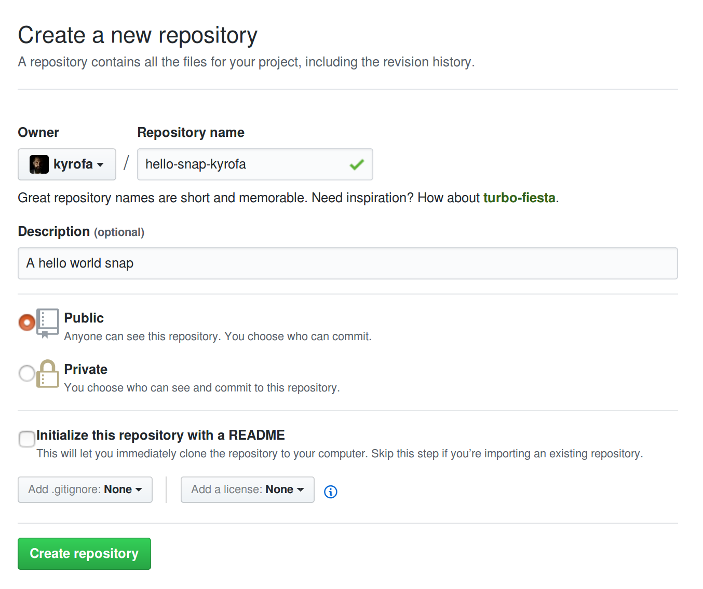
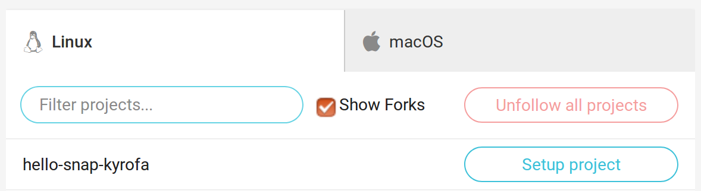
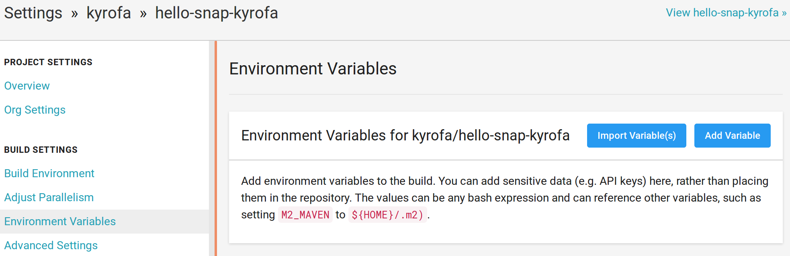
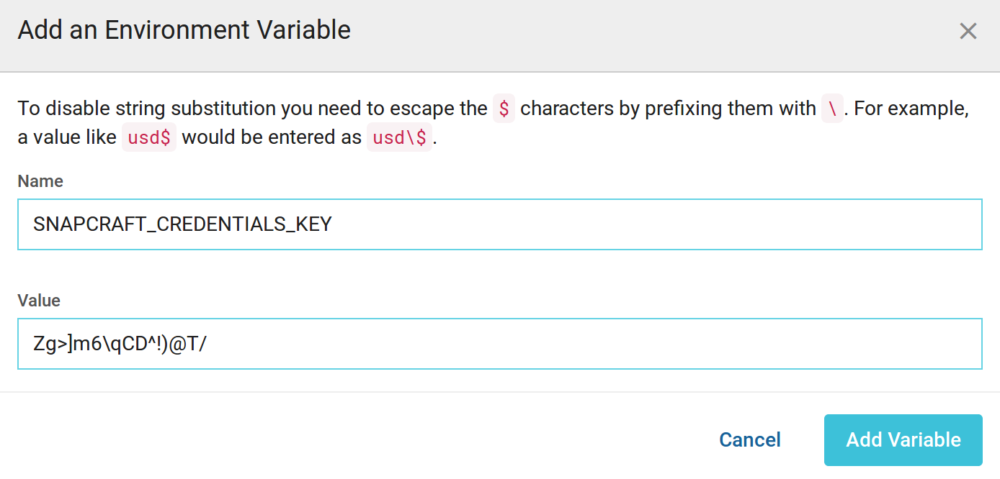

# Continuous snap delivery from CircleCI

## Overview
Duration: 1:00

CircleCI is a continuous integration service that can be used to build, test and deliver software. It's priced based on the number of concurrent build instances you require. A single instance is free (or four for FOSS), and [more are available](https://circleci.com/pricing/).

We will use CircleCI to build your snap and push it automatically to the `edge` channel of the [snap store](https://dashboard.snapcraft.io) every time you make a change to your `master` branch in GitHub.


### What you'll learn
  - How to build your snap in CircleCI
  - How to push your snap to the store automatically from CircleCI
  - How to use snapcraft to enable all this, with a few simple commands

### What you'll need
  - Ubuntu 16.04 or later
  - A little knowledge of the Linux command line and git
  - Snapcraft v2.37 or later
  - A store account at [https://dashboard.snapcraft.io]


survey
: How will you use this tutorial?
 - Only read through it
 - Read it and complete the exercises
: What is your current level of experience working with snaps?
 - Novice
 - Intermediate
 - Proficient
: What is your preferred continuous integration system?
 - Travis CI
 - CircleCI
 - Jenkins CI
 - GitLab CI
 - Other
 - None

## Setting up GitHub
Duration: 7:00

Before we can start the continuous delivery of snaps to the store, we will need a project with snap packaging. It can be hosted on either GitHub or Bitbucket; we'll use GitHub, here.

If you already have your project in GitHub packaged as a snap, you can skip this step and jump straight to the next one. If you have your project in GitHub but haven’t packaged it yet, we have many tutorials that can help! The "[Create your first snap]" tutorial is a good place to start.

Let's set up one GitHub project here, in case you don't already have one.

First, go to [https://github.com] and sign up. Then, go to [https://github.com/new] where we will fill the details of our new repository. The only required field is the repository name where you can enter something like `hello-snap-yourusername`. That might look something like this:



Next, click the "Create repository" button to get an empty repository in GitHub. Let's put our snap project in there!

Open a terminal, and run the following commands. The first one is to install git:

``` bash
sudo apt install git
```

Now, clone your repository to your local workspace, using the address displayed in GitHub. Something like this, but with your username:


``` bash
mkdir -p ~/workspace
cd workspace
git clone git@github.com:kyrofa/hello-snap-username.git
cd hello-snap-username
```

To create a snap project, open a text editor, and write the following content:

``` yaml
name: hello-yourname
version: '2.10'
summary: GNU Hello, the "hello world" snap
description: GNU hello prints a friendly greeting.
grade: stable
confinement: strict

apps:
  hello:
    command: bin/hello

parts:
  gnu-hello:
    source: http://ftp.gnu.org/gnu/hello/hello-2.10.tar.gz
    plugin: autotools
```

Save it to `~/workspace/hello-snap-username/snap/snapcraft.yaml` (remember to replace "username" with yours!)

This is the packaging metadata of a very simple snap, that, as the description says, will just print a greeting. The "[Create your first snap]" tutorial can provide details for all the lines of this file, so please refer to it to know more about the packaging. In here we will be focusing just on the continuous delivery, so let's continue and push this snap to our GitHub repository:


``` bash
git add snap/snapcraft.yaml
git commit -m "add the hello snap"
git push
```

Now that we have chosen our snap name, we need to make sure we register it to our store account (snap names are unique, and they must be registered before they can be published). Replace "hello-yourname" with whatever you used for the `name` field in the `snapcraft.yaml`.

```bash
snapcraft login
snapcraft register hello-yourname
```

We now have a GitHub project containing packaging details for a snap that has been registered to our account. Let's move onto CircleCI.

## Setting up CircleCI
Duration: 5:00

To use CircleCI, first we will have to sign up there. Let's go to [https://circleci.com/signup/] and click "Sign Up with GitHub". Then, click "Authorize application" to allow CircleCI to access your GitHub account.

Now, you should see a list of GitHub repositories, including your snap. If you don't see this list, there should be an "Add projects" button. Enable the GitHub repository of your snap by clicking the "Setup project" button next to it.



Once you select that button, you'll be given a choice between the operating system and platform you'd like to use. You'll need to use Linux (of course) and the CircleCI 2.0 platform.

You can even select a language, although since we're only building snaps here, we'll just use "Other".

Finally, it gives you a suggestion for a basic `.circleci/config.yml`. No need to do any of that, just hit "Start building". That will set things up such that CircleCI will be triggered whenever you make changes to your repository. You'll notice it starts to build the current state of the repository, but will soon realize there is nothing to run (because we haven't done that, yet).

The way we tell CircleCI what needs to run is by creating a new directory in the root of our project called `.circleci`, and creating a `config.yml` file within it. Let's go ahead and create that now, although we don't put anything in that file just yet:

```bash
cd ~/workspace/hello-snap-username
mkdir .circleci
touch .circleci/config.yml
```

CircleCI will run the steps we specify in this file on every pull request and every time we make a change to any of the branches. These steps will be a few bash commands that we'll provide momentarily to build and publish your snap.

Later you can use CircleCI to run your tests. For that you will have to adjust this file depending on the language of your project, and add steps to test your snap before pushing it. However, we don't need any of that here -- we're just focusing on continuous delivery.

In the next step we'll make sure that your snap can be built successfully in CircleCI, so we can push the generated snap to the store.

## Building the snap in a clean environment
Duration: 8:00

CircleCI uses a build environment based on Ubuntu 14.04, which is missing some requirements for running snapcraft. However, it does have support for Docker, so we will use a Docker container to build the snap.

Before we try building our snap in CircleCI, we need to make sure the snap builds correctly in a Docker container.

Positive
: **The need for a clean environment**
When you build a snap on your machine, it could be using some dependencies that are already installed, but that you forgot to declare as `build-packages` in the snapcraft.yaml. This means that, when someone tries to build the same snap on a different machine, those undeclared packages could be missing and the build would fail. A clean environment, such as a default Ubuntu 14.04 or 16.04 in a container, ensures reliable builds.

Let’s install Docker, to get the same environment that CircleCI will use to build the snap:


```bash
snap install docker
```

Go to the project directory, and run the snapcraft command in the container:


```bash
sudo docker run -v $(pwd):/my-snap snapcore/snapcraft sh -c "apt update && cd /my-snap && snapcraft"
```

This will take some time while Docker downloads the image, gets all the packages required by your snap, and builds it.

In the meantime, let's take a look at the command we just ran. We are calling the `docker run` command as the superuser, that's clear. This will run a command in a docker container. The `-v` argument mounts a directory in the container and the `pwd` command is used to get the current directory path, this is basically giving the container access to the current directory, and mounting it in the `/my-snap` path. `snapcore/snapcraft` is the name of the snapcraft Docker image. What follows next is the command that we want to run in that container, so we first `cd` to the mounted project directory and then run `snapcraft` in there.

If everything goes well, a message like this one will be printed at the end, with the name of your snap:

```bash
Snapped hello-snap-kyrofa_2.10_amd64.snap
```

If you can build your snap locally, but it fails when building it in the container, you're probably missing some `build-packages` in the snapcraft.yaml file. Use the error message to identify the missing packages, and try again until you are able to build the snap in a clean environment, without depending on your local machine.

Once you get the snap building in the Docker container, you can be confident that it will build without problems in CircleCI.

We are ready to enable continuous delivery!

## Building and pushing the snap in CircleCI
Duration: 15:00

The final step to enable continuous delivery from CircleCI to all your early adopters is to add some commands to the `.circleci/config.yml` file we created earlier.

### Export login capable of pushing this snap

The first thing we need to do is export a login so that the Snapcraft running in CircleCI can authenticate as us, thereby gaining permission to actually upload this snap (note that this feature requires at least Snapcraft v2.37, which at the time of this writing is only available in the `beta` channel of the snap):

```
$ snapcraft export-login --snaps hello-kyrofa --channels edge --acls package_upload credentials
Enter your Ubuntu One e-mail address and password.
If you do not have an Ubuntu One account, you can create one at https://dashboard.snapcraft.io/openid/login
Email: email@example.com
Password:

Login successfully exported to 'credentials'. This file can now be used with
'snapcraft login --with credentials' to log in to this account with no password
and have these capabilities:

snaps:       ['hello-kyrofa']
channels:    ['edge']
permissions: ['package_upload']

This exported login is not encrypted. Do not commit it to version control!
```

Using this command, we exported a login whose capabilities are limited to uploading a new revision of the `hello-kyrofa` snap, and only releasing to the `edge` channel. **Take heed of the final warning**, however: this exported login is not encrypted, and should _not_ be placed directly into our repository. Let's encrypt it, first:

```bash
$ sudo apt install openssl
$ openssl aes-256-cbc -e -in credentials -out .circleci/credentials.enc
enter aes-256-cbc encryption password:
Verifying - enter aes-256-cbc encryption password:
```

Now you have your exported login safely encrypted with the password you selected in `.circleci/credentials.enc`. You should now remove the unencrypted version:

```bash
rm credentials
```

Note that this exported login by default is only valid for a year. Once it expires you'll have to do this step again to refresh it (export it and encrypt it using the same password).

We need to be able to decrypt this file in CircleCI, so open up your project's settings. Under "BUILD SETTINGS" select "Environment Variables" and then select "Add Variable"



Create a new variable named "SNAPCRAFT_CREDENTIALS_KEY" and set its value to the password you used to encrypt the `.circleci/credentials.enc` file above, then select "Add Variable".



### Fill out .circleci/config.yml

Now open up your `.circleci/config.yml` file and make it look like this:

```yaml
defaults: &defaults
  working_directory: ~/workspace
  docker:
    - image: snapcore/snapcraft:edge

version: 2
jobs:
  build:
    <<: *defaults
    steps:
      - checkout

      - run:
          name: Update index
          command: apt update

      - run:
          name: Build snap
          command: snapcraft

      - persist_to_workspace:
          root: ~/workspace
          paths: ['*.snap']

  release:
    <<: *defaults
    steps:
      - checkout

      - attach_workspace:
          at: ~/workspace

      - run:
          name: Install prerequisites
          command: |
            sudo apt update
            apt install -y openssl

      - run:
          name: Decrypt credentials
          command: |
            openssl aes-256-cbc -d \
              -in .circleci/credentials.enc \
              -out credentials \
              -k $SNAPCRAFT_CREDENTIALS_KEY

      - run:
          name: Authenticate snapcraft
          command: snapcraft login --with credentials

      - run:
          name: Push/release snap
          command: snapcraft push *.snap --release edge

workflows:
  version: 2
  commit:
    jobs:
      - build
      - release:
          requires: [build]
          filters:
            branches:
              only: master
```

Let's break that down piece by piece.

```yaml
defaults: &defaults
  working_directory: ~/workspace
  docker:
    - image: snapcore/snapcraft:edge
```

This is a YAML anchor. It doesn't do anything by itself, but we'll be using it below to keep each job using the same settings. It provides a specification for the working directory (where we'll build the snap) and tells CircleCI which Docker image to use.

```yaml
version: 2
```

As we mentioned previously, we're using platform v2.0. This is how we communicate that to CircleCI.

```yaml
jobs:
  build:
    <<: *defaults
    steps:
      - checkout

      - run:
          name: Update index
          command: apt update

      - run:
          name: Build snap
          command: snapcraft

      - persist_to_workspace:
          root: ~/workspace
          paths: ['*.snap']
```

Here we create the `build` job, responsible for-- you guessed it-- building the snap. We use our `defaults` anchor for the correct settings, and provide a number of steps to conduct the build:

1. Checkout the code
2. Install snapcraft
3. Build the snap
4. Cache the snap (so we can use it later)

```yaml
  release:
    <<: *defaults
    steps:
      - checkout

      - attach_workspace:
          at: ~/workspace

      - run:
          name: Install prerequisites
          command: |
            sudo apt update
            apt install -y openssl

      - run:
          name: Decrypt credentials
          command: |
            openssl aes-256-cbc -d \
              -in .circleci/credentials.enc \
              -out credentials \
              -k $SNAPCRAFT_CREDENTIALS_KEY

      - run:
          name: Authenticate snapcraft
          command: snapcraft login --with credentials

      - run:
          name: Push/release snap
          command: snapcraft push *.snap --release edge
```


Here we create the `release` job, responsible for pushing and releasing the snap in the store. Again, we use our `defaults` anchor for the correct settings, and provide a number of steps to push/release the snap:

1. Checkout the code
2. Attach the workspace we cached in the `build` step (thus getting the already-built snap)
3. Install openssl
4. Using openssl (and the environment variable we just created containing the password), decrypt the credentials
5. Using snapcraft, login with the now-decrypted credentials, and push the snap, releasing to the `edge` channel.

```yaml
workflows:
  version: 2
  commit:
    jobs:
      - build
      - release:
          requires: [build]
          filters:
            branches:
              only: master
```

The `workflows` key gives us the ability to define when these jobs run. We create a single workflow named "commit" which runs on every commit (pull requests made, commits pushed to branches, etc.). That workflow consists of both of the jobs we just defined. The `build` job runs on every commit (e.g. when a pull request is created, the `build` job will run). However, the `release` job has a filter on it that causes it to only run on the `master` branch.

That's it! To finish, commit the changes and push, using these commands:

```bash
git add .circleci/config.yml
git commit -m 'Enable continuous delivery of the snap from CircleCI'
git push
```

Go to back to CircleCI and select "workflows". You'll either see one pending, or already running. Select it, and you'll see two jobs: the `build` job and the `release` job. Once the `release` job finishes, you should see a final message that looks something like this:


```bash
/snap/bin/snapcraft push *.snap --release edge

Pushing hello-kyrofa_2.10_amd64.snap
After pushing, an attempt to release to ['edge'] will be made
Preparing to push '/home/circleci/workspace/hello-kyrofa_2.10_amd64.snap' to the store.
Pushing hello-kyrofa_2.10_amd64.snap [] 100%

Processing...|

Ready to release!
Revision 1 of 'hello-kyrofa' created.
Track    Arch    Channel    Version    Revision
latest   amd64   stable     -          -
                 candidate  -          -
                 beta       -          -
                 edge       2.10       1

```

You may have also received an email message from CircleCI notifying you about the successful execution, and another from the store notifying you about the new snap.

Congratulations! Now you can spread the word and tell everybody to help you test your app by running a single command:


```bash
$ snap install hello-kyrofa --edge
```

## Now let’s do some crowd testing!
Duration: 1:00

From now on, every single change that lands in the `master` branch of your project will be made available to early adopters almost immediately. Your community of testers will be very happy because their edge snap will be updated automatically; they won't have to do anything complex to help you test your most recent changes. It's very likely that your community will grow, because they can be more involved with what's happening in your project; they can report any issues as soon as they appear, and contribute to improve your releases. After letting this crowd testing happen for a while, you can then push to lower risk channels until you are confident enough to make it available to the world in the `stable` channel.


### Final code

Your final code should contain a `.circleci/` directory containing both a `config.yml` as well as a `credentials.enc`, similar to [this demo repository].

You should successfully have built your snap in a clean environment, configured your project to build the snap continuously on CircleCI, and deliver a new version to the edge channel for every change on your `master` branch. You can relax because your delivery pipeline is all automated. Now let your community know about this, encourage them to try the edge snap, and to tell their friends how cool it is to get even more testers.

### Next steps

  - CircleCI is very nice, but it can only build snaps for the amd64 architecture. If you need to deliver your snaps for users in other architectures like armhf and arm64, you can [use the snapcraft build service].
  - Learn some more advanced techniques on how to use snaps by looking for other [tutorials]!
  - Join the snapcraft.io community by subscribing to [our forum].

### Further readings

  - The [CircleCI 2.0 docs] have a lot of information about adding tests and other things to your CI executions.

[Create your first snap]: /tutorial/create-your-first-snap
[https://github.com]: https://github.com/
[https://github.com/new]: https://github.com/new
[https://circleci.com/vcs-authorize]: https://circleci.com/vcs-authorize/
[https://dashboard.snapcraft.io]: https://dashboard.snapcraft.io/
[four channels]: https://snapcraft.io/docs/reference/channels#channels
[this demo repository]: https://github.com/kyrofa/hello-snap-kyrofa
[use the snapcraft build service]: https://build.snapcraft.io/
[tutorials]: https://tutorials.ubuntu.com?q=snap
[our forum]: https://forum.snapcraft.io
[CircleCI 2.0 docs]: https://circleci.com/docs/2.0/
