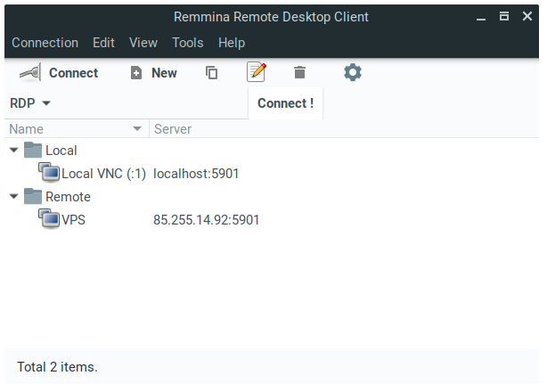
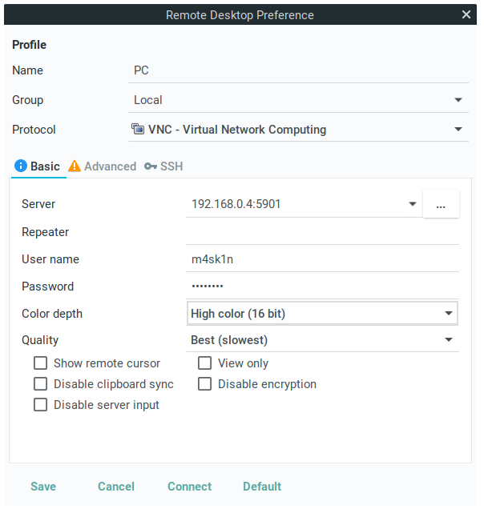
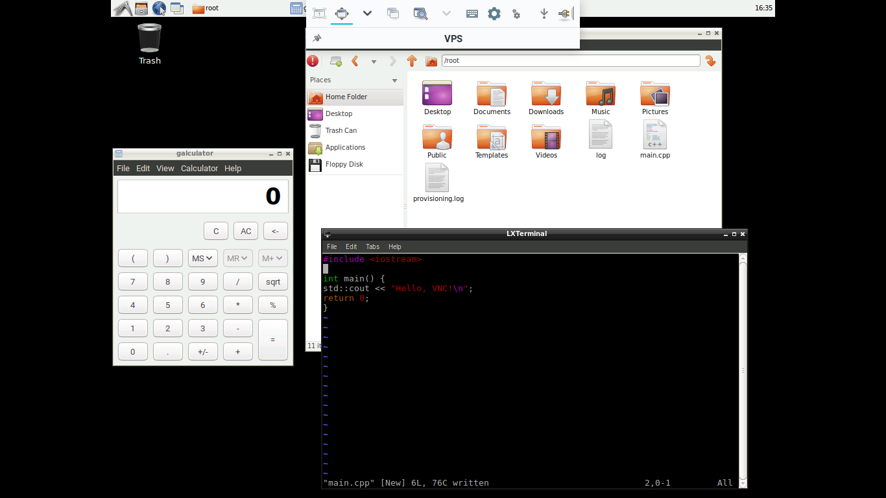
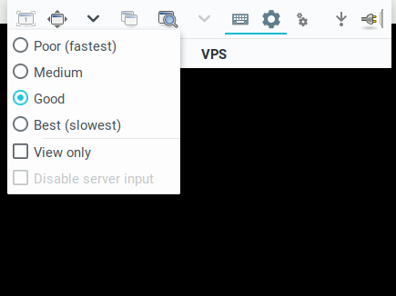

# Access a remote desktop

## Overview
Duration: 1:00

**Virtual Network Computing** (VNC) is a protocol commonly used to share a graphical desktop over a network. Popular uses for VNC include technical support and screen sharing.

By default, Ubuntu comes with [Remmina] remote desktop client with support for VNC and RDP protocols. We will use it to access remote server.

### What you’ll need

  - A computer running Ubuntu 16.04 LTS or above
  - A running VNC server
  - Remmina Remote Desktop Client installed

### Installing Remmina

If you don’t have Remmina on your Ubuntu installation, install it with `sudo apt install remmina remmina-plugin-vnc`. You can also use snap package (`sudo snap install remmina`).

## Launch Remmina
Duration: 1:00

Remmina’s user-interface is easy to use. A quick connection can be made from the entry field beneath the toolbar by switching from the RDP to the VNC protocol, entering the address of your VNC server and clicking “Connect !”. But for convenience, it’s far better to create a re-usable connection, which we’ll cover in the next step.

## Add a connection
Duration: 3:00

Click on “New” to open the “Remote Desktop Preference” pane. The following details should be configured:

  - **Server**: The IP address and port of the VNC server you wish to connect to. For example, 192.168.1.2:5901
  - **User name**: Not necessary unless your server is using VNC users.
  - **Password**: If your server uses a password, enter it here. If not entered and your server requires a password, you’ll be able to enter it after starting the connection.
  - **Colour depth**: Choose 24-bit for a fast connection, such as across a LAN, or 256 colours when using a low bandwidth connection.
  - **Quality**: Provides more control over bandwidth and rendering quality, with “Poor” trades visual quality for responsiveness, while “Best” does the opposite.

Click “Save” when you’re happy with the connection. Now, let’s connect to our VNC!

## Connecting to the server
Duration: 3:00

Connect to the VNC server by selecting your server profile and clicking “connect”.

In toolbar, you have options to switch to fullscreen mode, change view and graphics quality.

## That’s all!
Duration: 1:00

### Easy, wasn’t it?

Congratulations! You have successfully used Remmina to connect to a VNC server, allowing you to remotely access your machine or potentially provide some technical support to someone sharing theirs.

If you need more guidance on using VNC client, help is always at hand:

* [Ask Ubuntu][askubuntu]
* [Ubuntu Forums][forums]
* [IRC-based support][ubuntuirc]

### Further readings
  - [Remmina Wiki page][remmina-wiki]

<!-- LINKS -->
[Remmina]: https://www.remmina.org/
[askubuntu]: https://askubuntu.com/
[forums]: https://ubuntuforums.org/
[ubuntuirc]: https://wiki.ubuntu.com/IRC/ChannelList
[remmina-wiki]: https://github.com/FreeRDP/Remmina/wiki
