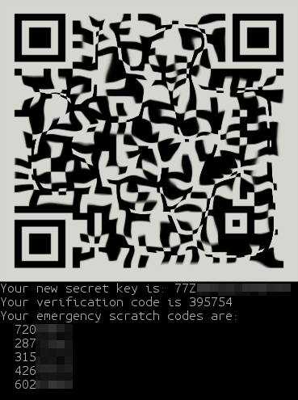
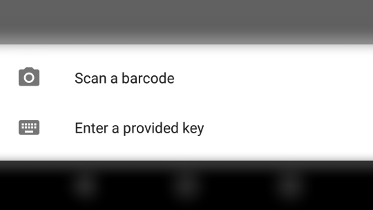
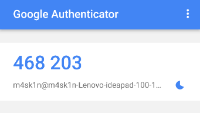

# Configure SSH to use two-factor authentication

## Overview
Duration: 2:00

SSH, the secure shell, is often used to access remote Linux systems. Because we often use it to connect with computers containing important data, it’s recommended to add another security layer. Here comes the two factor authentication (*2FA*).

### What is two-factor authentication

Multi-factor authentication is a method of confirming your identity using at least two different ways of authentication. The most common and easiest to implement example of two-factor authentication uses a combination of **passphrase** (a complex password, often made of several words) and **one-time-passcode** generated by a special mobile app.

We will use the Google Authenticator app available for Android (in the [Play Store]) and iOS (in [iTunes]) to generate authentication codes.

### What you'll need

  - A computer running Ubuntu 16.04 LTS or above
  - A phone running Android or iOS
  - A configured SSH connection
  - You should understand the danger of stolen passwords.
  - You don’t need to know what two-factor authentication is and how it works.


## Installing and configuring required packages
Duration: 3:00

### Installing the Google Authenticator PAM module

Start a terminal session and type:

```bash
sudo apt install libpam-google-authenticator
```


### Configuring SSH

To make SSH use the Google Authenticator PAM module, add the following line to the `/etc/pam.d/sshd` file:

```
auth required pam_google_authenticator.so
```

Now you need to restart the `sshd` daemon using:

```bash
sudo systemctl restart sshd.service
```

Modify `/etc/ssh/sshd_config` – change `ChallengeResponseAuthentication` from `no` to `yes`, so this part of the file looks like this:

```
# Change to yes to enable challenge-response passwords (beware issues with
# some PAM modules and threads)
ChallengeResponseAuthentication no # CHANGE THIS TO YES

# Change to no to disable tunnelled clear text passwords
#PasswordAuthentication yes
```


## Configuring authentication
Duration: 2:00

Google Authenticator makes the configuration of two-factor authentication much easier, comparing to (for example) libpam-oath.

In a terminal, run the google-authenticator command.

It will ask you a series of questions, here is a recommended configuration:

  - Make tokens “time-base”": yes
  - Update the `.google_authenticator` file: yes
  - Disallow multiple uses: yes
  - Increase the original generation time limit: no
  - Enable rate-limiting: yes

You may have noticed the giant QR code that appeared during the process, underneath are your emergency scratch codes to be used if you don’t have access to your phone: write them down on paper and keep them in a safe place.

That's all. Now, let’s open Google Authenticator and add our secret key to make it work.





negative
: Don’t use unencrypted services to store secret keys, such as a notes synchronization service and so on. If you don't want to type the key manually, use the QR code.

## Adding the secret to Google Authenticator
Duration: 2:00

We will use the latest version of Authenticator from the Play Store. The process shouldn’t look very different on iOS.


### Using the QR code

Touch the Add icon (+) and select “Scan a barcode”. Use phone camera to scan QR code.



### Using the through key

Touch the Add icon (+) and select “Enter a provided key”. Enter a name that you will recognise as being your 2FA method for SSH, then type the secret key provided by `google-authenticator` command.




## Getting help
Duration: 1:00

Congratulations! You have just configured two-factor authentication for SSH shell using Google Authenticator. Now, every time you (or some bad guy with your password…) will try to log in to your SSH shell, you (or this bad guy) will be asked for an authentication key in addition to a traditional passphrase.

If you need more guidance on using two-factor authentication, help is always at hand:

* [Ask Ubuntu][askubuntu]
* [Ubuntu Forums][forums]
* [IRC-based support][ubuntuirc]

<!-- LINKS -->
[Play Store]: https://play.google.com/store/apps/details?id=com.google.android.apps.authenticator2
[iTunes]: https://itunes.apple.com/us/app/google-authenticator/id388497605
[askubuntu]: https://askubuntu.com/
[forums]: https://ubuntuforums.org/
[ubuntuirc]: https://wiki.ubuntu.com/IRC/ChannelList
