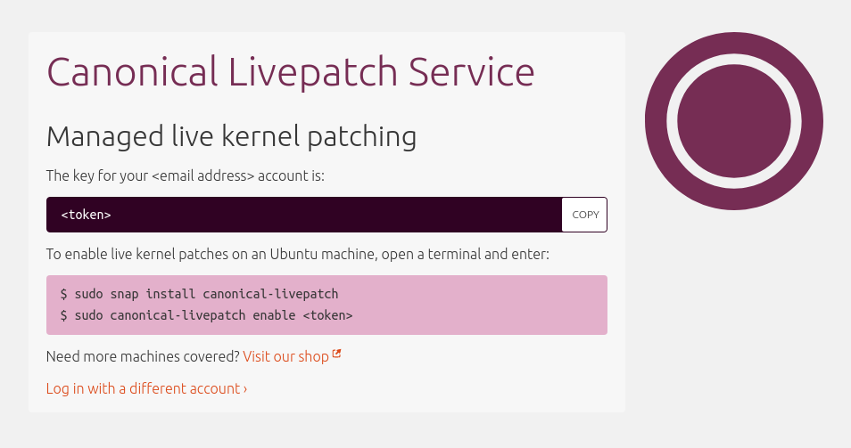

# Apply kernel patches without rebooting

## Overview
Duration: 1:00

The [Canonical Livepatch Service](https://www.ubuntu.com/server/livepatch) applies critical kernel security patches without rebooting Ubuntu. This is especially useful on production environments and services where any downtime could be disruptive.

Livepatch is free for up to 3 machines. It is also included in every [Ubuntu Advantage](https://buy.ubuntu.com) subscription.

This tutorial will show you how to enable this service on your Ubuntu system.

### What you'll need

- A computer running Ubuntu 16.04 LTS or 14.04 LTS with an Internet connection
- An [Ubuntu One](https://login.ubuntu.com) account
- Some basic command-line knowledge

## Getting the Livepatch token
Duration: 1:00

In order to use this service, you have to generate the Livepatch token.

To get it, simply visit the [Livepatch portal](https://auth.livepatch.canonical.com/).


Select the **Ubuntu user** option and click **Get your Livepatch token**. You'll have to log in with your Ubuntu One account if you haven't done so already.

The portal will return your Livepatch credentials:



You'll see a key associated with your account. Don't close the page or copy the token somewhere - you'll need it later.

## Installing the Livepatch daemon
Duration: 3:00

### Enabling snap support

The Livepatch daemon is distributed through the [Snap Store](https://snapcraft.io/discover).

If you are using Ubuntu 14.04 LTS, you have to enable snap support first:

```bash
sudo apt update
sudo apt install snapd
```

Then, start a new shell so your `PATH` variable is updated to include the `snapd` package.

Ubuntu 16.04 LTS supports snaps by default - you don't have to do anything.

### Installing the daemon

To install the Livepatch daemon, simply type:

```bash
sudo snap install canonical-livepatch
```

## Enabling Livepatch
Duration: 1:00

Almost there! You now have to enable the service with the token you got from the Livepatch portal:

```bash
sudo canonical-livepatch enable <token>
```

Once the service has checked your token, you should see the following message:

```bash
Successfully enabled device. Using machine-token: <token>
```

You can ensure that the Livepatch service is working properly by running:

```bash
canonical-livepatch status --verbose
```

## Conclusion
Duration: 1:00

Congratulations, you now have zero downtime kernel patching on your system!

### Next steps

If you have a problem, we're ready to help! Check the following links:

* [Ubuntu Forums](https://ubuntuforums.org)
* [Ask Ubuntu](https://askubuntu.com/)

### Further reading

* [This datasheet](https://assets.ubuntu.com/v1/ac3aa269-DS_Canonical_Livepatch_Service_screen-AW_08.17.pdf) contains more technical details and FAQs on the Canonical Livepatch service.
