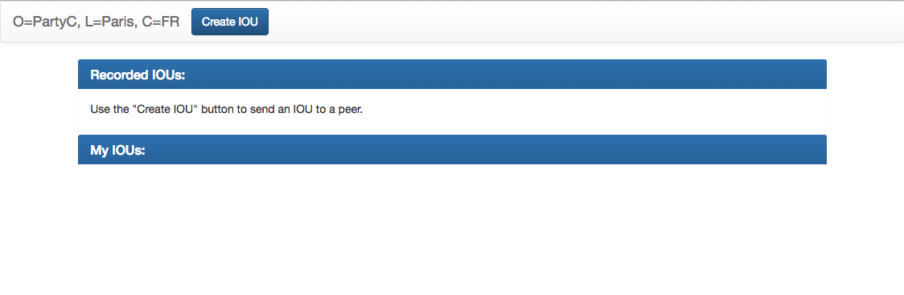
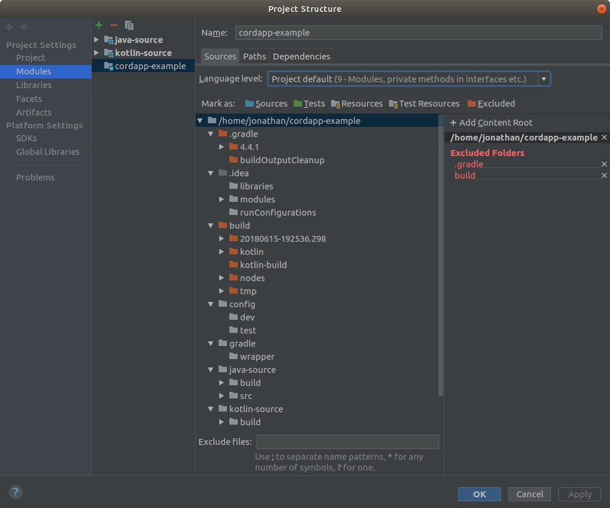

# Get started with Corda

## Overview
Duration: 1:00

Corda is a blockchain platform built for business. Corda removes costly friction in business transactions by enabling businesses to transact directly. Using smart contract and blockchain technology, Corda allows existing business networks to reduce transaction and record-keeping costs and to streamline business operations. 

Corda enables an interoperable, open network that empowers organisations to collaborate and transfer value directly with trust. Corda achieves this with complete privacy in a freely available open source software platform.


### What you'll learn
* How to set up your desktop environment for running and developing on the Corda Platform
* How to install Corda Applications
* How to run Applications from both an IDE and the terminal

### What you'll need
* A computer running Ubuntu 16.04 or above
* Basic knowledge of terminal navigation and operations

**Let's get started by installing the tools we need to work with Corda**

## Environment setup 
Duration: 8:00

The Corda Platform and its applications run in the Java Virtual Machine (JVM), requiring the Java 8 JDK to be installed. Additionally, the git command line interface is used to clone projects. This step will also detail how to install the JetBrains IntelliJ Integrated Development Environment (IDE).

### Installing the Java Development Kit (JDK)

In order to install the Oracle Java JDK, you must add their repository to your system

* Open a terminal window, and add Oracle's PPA and update your package list

```
sudo add-apt-repository ppa:webupd8team/java
sudo apt update 
```
* Install the Oracle JDK 8

```
sudo apt install oracle-java8-installer
```
* Verify that the JDK was installed correctly by typing `java -version`. You should see `Java version "1.8.xxx"` (where xxx is the minor version number)

### Installing Git 

Git can be installed using apt with the command
```
sudo apt install git
``` 
* Verify that the Git was installed correctly by typing `git --version`. You should see a version number. 

### Installing IntelliJ 

Jetbrains offers a pre-built snap package that allows for easy, one-step installation of IntelliJ onto Ubuntu. To download the snap, navigate to <https://snapcraft.io/intellij-idea-community>. The snap can also be found directly by searching "IntelliJ Community" in the Ubuntu Software store.

From Snapcraft.io
* Click `Install`, then `View in Desktop Store`. Choose `Ubuntu Software` in the Launch Application window.

From the IntelliJ Software Store page
* Click `Install`
* To open the application, click `Launch`.

**Now that our environment is set up, we can start working with Corda**

## Cloning the example CorDapp 
Duration: 2:00

Distributed applications running on the Corda platform are known as CorDapps. In this step we will be installing an example CorDapp written by the Corda Team. It will demonstrate sending IOU contracts across a network of three nodes. 

Open a terminal and navigate to the directory where you wish to clone the example CorDapp
* To clone the Github repository, enter:

```
git clone https://github.com/corda/cordapp-example.git
```
* Navigate into the cloned directory.

**We can now run this CorDapp from the terminal**


## Running from terminal
Duration: 5:00

To begin the setup process, start the `deployNodes` Gradle task
* In the same terminal (inside the cloned directory), run the following command:

```
./gradlew deployNodes
```
Wait while the nodes are being configured.

To start up the node network, enter the following command:
```
kotlin-source/build/nodes/runnodes
```
negative
: **Warning** 
If this command fails with error message `Exception in thread "main" java.io.IOException: Cannot run program "xterm"` you will need to install the xterm terminal. This can be done using apt, with the command 
```
sudo apt install xterm
```
When finished, rerun the `runnodes` command. 

Wait while seven additional terminal windows open. The start up process is finished when all the terminal windows display either “Webserver started up in XX.X sec” or “Node for “PartyX” started up and registered in XX.XX sec”. 

Test that the CorDapp is running correctly by visiting PartyA's web frontend at <http://localhost:10009/web/example/>. You should see a page like this:



From this frontend you can create IOUs and send them to other parties. 


## Running from IntelliJ
Duration: 8:00

In this step we will setup and launch the CorDapp project from inside IntelliJ

### Setting up the project 
To start IntelliJ, open a terminal and navigate to the extracted install location.
* Run the command: 

```
bin/idea.sh
```
From the IntelliJ splash screen, click `open` and navigate to the directory where the CorDapp was cloned. Click `OK`. 
Once the project is open click `File`, then `Project Structure` 

positive
: **Warning**
Selecting `import` instead of `open` will erase the run configurations. View [this troubleshooting page](https://docs.corda.net/troubleshooting.html#run-configurations-are-missing) for more information.


Under `Project SDK` click `New`, then `JDK`. Chose the location of the Oracle JDK installed in the first step. The default installation location is `/usr/lib/jvm/java-8-oracle`. Click `OK`.

Back in the project structure menu, click `Apply`. Select `Modules` from the left hand navigation pane. 
Click the green plus button and select `Import Module`. The CorDapp installation location should be selected by default. If not, navigate to it and click `OK`. 
Select `Import module from external module`, choosing `Gradle` and clicking `Next`. 
Click `Finish`, leaving default settings. 

Wait while Gradle builds and indexes the project. Once finished, this is what the modules section of the Project Structure page should look like:



### Running the project 
Once indexing is finished, at the top-right of the screen, to the left of the green play arrow, click the dropdown and select `Run Example Cordapp - Kotlin`. Then click the green play arrow to start the network of nodes.

Wait until the run windows displays the message `Webserver started up in XX.X sec`. 

Just like when running from the terminal, test that the CorDapp is running correctly by visiting PartyA's web frontend at <http://localhost:10009/web/example/>
* From this frontend, you can create IOUs and send them to other parties.

**Congratulations, you are now able to run CorDapps from both the terminal and from an IDE.**


## Next steps and support
Duration: 2:00

To learn more about Corda or get support, check out the following resources: 

### Corda Source Code and Additional Projects
The Corda platform source code is available here:
<https://github.com/corda/corda.git>


A CorDapp template that can be used as the basis for new CorDapps is available in both Java and Kotlin versions:
<https://github.com/corda/cordapp-template-java.git>

<https://github.com/corda/cordapp-template-kotlin.git>


A list of simple sample CorDapps to explore basic concepts is available here:
<https://www.corda.net/samples/>


These repos can be downloaded and run using the steps from this tutorial, and by changing the repository clone command to 
```
git clone [repo URL]
```

### Next steps
The best way to check that everything is working fine is by taking a deeper look at the example CorDapp.

Next, you should read through the self-guided [Corda Key Concepts course](https://r3.lessonly.com/path/5150-corda-key-concepts/login?view=signup) to understand how Corda works.

By then, you’ll be ready to start writing your own CorDapps. Learn how to do this in the [Hello, World tutorial](https://docs.corda.net/hello-world-introduction.html). You may want to refer to the [API documentation](https://docs.corda.net/api/kotlin/corda/index.html), [the flow cookbook](https://docs.corda.net/flow-cookbook.html) and [the samples](https://www.corda.net/samples/) along the way.

### Support
If you encounter any issues, please see [the Troubleshooting page](https://docs.corda.net/troubleshooting.html), or ask on [Stack Overflow](https://stackoverflow.com/questions/tagged/corda) or via [the Corda slack channels](https://slack.corda.net).
