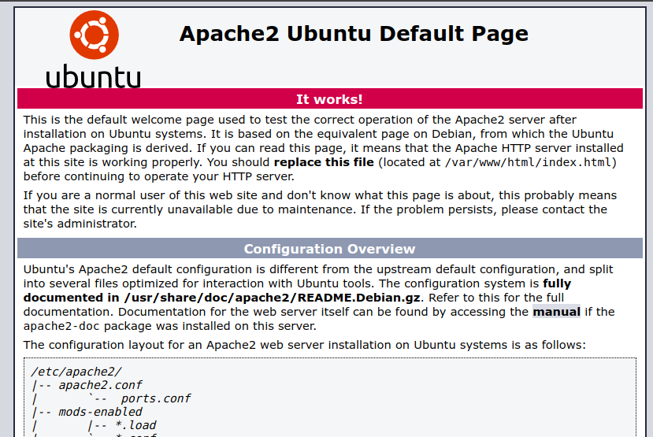
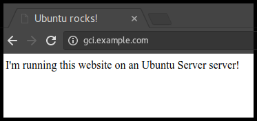

# Install and Configure Apache

## Overview
Duration: 1:00

Apache is an open source web server that's available for Linux servers free of charge.

In this tutorial we'll be going through the steps of setting up an Apache server.

### What you'll learn
- How to set up Apache
- Some basic Apache configuration

### What you'll need
- Ubuntu Server 16.04 LTS
- Secure Shell (SSH) access to your server
- Basic Linux command line knowledge

Got everything ready? Let's move on to the next step!

## Installing Apache
Duration: 1:00

To install Apache, install the latest meta-package `apache2` by running:

```bash
sudo apt update
sudo apt install apache2
```

After letting the command run, all required packages are installed and we can test it out by typing in our IP address for the web server.




If you see the page above, it means that Apache has been successfully installed on your server! Let's move on.

## Creating Your Own Website
Duration: 4:00

By default, Apache comes with a basic site (the one that we saw in the previous step) enabled. We can modify its content in `/var/www/html` or settings by editing its Virtual Host file found in `/etc/apache2/sites-enabled/000-default.conf`.

We can modify how Apache handles incoming requests and have multiple sites running on the same server by editing its Virtual Hosts file.

Today, we're going to leave the default Apache virtual host configuration pointing to www.example.com and set up our own at **gci.example.com**.

So let's start by creating a folder for our new website in `/var/www/` by running
```bash
sudo mkdir /var/www/gci/
```
We have it named `gci` here but any name will work, as long as we point to it in the virtual hosts configuration file later.

Now that we have a directory created for our site, lets have an HTML file in it. Let's go into our newly created directory and create one by typing:
```bash
cd /var/www/gci/
nano index.html
```
Paste the following code in the  `index.html` file:
```HTML
<html>
<head>
  <title> Ubuntu rocks! </title>
</head>
<body>
  <p> I'm running this website on an Ubuntu Server server!
</body>
</html>
```
Pretty cool, right?

Now let's create a VirtualHost file so it'll show up when we type in **gci.example.com**.

## Setting up the VirtualHost Configuration File
Duration: 3:00

We start this step by going into the configuration files directory:
```bash
cd /etc/apache2/sites-available/
```
Since Apache came with a default VirtualHost file, let's use that as a base. (`gci.conf` is used here to match our subdomain name):
```bash
sudo cp 000-default.conf gci.conf
```
Now edit the configuration file:
```bash
sudo nano gci.conf
```
We should have our email in `ServerAdmin` so users can reach you in case Apache experiences any error:
```bash
ServerAdmin yourname@example.com
```
We also want the `DocumentRoot` directive to point to the directory our site files are hosted on:
```bash
DocumentRoot /var/www/gci/
```
The default file doesn't come with a `ServerName` directive so we'll have to add and define it by adding this line below the last directive:
```bash
ServerName gci.example.com
```
This ensures people reach the right site instead of the default one when they type in **gci.example.com**.

Now that we're done configuring our site, let's save and activate it in the next step!

## Activating VirtualHost file
Duration: 1:00

After setting up our website, we need to activate the virtual hosts configuration file to enable it.
We do that by running the following command in the configuration file directory:
```bash
sudo a2ensite gci.conf
```

You should see the following output
```bash
Enabling site gci.
To activate the new configuration, you need to run:
  service apache2 reload
root@ubuntu-server:/etc/apache2/sites-available#

```
To load the new site, we restart Apache by typing:
```bash
service apache2 reload
```

### End result


Now is the moment of truth, let's type our host name in a browser.

Hooray!


positive
: **Further reading:**
 - [VirtualHost examples](https://httpd.apache.org/docs/2.4/vhosts/examples.html)
