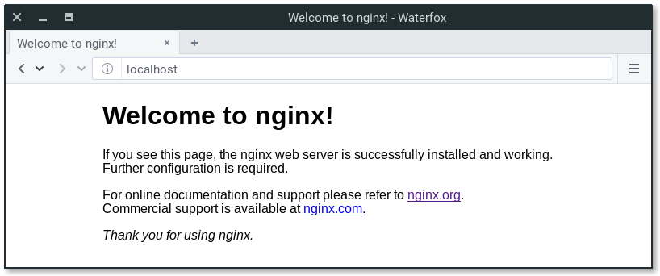
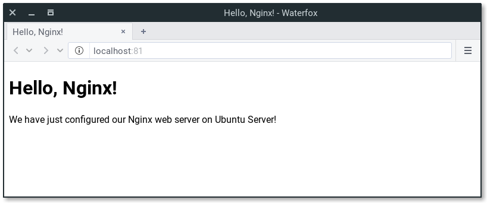

# Install and configure Nginx

## Overview
Duration: 1:00

Nginx (pronounced as “Engine-X”) is an open source web server that is often used as reverse proxy or HTTP cache. It is available for Linux for free.

In this tutorial we’ll install Nginx and set up a basic site.

### What you’ll learn

  - How to set up Nginx
  - Some basic Nginx configuration

### What you’ll need

  - A computer running Ubuntu Server 16.04 LTS
  - Some basic knowledge of command line use


## Installing Nginx
Duration: 1:00

To install Nginx, use following command:

```bash
sudo apt update
sudo apt install nginx
```

After installing it, you already have everything you need.

You can point your browser to your server IP address. You should see this page:



If you see this page, you have successfully installed Nginx on your web server.

## Creating our own website
Duration: 4:00

Default page is placed in `/var/www/html/` location. You can place your static pages here, or use virtual host and place it other location.

positive
: Virtual host is a method of hosting multiple domain names on the same server.

Let’s create simple HTML page in `/var/www/tutorial/` (it can be anything you want). Create `index.html` file in this location.

```bash
cd /var/www
sudo mkdir tutorial
cd tutorial
sudo "${EDITOR:-vi}" index.html
```

Paste the following to the `index.html` file:

```
<!doctype html>
<html>
<head>
    <meta charset="utf-8">
    <title>Hello, Nginx!</title>
</head>
<body>
    <h1>Hello, Nginx!</h1>
    <p>We have just configured our Nginx web server on Ubuntu Server!</p>
</body>
</html>
```

Save this file. In next step we are going to set up virtual host to make Nginx use pages from this location.


## Setting up virtual host
Duration: 3:00

To set up virtual host, we need to create file in `/etc/nginx/sites-enabled/` directory.

positive
: For this tutorial, we will make our site available on 81 port, not the standard 80 port. You can change it if you would like to.

```bash
cd /etc/nginx/sites-enabled
sudo "${EDITOR:-vi}" tutorial
```

```
server {
       listen 81;
       listen [::]:81;

       server_name example.ubuntu.com;

       root /var/www/tutorial;
       index index.html;

       location / {
               try_files $uri $uri/ =404;
       }
}
```

`root` is a directory where we have placed our .html file. `index` is used to specify file available when visiting root directory of site. `server_name` can be anything you want, because you aren't pointing it to any real domain by now.


## Activating virtual host and testing results
Duration: 1:00

To make our site working, simply restart Nginx service.

```bash
sudo service nginx restart
```

Let’s check if everything works as it should. Open our newly created site in web browser. Remember that we used :81 port.



Congratulations! Everything works as it should. We have just configured Nginx web server.


## That's all!
Duration: 1:00

I hope that this tutorial explained you the basics of working with Nginx. Of course, it’s much more powerful tool. You can find more in official resources, available on Nginx site.

If you need more guidance on using Nginx, help is always at hand:

* [Ask Ubuntu][askubuntu]
* [Ubuntu Forums][forums]
* [IRC-based support][ubuntuirc]

### Further reading:

* [Nginx Begineer’s Guide][nginxguide]
* [The Complete NGINX Cookbook – free e-book from O’Reilly][cookbook]

<!-- LINKS -->
[askubuntu]: https://askubuntu.com/
[forums]: https://ubuntuforums.org/
[ubuntuirc]: https://wiki.ubuntu.com/IRC/ChannelList
[nginxguide]: http://nginx.org/en/docs/beginners_guide.html
[cookbook]: https://www.nginx.com/resources/library/complete-nginx-cookbook/
