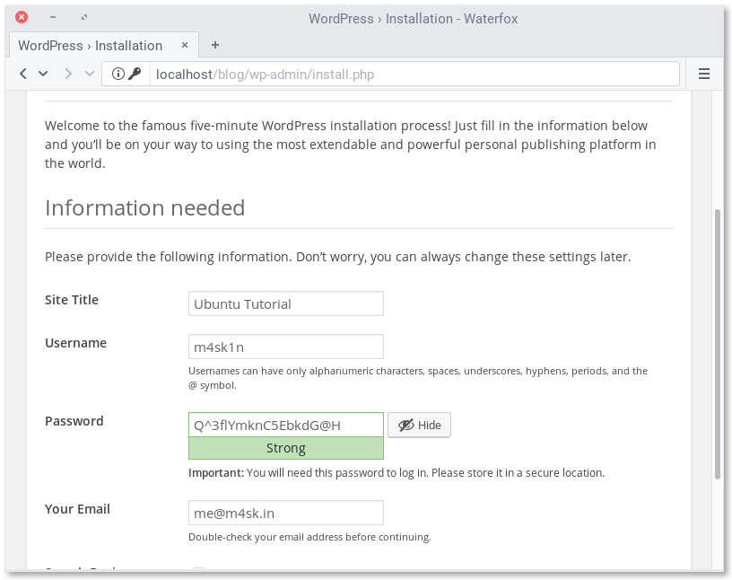
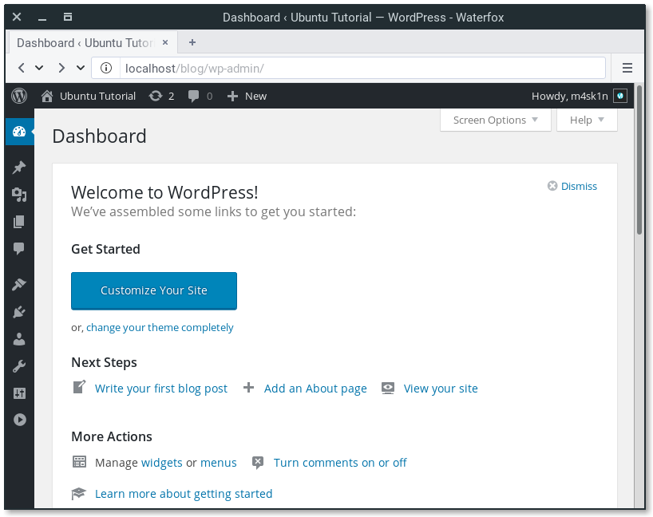
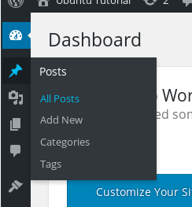
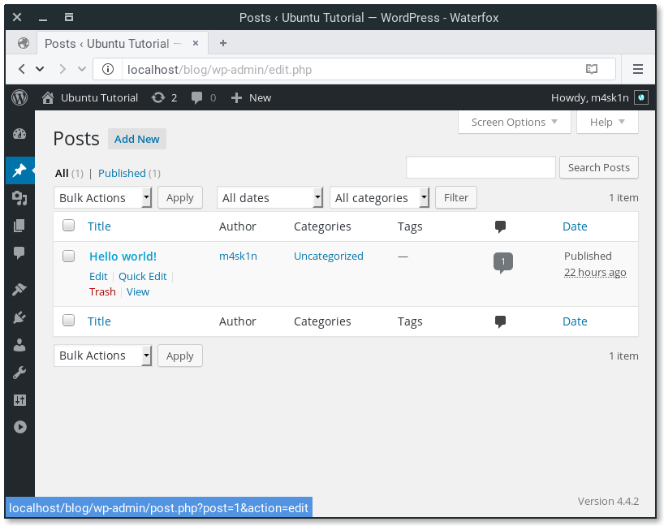
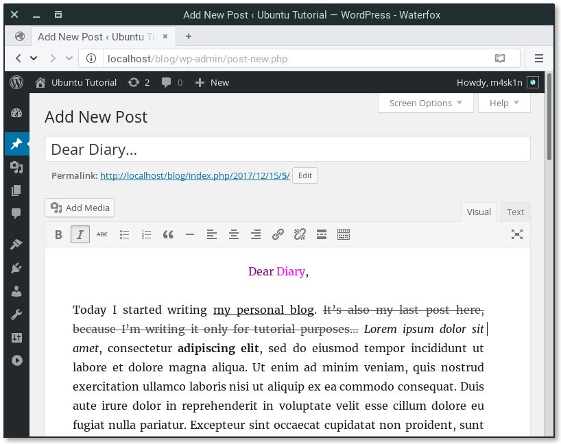

# Install and configure WordPress

## Overview
Duration: 1:00

WordPress is the most popular open source blogging system and CMS on the Web. It is based on PHP and MySQL. Its features can be extended with thousands of free plugins and themes. 

In this tutorial we will install WordPress on Apache2 server and create our first post.

### What you’ll learn

  - How to set up WordPress
  - How to configure WordPress
  - How to create first post

### What you’ll need

  - A computer running Ubuntu Server 16.04 LTS
  - Running Apache2 server
  - You don’t need to know how to configure database.


## Install WordPress
Duration: 1:00

To install WordPress, use following command:

```bash
sudo apt update
sudo apt install wordpress php libapache2-mod-php mysql-server php-mysql
```

If you haven’t installed MySQL before, you will be asked for password for “root” MySQL user. You can leave this field empty.

## Configure Apache for WordPress
Duration: 2:00

Create Apache site for WordPress. Create `/etc/apache2/sites-available/wordpress.conf` with following lines:

```
Alias /blog /usr/share/wordpress
<Directory /usr/share/wordpress>
    Options FollowSymLinks
    AllowOverride Limit Options FileInfo
    DirectoryIndex index.php
    Order allow,deny
    Allow from all
</Directory>
<Directory /usr/share/wordpress/wp-content>
    Options FollowSymLinks
    Order allow,deny
    Allow from all
</Directory>
```

Enable this site with `sudo a2ensite wordpress` and reload apache2 with `sudo service apache2 reload`.

## Configure database
Duration: 4:00

To configure WordPress, we need to create MySQL database. Let’s do it!

```bash
$ sudo mysql -u root
Welcome to the MySQL monitor.  Commands end with ; or \g.
Your MySQL connection id is 7
Server version: 5.7.20-0ubuntu0.16.04.1 (Ubuntu)

Copyright (c) 2000, 2017, Oracle and/or its affiliates. All rights reserved.

Oracle is a registered trademark of Oracle Corporation and/or its
affiliates. Other names may be trademarks of their respective
owners.

Type 'help;' or '\h' for help. Type '\c' to clear the current input statement.

mysql> CREATE DATABASE wordpress;
Query OK, 1 row affected (0,00 sec)

mysql> GRANT SELECT,INSERT,UPDATE,DELETE,CREATE,DROP,ALTER
    -> ON wordpress.*
    -> TO wordpress@localhost
    -> IDENTIFIED BY '<your-password>';
Query OK, 1 row affected (0,00 sec)

mysql> FLUSH PRIVILEGES;
Query OK, 1 row affected (0,00 sec)

mysql> quit
Bye
```

Now, let’s configure WordPress to use this database. Open `/etc/wordpress/config-localhost.php` and write:

```
<?php
define('DB_NAME', 'wordpress');
define('DB_USER', 'wordpress');
define('DB_PASSWORD', '<your-password>');
define('DB_HOST', 'localhost');
define('WP_CONTENT_DIR', '/usr/share/wordpress/wp-content');
?>
```

Enable MySQL with `sudo service mysql start`.


## Configure WordPress
Duration: 2:00

Open `localhost/blog` in your browser. You will be asked for title of your new site, username, password and address e-mail. You can choose if you want to make your site indexed by search engines.



You can now login under `localhost/blog/wp-login.php`. In Dashboard, you will see bunch of icons and options. Don’t worry, it’s easy!




## Write your first post
Duration: 3:00

You have probably noticed that “Hello world!” post. We will delete it and write something more interesting…



From Dashboard (`localhost/blog/wp-admin/`), select “Posts” icon and click on “All Posts”. Mouse over the “Hello world!” post title and select **Trash**.



To create new post, click on the “Add New” button. You should notice a fancy WYSIWYG editor with simple (but powerful) text formatting options. You may want to switch to Text mode, if you prefer pure HTML.

Let’s write something! It’s as easy, as using text processors that you know from office suites.



Now, click the Publish button. You can now view your brand new post!

## That’s all!
Duration: 1:00

Of course, this tutorial has only described basics of WordPress usage, you can do much more with this blogging platform/CMS. You can install one of thousands of available (free and commercial) plugins and themes. You can even configure it as forum (with [bbPress] plugin), microblogging platform ([BuddyPress]), eCommerce platform ([WooCommerce]) or extend existing WordPress features with plugins like [JetPack] or [TinyMCE Advanced][tinymce-advanced].

WordPress manual and documentation is available in the [WordPress Codex][wordpress-codex].You can read it to learn more about WordPress usage, and even something about themes/plugins development.

If you need more guidance on using WordPress, help is always at hand:

* [Ask Ubuntu][askubuntu]
* [Ubuntu Forums][forums]
* [WordPress.org Forums][wpforums]

### Further reading:

* [WordPress Codex][wordpress-codex]
* [WordPress page in Ubuntu documentation][ubuntu-docs]

<!-- LINKS -->
[bbPress]: https://bbpress.org/
[BuddyPress]: https://buddypress.org/
[WooCommerce]: https://woocommerce.com/
[JetPack]: https://jetpack.com/
[tinymce-advanced]: http://www.laptoptips.ca/projects/tinymce-advanced/
[wordpress-codex]: https://codex.wordpress.org/
[askubuntu]: https://askubuntu.com/
[forums]: https://ubuntuforums.org/
[wpforums]: https://wordpress.org/support/forums/
[ubuntu-docs]: https://help.ubuntu.com/lts/serverguide/wordpress.html
