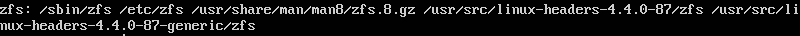
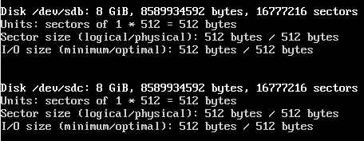
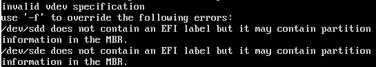

# Setup a ZFS storage pool

## Overview
Duration: 1:00

ZFS is a combined file system and logical volume manager originally designed and implemented by a team at Sun Microsystems led by Jeff Bonwick and Matthew Ahrens. Features of ZFS include protection against data corruption, high storage capacity (256 ZiB), snapshots and copy-on-write clones and continuous integrity checking to name but a few. If you are dealing with large amounts of data, or providing a backing filesystem for virtualisation, ZFS is a great choice.

This guide will go through the process of installing ZFS on Ubuntu 16.04 LTS and setting up a storage pool.

### What you'll learn

- How to install ZFS
- How to create a storage pool

### What you'll need

- Ubuntu Server 16.04 LTS

Ready? Let's head over to the next step!

## Installing ZFS
Duration: 1:00

The main components of ZFS are maintained as a standard Ubuntu package, so to install simply run:

```bash
sudo apt install zfsutils-linux
```

After that, we can check if ZFS was installed correctly by running:
```bash
whereis zfs
```

You should see output similar to the following:



Now that we're done installing the required packages, let's create a storage pool!

## Creating a ZFS Pool
Duration: 3:00

### Choosing Drives to Pool

Check installed drives by running:

```bash
sudo fdisk -l
```
Carefully note down the device names of drives you want to pool.

These are the two drives we're going to pool:


### Creating a Pool

There are two types of simple storage pools we can create. A `striped pool`, where a copy of data is stored across all drives or a `mirrored pool`, where a single complete copy of data is stored on all drives.

To create a striped pool, we run:

```bash
sudo zpool create new-pool /dev/sdb /dev/sdc
```

To create a mirrored pool, we run:

```bash
sudo zpool create new-pool mirror /dev/sdb /dev/sdc
```
In both examples, `new-pool` is the name of the pool.

negative
: **Sometimes an error like this might pop up:**

Add "`-f`" to the end of the `zpool create` command to override it.

A `mirrored pool` is usually recommended as we'd still be able to access our data if a single drive fails. However, this means that we'll only get the capacity of a single drive. A `striped pool`, while giving us the combined storage of all drives, is rarely recommended as we'll lose all our data if a drive fails. You can also opt for both, or change the designation at a later date if you add more drives to the pool.

The newly created pool is mounted at `/new-pool`. You can select a different mount point using the `-m` option:

```bash
sudo zpool create -m /usr/share/pool new-pool mirror /dev/sdb /dev/sdc
```

The newly mounted pool will appear to Ubuntu as any other part of the filesystem.

## Checking Pool Status
Duration: 1:00

You can check the status of ZFS pools with:

```bash
sudo zpool status
```
This is the status of our newly created pool:


## Removing the pool
Duration: 1:00

If you are finished with the pool, you can remove it. Beware that this will also remove any files that you have created within the pool!

```bash
sudo zpool destroy new-pool
```

You can confirm that the pool has been removed by checking the filesystem and by running the status check again:

```bash
sudo zpool status
```

## That's all!
Duration: 1:00

Congratulations, you have updated your Ubuntu install with a cutting edge new filesystem! You have found out:

- How to install the ZFS utilities
- How to identify which drives to use in a ZFS pool
- The basic types of ZFS pools
- How to create and mount a pool
- How to remove the pool once you no longer need it

Be sure to check back on this site for more tutorials on using ZFS! 

### Further reading

- For detailed operations check out the [Oracle ZFS Administration Guide](https://docs.oracle.com/cd/E19253-01/819-5461/index.html)
- For a quick 'cheat-sheet' guide, try the [Ubuntu Wiki ZFS reference](https://wiki.ubuntu.com/Kernel/Reference/ZFS)
