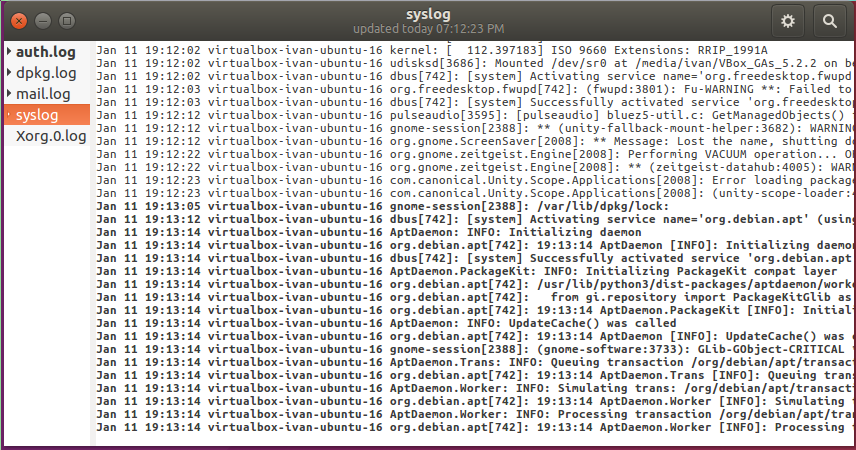

# Viewing and monitoring log files

## Overview
Duration: 1:00

The Linux operating system, and many applications that run on it, do a lot of logging. These logs are invaluable for monitoring and troubleshooting your system.

### What you'll learn

- Viewing logs with a simple GUI tool
- Basic command-line commands for working with log files

### What you'll need

- Ubuntu Desktop or Server
- Very basic command-line knowledge (`cd`, `ls`, etc.)

Survey
: How will you use this tutorial?
 - Only read through it
 - Read it and complete the exercises
: What is your current level of experience?
 - Novice
 - Intermediate
 - Proficient

## Log files locations
Duration: 2:00

There are many different log files that all serve different purposes. When trying to find a log about something, you should start by identifying the most relevant file. Below is a list of common log file locations.

### System logs

System logs deal with exactly that - the Ubuntu system - as opposed to extra applications added by the user. These logs may contain information about authorizations, system daemons and system messages.

#### Authorization log

Location: `/var/log/auth.log`

Keeps track of authorization systems, such as password prompts, the `sudo` command and remote logins.

#### Daemon Log

Location: `/var/log/daemon.log`

Daemons are programs that run in the background, usually without user interaction. For example, display server, SSH sessions, printing services, bluetooth, and more.

#### Debug log

Location: `/var/log/debug`

Provides debugging information from the Ubuntu system and applications.

#### Kernel log

Location: `/var/log/kern.log`

Logs from the Linux kernel.

#### System log

Location: `/var/log/syslog`

Contains more information about your system. If you can't find anything in the other logs, it's probably here.

### Application logs

Some applications also create logs in `/var/log`. Below are some examples.

#### Apache logs

Location: `/var/log/apache2/` (subdirectory)

Apache creates several log files in the `/var/log/apache2/` subdirectory. The `access.log` file records all requests made to the server to access files. `error.log` records all errors thrown by the server.

#### X11 server logs

Location: `/var/log/Xorg.0.log`

The X11 server creates a seperate log file for each of your displays. Display numbers start at zero, so your first display (display 0) will log to `Xorg.0.log`. The next display (display 1) would log to `Xorg.1.log`, and so on.

### Non-human-readable logs

Not all log files are designed to be read by humans. Some were made to be parsed by applications. Below are some of examples.

#### Login failures log

Location: `/var/log/faillog`

Contains info about login failures. You can view it with the `faillog` command.

#### Last logins log

Location: `/var/log/lastlog`

Contains info about last logins. You can view it with the `lastlog` command.

#### Login records log

Location: `/var/log/wtmp`

Contains login info used by other utilities to find out who's logged in. To view currently logged in users, use the `who` command.

positive
: **This is not an exhaustive list!**
You can search the web for more locations relevant to what you're trying to debug. There is also a longer list [here](https://help.ubuntu.com/community/LinuxLogFiles#System_Logs).

## Viewing logs using GNOME System Log Viewer
Duration: 3:00

The GNOME System Log Viewer provides a simple GUI for viewing and monitoring log files. If you're running Ubuntu 17.10 or above, it will be called **Logs**. Otherwise, it will be under the name **System Log**.

### System Log Viewer interface

The log viewer has a simple interface. The sidebar on the left shows a list of open log files, with the contents of the currently selected file displayed on the right.

The log viewer not only displays but also monitors log files for changes. The bold text (as seen in the screenshot above) indicates new lines that have been logged after opening the file. When a log that is not currently selected is updated, it's name in the file list will turn bold (as shown by `auth.log` in the screenshot above).

Clicking on the cog at the top right of the window will open a menu allowing you to change some display settings, as well as open and close log files.

There is also a magnifying glass icon to the right of the cog that allows you to search within the currently selected log file.

### More information

If you wish to learn more about the GNOME System Log Viewer, you may visit the [official documentation](https://help.gnome.org/users/gnome-system-log/).

## Viewing and monitoring logs from the command line
Duration: 5:00

It is also important to know how to view logs in the command line. This is especially useful when you're remotely connected to a server and don't have a GUI.

The following commands will be useful when working with log files from the command line.

### Viewing files

The most basic way to view files from the command line is using the `cat` command. You simply pass in the filename, and it outputs the entire contents of the file: `cat file.txt`.

This can be inconvenient when dealing with large files (which isn't uncommon for logs!). We could use an editor, although that may be overkill just to view a file. This is where the `less` command comes in. We pass it the filename (`less file.txt`), and it will open the file in a simple interface. From here, we can use the arrow keys (or j/k if you're familiar with Vim) to move through the file, use `/` to search, and press `q` to quit. There are a few more features, all of which are described by pressing `h` to open the help.

### Viewing the start or end of a file

We may also want to quickly view the first or last `n` number of lines of a file. This is where the `head` and `tail` commands come in handy. These commands work much like `cat`, although you can specify how many lines from the start/end of the file you want to view. To view the first 15 lines of a file, we run `head -n 15 file.txt`, and to view the last 15, we run `tail -n 15 file.txt`. Due to the nature of log files being appended to at the bottom, the `tail` command will generally be more useful.

### Monitoring files

To monitor a log file, you may pass the `-f` flag to `tail`. It will keep running, printing new additions to the file, until you stop it (Ctrl + C). For example: `tail -f file.txt`.

### Searching files

One way that we looked at to search files is to open the file in `less` and press `/`. A faster way to do this is to use the `grep` command. We specify what we want to search for in double quotes, along with the filename, and `grep` will print all the lines containing that search term in the file. For example, to search for lines containing "test" in `file.txt`, you would run `grep "test" file.txt`.

If the result of a `grep` search is too long, you may pipe it to `less`, allowing you to scroll and search through it: `grep "test" file.txt | less`.

### Editing files

The simplest way to edit files from the command line is to use `nano`. `nano` is a simple command line editor, which has all the most useful keybindings printed directly on screen. To run it, just give it a filename (`nano file.txt`). To close or save a file, press Ctrl + X. The editor will ask you if you want to save your changes. Press `y` for yes or `n` for no. If you choose yes, it will ask you for the filename to save the file as. If you are editing an existing file, the filename will already be there. Simply leave it as it is and it will save to the proper file.

## Conclusion
Duration: 1:00

Congratulations, you now have enough knowledge of log file locations, usage of the GNOME System Log Viewer and basic command line commands to properly monitor and trouble-shoot problems that arise on your system.

### Further reading

- The Ubuntu Wiki has an [article](https://help.ubuntu.com/community/LinuxLogFiles) that goes more in-depth into Ubuntu log files.
- This DigitalOcean Community [article](https://www.digitalocean.com/community/tutorials/how-to-use-journalctl-to-view-and-manipulate-systemd-logs) covers viewing Systemd logs

